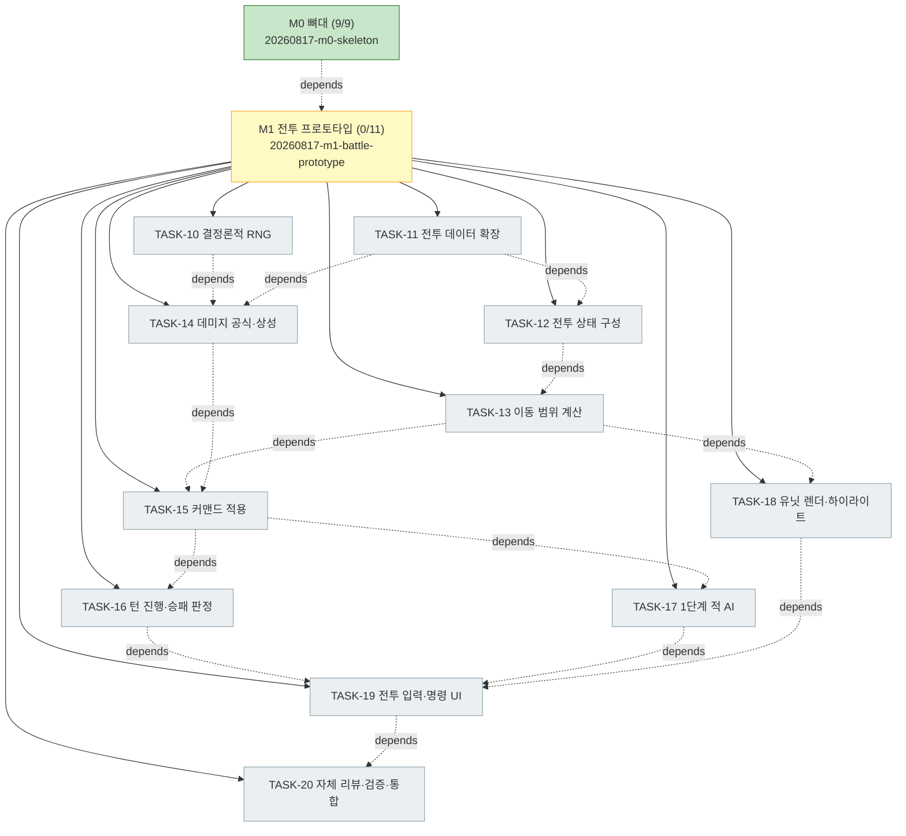

# PLAN-ygj-remake: 삼국지 영걸전 리메이크 구현 계획

> 문서 유형: `plan`
> 작업 ID: `20260817-m1-battle-prototype`
> 상태: `in-progress`
> 기준선: `v1` (2026-08-17 승인)
> 작성일: 2026-08-17
> 최종 갱신: 2026-08-17
> 관련 문서: [REQ-ygj-remake: 요구사항](./requirements.md), [DESIGN-ygj-remake: 설계](./design.md), [결정 등록부](./decisions.md), [WORK-20260817-m0-skeleton: 작업 기록](./work/20260817-m0-skeleton/work-log.md)

## 요약

- 목적: 승인된 기준선 v1을 마일스톤 단위로 구현하기 위한 저장소 현행 계획. 현재 사이클은 **M0 뼈대**다.
- 현재 결론 또는 상태: **M0 사이클 완료**(TASK-01~09, 검증 4/4 성공, [기록](./work/20260817-m0-skeleton/work-log.md)). **M1 사이클 계획 수립 완료, 구현 미착수**(TASK-10~20).
- 다음 행동: TASK-10(결정론적 RNG)부터 순서대로 구현한다. 재개 절차는 [M1 작업 기록의 인계](./work/20260817-m1-battle-prototype/work-log.md#인계)를 따른다.

## 문서 연결

| 방향 | 관계 | 대상 문서 | 대상 항목 | 비고 |
|---|---|---|---|---|
| input | baseline | [REQ-ygj-remake: 요구사항](./requirements.md) | FR-02, FR-03, FR-11, FR-13, FR-17, FR-18, NFR-01~03, NFR-06, AC-01, AC-02, AC-04 | 충족할 승인된 요구사항 |
| input | baseline | [DESIGN-ygj-remake: 설계](./design.md) | DES-01, DES-03~06, DES-12 | 구현할 설계 요소 |
| input | decision | [ADR-002: 기술 스택 선정](./work/20260817-ygj-remake-baseline/ADR-002-기술-스택-선정.md) | document | 스택 제약 |
| input | decision | [ADR-003: 결정론적 RNG와 세이브 포함 정책](./work/20260817-ygj-remake-baseline/ADR-003-결정론적-RNG와-세이브-포함-정책.md) | document | TASK-10의 근거 |
| output | implementation | [WORK-20260817-m0-skeleton: 작업 기록](./work/20260817-m0-skeleton/work-log.md) | TASK-01~09, VER-01~04 | M0 수행 기록·검증 결과 |
| output | implementation | [WORK-20260817-m1-battle-prototype: 작업 기록](./work/20260817-m1-battle-prototype/work-log.md) | TASK-10~20, VER-05~08 | M1 수행 기록·검증 결과 |

## 기준선

- 관련 요구사항: [REQ-ygj-remake](./requirements.md) v1 — FR-13(데이터 주도·검증), NFR-02(로직·렌더 분리), NFR-03(데이터 무결성·내성), AC-01(데이터 검증)
- 관련 설계: [DESIGN-ygj-remake](./design.md) v1 — DES-03(데이터 계층), DES-05(렌더 계층), DES-12(데이터 계약)
- 관련 ADR·DCR: [ADR-001](./work/20260817-ygj-remake-baseline/ADR-001-하이브리드-리메이크와-데이터-주도-엔진.md), [ADR-002](./work/20260817-ygj-remake-baseline/ADR-002-기술-스택-선정.md)

## 작업 정의

- 목표: [전체 설계 §8](../yeonggeoljeon-remake-design.md)의 M0 완료 기준 — `npm run dev`로 빈 맵이 렌더되고 `npm run validate`가 동작한다.
- 범위: Vite+TS(strict) 스캐폴딩, zod 데이터 스키마, 시드 데이터, 데이터 로더와 참조 무결성 검사, validate CLI, PixiJS 타일맵 렌더와 플레이스홀더 에셋 파이프라인.
- 범위 밖: 전투 로직(M1~M2), 캠페인·세이브(M3), 맵 에디터(M3.5), 콘텐츠 데이터 입력(M4), 장수 에디터(M4.5), 그래픽 교체(M5), Tauri 패키징·CI(M6). M0 시드 데이터는 파이프라인 검증용 최소 샘플이며 원작 데이터 입력이 아니다.
- 가정: Node.js LTS·npm 사용 가능(2026-08-17 확인 — v24.19.0 / npm 11.17.0 사용자 영역 설치).
- 위험: 렌더 결과(빈 맵)는 자동 테스트가 어려워 수동 확인에 의존한다([RISK-M0-01](#위험-1)).

## 계획 트리

<!-- generated -->

```text
[✓] [작업] 20260817-m0-skeleton — M0 뼈대 ................ completed (9/9)
    └─ 상세 트리 스냅숏: work-log.md의 계획 트리 절

[▶] [작업] 20260817-m1-battle-prototype — M1 전투 프로토타입 ... in-progress (0/11)
    ├─ [ ] TASK-10 구현: 결정론적 RNG
    ├─ [ ] TASK-11 구현: 전투 데이터 확장(무장·전투 상수·스테이지)
    ├─ [ ] TASK-12 구현: 전투 상태 구성            depends: TASK-11
    ├─ [ ] TASK-13 구현: 이동 범위 계산            depends: TASK-12
    ├─ [ ] TASK-14 구현: 데미지 공식·상성          depends: TASK-10, TASK-11
    ├─ [ ] TASK-15 구현: 커맨드 적용               depends: TASK-13, TASK-14
    ├─ [ ] TASK-16 구현: 턴 진행·승패 판정         depends: TASK-15
    ├─ [ ] TASK-17 구현: 1단계 적 AI               depends: TASK-15
    ├─ [ ] TASK-18 구현: 유닛 렌더·범위 하이라이트  depends: TASK-13
    ├─ [ ] TASK-19 구현: 전투 입력·명령 UI         depends: TASK-16, TASK-17, TASK-18
    └─ [ ] TASK-20 통합: 자체 리뷰·검증·통합       depends: TASK-19
```



## 작업 목록

### M0 사이클 (완료)

완료·통합된 사이클이므로 축약형으로 유지한다. 각 작업의 수행 내용·결정·검증 증거는 [WORK-20260817-m0-skeleton](./work/20260817-m0-skeleton/work-log.md)이 정본이다.

| 작업 | 상태 | 상위 | 요약 |
|---|---|---|---|
| TASK-01 | completed | 없음 | Vite+TS(strict)+PixiJS+Vitest 스캐폴딩 |
| TASK-02 | completed | 없음 | zod 데이터 스키마 정의 (`src/core/data/schemas.ts`) |
| TASK-03 | completed | TASK-02 | 스키마 검증 테스트 (선행, Red→Green) |
| TASK-04 | completed | 없음 | 시드 데이터 (지형 9·병과 6·상성 9·스테이지 1) |
| TASK-05 | completed | 없음 | 데이터 로더·참조 무결성 검사 (`loader.ts`, `integrity.ts`) |
| TASK-06 | completed | TASK-05 | 무결성·AC-01 인수 테스트 (선행, Red→Green) |
| TASK-07 | completed | 없음 | validate CLI (`npm run validate`, 실패 시 exit 1) |
| TASK-08 | completed | 없음 | PixiJS 타일맵 렌더·플레이스홀더 파이프라인 |
| TASK-09 | completed | 없음 | 자체 리뷰·전체 검증·통합 |

### M1 사이클 (진행 중)

목표: [전체 설계 §8](../yeonggeoljeon-remake-design.md)의 M1 완료 기준 — 테스트 스테이지 1개에서 전투 한 판을 완주한다([AC-02](./requirements.md#인수-조건)).

범위: 유닛 배치·선택·이동(코스트 기반 이동 범위), 근접/원거리 공격과 데미지 공식·상성, 턴 교대, 1단계 AI, 승패 판정, 결정론적 RNG.
범위 밖: 책략·아이템·사기 변동·혼란·경험치·레벨업·승급·일기토·전투 이벤트(전부 M2), 캠페인·세이브(M3).

각 작업은 [TDD 사이클](./work/20260817-m1-battle-prototype/work-log.md)을 따른다 — 검증 방법의 "선행 테스트"가 Red 시작점이다.

#### TASK-10: 결정론적 RNG

- 상태: pending
- 상위: 없음
- 목표: xoshiro128** 기반 시드 RNG를 구현하고 128bit 상태를 직렬화·복원한다.
- 관련 요구사항과 설계: NFR-01, DES-04, [ADR-003](./work/20260817-ygj-remake-baseline/ADR-003-결정론적-RNG와-세이브-포함-정책.md)
- 변경 대상: `src/core/rng.ts`
- 의존성: 없음
- 위험: 알고리즘 구현 오류는 재현성을 조용히 깨뜨린다
- 검증 방법: 선행 테스트 — 같은 시드는 같은 수열을, 다른 시드는 다른 수열을 낸다. 상태 저장→복원 후 이어지는 수열이 일치한다. `range(min,max)`가 경계 안에 머문다.
- 완료 조건: 결정론과 상태 왕복이 테스트로 고정된다

#### TASK-11: 전투 데이터 확장

- 상태: pending
- 상위: 없음
- 목표: 무장(`officers.json`), 전투 상수(`combat-config.json`), 스테이지의 배치·적·승패 조건을 스키마와 시드 데이터로 추가한다.
- 관련 요구사항과 설계: FR-02, FR-13, DES-12, [상세 스펙 §9](../yeonggeoljeon-remake-spec-detail.md)
- 변경 대상: `src/core/data/schemas.ts`, `src/core/data/loader.ts`, `src/core/data/integrity.ts`, `scripts/readGameData.ts`, `src/browserData.ts`, `data/officers.json`, `data/config/combat-config.json`, `data/scenario/stages/stage-test.json`
- 의존성: 없음
- 위험: 스키마를 M1 이상으로 넓히면 YAGNI 위반 — 전투 프로토타입이 실제로 읽는 필드로 한정한다
- 검증 방법: 선행 테스트 — 무장·전투 상수 스키마 경계값, 스테이지의 적/배치 참조(officerId·classId·좌표 범위) 무결성 검사
- 완료 조건: `npm run validate`가 확장된 시드 데이터를 통과하고 잘못된 참조를 잡는다

#### TASK-12: 전투 상태 구성

- 상태: pending
- 상위: 없음
- 목표: 스테이지 데이터와 출진 명단으로 초기 `BattleState`(유닛·턴·페이즈·날씨)를 만든다.
- 관련 요구사항과 설계: FR-02, DES-01, [전체 설계 §6.3](../yeonggeoljeon-remake-design.md)
- 변경 대상: `src/core/battle/state.ts`
- 의존성: TASK-11
- 위험: 병력 상한 산출 규칙이 기준선에 명시되지 않았다 — 결정과 근거를 작업 기록에 남긴다
- 검증 방법: 선행 테스트 — 레벨·병과·무장으로부터 파생치(병력 상한·사기)가 계산되고, 배치 좌표가 맵 밖이거나 겹치면 거부된다
- 완료 조건: 시드 스테이지에서 양 진영 유닛이 있는 상태가 만들어진다

#### TASK-13: 이동 범위 계산

- 상태: pending
- 상위: 없음
- 목표: 지형 코스트 합이 이동력 이하인 타일 집합을 구한다(다익스트라). 진입 불가 지형, 적 유닛 차단, 아군 통과 허용·정지 불가를 반영한다.
- 관련 요구사항과 설계: FR-02, DES-01, [상세 스펙 §1.2](../yeonggeoljeon-remake-spec-detail.md)
- 변경 대상: `src/core/battle/movement.ts`
- 의존성: TASK-12
- 위험: `movementRules`와 `terrain.moveCost`의 우선순위가 미확정([M0 후속 작업](./work/20260817-m0-skeleton/work-log.md#후속-작업)) — 이 작업에서 확정하고 기록한다
- 검증 방법: 선행 테스트 — 코스트 합 경계, 진입 불가 지형 제외, 적 유닛 통과 불가, 아군 통과 가능·정지 불가, 이동력 반감 병과
- 완료 조건: 규칙별 테스트가 통과하고 경로 비용이 정확하다

#### TASK-14: 데미지 공식과 상성

- 상태: pending
- 상위: 없음
- 목표: [상세 스펙 §1.3](../yeonggeoljeon-remake-spec-detail.md)의 물리 데미지 공식과 상성·지형 보정을 구현한다. 모든 상수는 `combat-config.json`에서 읽는다.
- 관련 요구사항과 설계: FR-02, FR-03, NFR-06, AC-04, DES-01
- 변경 대상: `src/core/battle/damage.ts`
- 의존성: TASK-11
- 위험: 상성 배수 방향을 반대로 적용하면 전투 감각이 뒤집힌다 — 방향을 테스트로 고정한다
- 검증 방법: 선행 테스트 — 상성 3×3 배수, 지형 방어 보정, 최소 데미지·잔여 병력 상한 경계, 고정 시드에서 결정론
- 완료 조건: AC-04 대응 테스트가 통과한다

#### TASK-15: 커맨드 적용

- 상태: pending
- 상위: 없음
- 목표: `applyCommand(state, cmd, rng) → BattleEvent[]`로 이동·공격·대기를 적용한다. 반격은 없다(병과 플래그 예외만 허용).
- 관련 요구사항과 설계: FR-02, DES-01, [상세 스펙 §1.1, §1.3](../yeonggeoljeon-remake-spec-detail.md)
- 변경 대상: `src/core/battle/commands.ts`, `src/core/battle/events.ts`
- 의존성: TASK-13, TASK-14
- 위험: 상태 변경이 커맨드 경계 밖으로 새면 세이브 일관성(M3)이 깨진다 — 항상 완결된 상태만 남긴다
- 검증 방법: 선행 테스트 — 이동 후 행동 순서 강제, 행동 완료 유닛의 재행동 거부, 사거리·방향 밖 공격 거부, 격파 시 유닛 제거, 반격 없음
- 완료 조건: 커맨드별 테스트가 통과하고 잘못된 커맨드는 상태를 바꾸지 않는다

#### TASK-16: 턴 진행과 승패 판정

- 상태: pending
- 상위: 없음
- 목표: 페이즈 교대(플레이어 → 적 → 턴 +1)와 승리·패배 조건 판정을 구현한다.
- 관련 요구사항과 설계: FR-02, DES-01, [상세 스펙 §1.1](../yeonggeoljeon-remake-spec-detail.md)
- 변경 대상: `src/core/battle/turn.ts`
- 의존성: TASK-15
- 위험: 없음
- 검증 방법: 선행 테스트 — 페이즈 전환 시 행동 플래그 초기화, 적 전멸 시 승리, 지정 유닛 격파 시 패배, 판정 우선순위
- 완료 조건: 조건별 테스트가 통과한다

#### TASK-17: 1단계 적 AI

- 상태: pending
- 상위: 없음
- 목표: 가장 가까운 아군에게 접근해 공격하고, 사거리 밖이면 이동만 하는 AI를 구현한다.
- 관련 요구사항과 설계: FR-11, DES-01, [전체 설계 §3.4](../yeonggeoljeon-remake-design.md)
- 변경 대상: `src/core/battle/ai.ts`
- 의존성: TASK-15
- 위험: 도달 불가 목표에서 무한 루프 — 이동 불가 시 대기로 종료시킨다
- 검증 방법: 선행 테스트 — 사거리 안이면 공격, 밖이면 접근, 도달 불가면 대기, 페이즈가 반드시 종료됨
- 완료 조건: 적 페이즈가 모든 상황에서 유한하게 끝난다

#### TASK-18: 유닛 렌더와 범위 하이라이트

- 상태: pending
- 상위: 없음
- 목표: 유닛을 플레이스홀더로 그리고(진영 구분), 이동 범위(청)·공격 범위(적)를 하이라이트한다.
- 관련 요구사항과 설계: FR-17, FR-18, NFR-03, DES-05
- 변경 대상: `src/render/UnitRenderer.ts`, `src/render/HighlightRenderer.ts`
- 의존성: TASK-13
- 위험: 스프라이트 시트가 없으므로 플레이스홀더 경로만 존재한다 — M1에서 유닛 폴백을 검증한다([M0에서 이월](./work/20260817-m0-skeleton/work-log.md#설계와-달라진-점))
- 검증 방법: 빌드 성공 + 화면 확인(유닛 표시·범위 하이라이트). 스프라이트 매핑 누락 시 폴백 렌더 확인
- 완료 조건: 양 진영 유닛과 범위가 화면에 보인다

#### TASK-19: 전투 입력과 명령 UI

- 상태: pending
- 상위: 없음
- 목표: 유닛 선택 → 이동(취소 가능) → 공격/대기 흐름과 턴·페이즈 HUD, 예상 데미지 표시, 승패 결과 표시를 구현한다.
- 관련 요구사항과 설계: FR-18, DES-06, [상세 스펙 §8](../yeonggeoljeon-remake-spec-detail.md)
- 변경 대상: `src/ui/`, `src/scenes/BattleScene.ts`, `src/main.ts`
- 의존성: TASK-16, TASK-17, TASK-18
- 위험: UI가 데이터를 하드코딩하면 FR-13이 깨진다 — 병과명·상성은 데이터에서 읽는다
- 검증 방법: 화면에서 전투 한 판 완주(AC-02), 예상 데미지가 실제 결과와 같은 공식을 쓰는지 확인
- 완료 조건: 마우스·키보드로 전투를 승리까지 진행할 수 있다

#### TASK-20: 자체 리뷰·검증·통합

- 상태: pending
- 상위: 없음
- 목표: 자체 리뷰 항목을 점검하고 전체 검증을 실행한 뒤 문서·기록을 통합한다.
- 관련 요구사항과 설계: 전체
- 변경 대상: `docs/plan.md`, `docs/work/20260817-m1-battle-prototype/work-log.md`, `README.md`
- 의존성: TASK-19
- 위험: 없음
- 검증 방법: `npx tsc --noEmit`, `npm test`, `npm run validate`, `npm run build` 전체 실행 + AC-02·AC-04 판정
- 완료 조건: 전 검증 결과가 작업 기록에 남고 계획 트리가 동기화된다

## 검증 계획

| 검증 ID | 인수 조건 | 방법 | 대상 작업 |
|---|---|---|---|
| VER-01 | [AC-01](./requirements.md#인수-조건) | 자동 인수 테스트(`tests/data/integrity.test.ts`) + CLI 시나리오(정상 exit 0 / 손상 exit 1) | TASK-06, TASK-07 |
| VER-02 | M0 완료 기준(빈 맵 렌더) | `npm run build` 성공 + `npm run dev` 화면 확인 | TASK-08 |
| VER-03 | NFR-02(로직·렌더 분리) | `src/core/`가 PixiJS·`node:` 모듈을 import하지 않음을 정적 확인 | TASK-09 |
| VER-04 | NFR-03(데이터 내성) | 미정의 지형 주입 시 크래시 없이 폴백 렌더 + validate 보고 확인 | TASK-08 |

M0 사이클의 실행 결과와 증거는 [작업 기록의 인수 조건별 결과](./work/20260817-m0-skeleton/work-log.md#인수-조건별-결과)에 있다(VER-01~04 전부 성공).

M1 사이클의 검증 계획:

| 검증 ID | 인수 조건 | 방법 | 대상 작업 |
|---|---|---|---|
| VER-05 | [AC-02](./requirements.md#인수-조건) 전투 완주 | 화면에서 배치→이동/공격→턴 교대→승패 판정까지 한 판 진행 | TASK-19 |
| VER-06 | [AC-04](./requirements.md#인수-조건) 상성 검증 | 상성 3×3 조합·지형·경계값 단위 테스트 | TASK-14 |
| VER-07 | NFR-01 결정론 | 고정 시드에서 같은 커맨드 열이 같은 결과를 내는 테스트 | TASK-10, TASK-14 |
| VER-08 | NFR-03 데이터 내성 | 유닛 스프라이트 매핑 누락 시 플레이스홀더 폴백 확인(M0에서 이월) | TASK-18 |

VER-04는 계획 작성 시 "스프라이트 매핑 누락 시 폴백"으로 적었으나 M0에는 렌더할 유닛이 없어, 같은 성질의 M0 범위 폴백(미정의 지형)으로 검증했다. 유닛 스프라이트 폴백 검증은 M1로 넘긴다. 인수 조건은 바뀌지 않았다.

## 마이그레이션과 롤백

- 마이그레이션: N/A — 신규 프로젝트로 기존 데이터·사용자 없음.
- 롤백: 전 변경이 신규 파일이며 git 커밋 단위로 되돌릴 수 있다. Node.js는 사용자 영역(`%LOCALAPPDATA%\Programs\nodejs`)에 설치되어 폴더 삭제와 사용자 PATH 항목 제거로 되돌릴 수 있다.

## 위험

| ID | 위험 | 영향 | 완화 |
|---|---|---|---|
| RISK-M0-01 | 렌더 결과는 자동 검증이 어렵다 | 회귀를 놓칠 수 있음 | 빌드 성공을 자동 게이트로 두고 육안 확인 결과를 작업 기록에 남긴다. 렌더 회귀 테스트 도입은 M1 이후 검토 |
| RISK-M0-02 | M0 시드 데이터를 원작 데이터로 오인 | 잘못된 기준으로 M4 진행 | 시드 파일에 파이프라인 검증용임을 명시하고 M4에서 교체 |

## 인계

- 다음 단계 또는 워크플로우: wf-implement로 M1 사이클(TASK-10~20)을 구현한다.
- 시작 조건: 기준선 v1 승인 완료(2026-08-17), Node.js·npm 사용 가능, M0 뼈대 완료
- 입력 문서와 기준선: [REQ-ygj-remake](./requirements.md), [DESIGN-ygj-remake](./design.md), [결정 등록부](./decisions.md), [WORK-20260817-m0-skeleton](./work/20260817-m0-skeleton/work-log.md)
- 완료된 항목: M0 사이클 TASK-01~09, 검증 VER-01~04. M1 계획 수립.
- 미완료 항목: M1 TASK-10~20 구현, M2~M6 전부
- 차단 요인: 없음
- 다음 행동: TASK-10(결정론적 RNG) 착수. 재개 절차는 [M1 작업 기록의 인계](./work/20260817-m1-battle-prototype/work-log.md#인계)를 따른다
