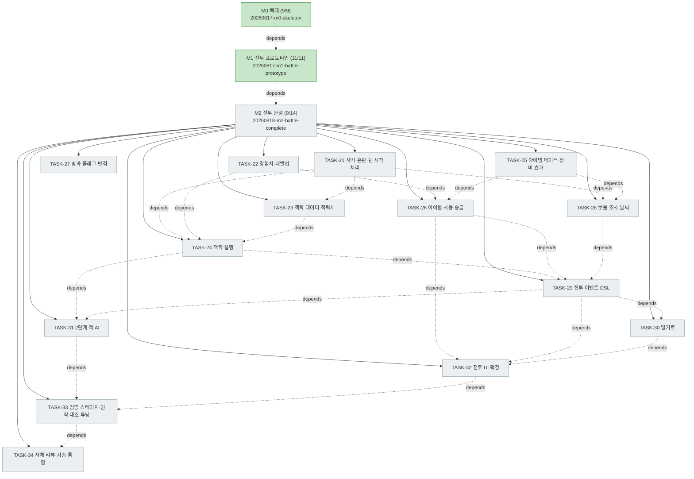

# PLAN-ygj-remake: 삼국지 영걸전 리메이크 구현 계획

> 문서 유형: `plan`
> 작업 ID: `20260818-m2-battle-complete`
> 상태: `in-progress`
> 기준선: `v1` (2026-08-17 승인)
> 작성일: 2026-08-17
> 최종 갱신: 2026-08-18
> 관련 문서: [REQ-ygj-remake: 요구사항](./requirements.md), [DESIGN-ygj-remake: 설계](./design.md), [결정 등록부](./decisions.md), [WORK-20260817-m0-skeleton: 작업 기록](./work/20260817-m0-skeleton/work-log.md), [WORK-20260817-m1-battle-prototype: 작업 기록](./work/20260817-m1-battle-prototype/work-log.md), [WORK-20260818-m2-battle-complete: 작업 기록](./work/20260818-m2-battle-complete/work-log.md)

## 요약

- 목적: 승인된 기준선 v1을 마일스톤 단위로 구현하기 위한 저장소 현행 계획. 진행 중인 사이클은 **M2 전투 완성**이다.
- 현재 결론 또는 상태: **M0 사이클 완료**(TASK-01~09, 검증 4/4 성공, [기록](./work/20260817-m0-skeleton/work-log.md)). **M1 사이클 완료**(TASK-10~20, 검증 VER-05~08 4/4 충족, [기록](./work/20260817-m1-battle-prototype/work-log.md)) — 화면에서 전투 한 판을 승리까지 완주했고 테스트 184건·타입 검사·데이터 검증·빌드가 모두 성공했다. **M2 사이클 계획 수립 완료**(2026-08-18) — 작업 14건(TASK-21~34)과 검증 7건(VER-09~15)을 아래에 정의했고 아직 구현을 시작하지 않았다.
- 다음 행동: [TASK-21](#task-21-사기혼란과-턴-시작-처리)부터 계획 순서대로 구현한다(wf-implement §3.3 TDD 사이클). 진행 상태는 이 문서의 작업 목록과 [M2 작업 기록](./work/20260818-m2-battle-complete/work-log.md)에 갱신한다.

## 문서 연결

| 방향 | 관계 | 대상 문서 | 대상 항목 | 비고 |
|---|---|---|---|---|
| input | baseline | [REQ-ygj-remake: 요구사항](./requirements.md) | FR-02~09, FR-11, FR-13, FR-17, FR-18, NFR-01~04, NFR-06, AC-01~04, AC-12 | 충족할 승인된 요구사항 |
| input | baseline | [DESIGN-ygj-remake: 설계](./design.md) | DES-01, DES-03~06, DES-12, DES-13 | 구현할 설계 요소 |
| input | decision | [ADR-002: 기술 스택 선정](./work/20260817-ygj-remake-baseline/ADR-002-기술-스택-선정.md) | document | 스택 제약 |
| input | decision | [ADR-003: 결정론적 RNG와 세이브 포함 정책](./work/20260817-ygj-remake-baseline/ADR-003-결정론적-RNG와-세이브-포함-정책.md) | document | TASK-10의 근거, M2 신규 판정(책략 명중·혼란·일기토)의 RNG 제약 |
| output | implementation | [WORK-20260817-m0-skeleton: 작업 기록](./work/20260817-m0-skeleton/work-log.md) | TASK-01~09, VER-01~04 | M0 수행 기록·검증 결과 |
| output | implementation | [WORK-20260817-m1-battle-prototype: 작업 기록](./work/20260817-m1-battle-prototype/work-log.md) | TASK-10~20, VER-05~08 | M1 수행 기록·검증 결과 |
| output | implementation | [WORK-20260818-m2-battle-complete: 작업 기록](./work/20260818-m2-battle-complete/work-log.md) | TASK-21~34, VER-09~15 | M2 수행 기록·검증 결과 |

## 기준선

- 관련 요구사항: [REQ-ygj-remake](./requirements.md) v1
  - M0·M1이 사용한 항목 — FR-02(전투 규칙), FR-03(상성), FR-11(적 AI), FR-13(데이터 주도·검증), FR-17(플레이스홀더 렌더), FR-18(전투 UI), NFR-01(결정론), NFR-02(로직·렌더 분리), NFR-03(데이터 무결성·내성), NFR-06(상수 튜닝), AC-01(데이터 검증), AC-02(전투 완주), AC-04(상성)
  - M2가 더하는 항목 — FR-04(책략), FR-05(사기·혼란), FR-06(경험치·레벨·승급), FR-07(아이템), FR-08(일기토), FR-09(이벤트 스크립트), NFR-04(AI 성능), AC-03(전투 규칙 재현), AC-12(AI 성능)
- 관련 설계: [DESIGN-ygj-remake](./design.md) v1 — DES-01(전투 코어), DES-03(데이터 계층), DES-04(결정론적 RNG), DES-05(렌더 계층), DES-06(UI 계층), DES-12(데이터 계약), DES-13(이벤트 DSL 계약 — M2 신규)
- 관련 ADR·DCR: [ADR-001](./work/20260817-ygj-remake-baseline/ADR-001-하이브리드-리메이크와-데이터-주도-엔진.md), [ADR-002](./work/20260817-ygj-remake-baseline/ADR-002-기술-스택-선정.md), [ADR-003](./work/20260817-ygj-remake-baseline/ADR-003-결정론적-RNG와-세이브-포함-정책.md)
- 규칙·수치 정본: [상세 스펙](../yeonggeoljeon-remake-spec-detail.md) §1.4(사기·혼란)·§1.5(책략)·§1.6(경험치·승급)·§1.7(지형·거점)·§3(이벤트 DSL)·§5(적 AI)·§7(일기토). 설계 문서가 이 절들을 정본으로 지목하므로 M2 구현은 값이 아니라 이 규칙을 따른다.

## 작업 정의

- 목표: [전체 설계 §8](../yeonggeoljeon-remake-design.md)의 마일스톤 완료 기준을 순서대로 충족한다. 각 사이클의 목표·범위는 아래 [작업 목록](#작업-목록)의 사이클별 절에 있다.
  - M0(완료): `npm run dev`로 맵이 렌더되고 `npm run validate`가 동작한다.
  - M1(완료): 테스트 스테이지 1개에서 전투 한 판을 완주한다([AC-02](./requirements.md#인수-조건)).
  - M2(진행 중): 원작 1장 수준의 전투를 규칙 누락 없이 재현하고 데미지를 실측 대조로 튜닝한다([AC-03](./requirements.md#인수-조건)).
- 범위: 기준선 v1이 규정한 엔진과 데이터 파이프라인 전체를 마일스톤 단위로 구현한다.
- 범위 밖(현재까지): 캠페인·세이브(M3), 맵 에디터(M3.5), 콘텐츠 데이터 입력(M4), 장수 에디터(M4.5), 그래픽 교체(M5), Tauri 패키징·CI(M6). 지금까지의 시드 데이터는 파이프라인·전투 검증용 최소 샘플이며 원작 데이터 입력이 아니다.
- 가정: Node.js LTS·npm 사용 가능(2026-08-17 확인 — v24.19.0 / npm 11.17.0 사용자 영역 설치).
- 위험: 렌더·입력 결과는 자동 테스트가 어려워 화면 확인에 의존한다([RISK-M0-01](#위험)). M2가 더하는 위험은 [RISK-M2-01~04](#위험)에 있다.

## 계획 트리

<!-- generated -->

```text
[✓] [작업] 20260817-m0-skeleton — M0 뼈대 ................ completed (9/9)           2026-08-17 21:08
    └─ 상세 트리 스냅숏: work-log.md의 계획 트리 절

[✓] [작업] 20260817-m1-battle-prototype — M1 전투 프로토타입 .. completed (11/11)      2026-08-17 23:39
    └─ 상세 트리 스냅숏: work-log.md의 계획 트리 절

[ ] [작업] 20260818-m2-battle-complete — M2 전투 완성 ..... pending (0/14)  depends: M1
    ├─ [ ] TASK-21 구현: 사기·혼란과 턴 시작 처리
    ├─ [ ] TASK-22 구현: 경험치·레벨업
    ├─ [ ] TASK-23 구현: 책략 데이터 계약과 책략치(MP)     depends: TASK-21
    ├─ [ ] TASK-24 구현: 책략 실행 커맨드                  depends: TASK-21, TASK-22, TASK-23
    ├─ [ ] TASK-25 구현: 아이템 데이터 계약과 장비 효과
    ├─ [ ] TASK-26 구현: 아이템 사용과 승급·계열 전환      depends: TASK-22, TASK-25
    ├─ [ ] TASK-27 구현: 병과 플래그와 반격
    ├─ [ ] TASK-28 구현: 보물·군량고 조사와 날씨           depends: TASK-21, TASK-25
    ├─ [ ] TASK-29 구현: 전투 이벤트 DSL 인터프리터        depends: TASK-24, TASK-26, TASK-28
    ├─ [ ] TASK-30 구현: 일기토                            depends: TASK-29
    ├─ [ ] TASK-31 구현: 2단계 적 AI                       depends: TASK-24, TASK-29
    ├─ [ ] TASK-32 구현: 전투 UI 확장                      depends: TASK-26, TASK-29, TASK-30
    ├─ [ ] TASK-33 검증: M2 검증 스테이지와 원작 대조 튜닝  depends: TASK-31, TASK-32
    └─ [ ] TASK-34 통합: 자체 리뷰·전체 검증·통합          depends: TASK-33
```



트리 표기 규칙(M1과 동일):

- M2의 14개 작업은 모두 형제이며 분해(`상위:`)가 없다. 순서 제약은 전부 `depends:`(점선)로 표현했다.
- wf-tree가 `implement` 노드마다 제안하는 `test`(선행)·`review` 자식은 채택하되 트리에서 펼치지 않는다 — 각 작업의 선행 테스트는 아래 작업 목록의 `검증 방법`에, 자체 리뷰는 [TASK-34](#task-34-자체-리뷰전체-검증통합)에 한 번 모아 두는 편이 14개 작업에서 더 읽기 쉽다. 생략이 아니라 표현 위치의 선택이다.
- 필수 게이트는 없다. M2에는 `release` 노드(push·PR·배포)와 `migrate` 노드가 없다 — 통합은 로컬 작업 사본까지이며 커밋·push는 사용자 요청이 있을 때 별도로 수행하고(wf-implement §2.3), 마이그레이션은 [아래](#마이그레이션과-롤백)대로 N/A다.

## 작업 목록

### M0 사이클 (완료)

완료·통합된 사이클이므로 축약형으로 유지한다. 각 작업의 수행 내용·결정·검증 증거는 [WORK-20260817-m0-skeleton](./work/20260817-m0-skeleton/work-log.md)이 정본이다.

사이클 완료: **2026-08-17 21:08** — 계획에서 M0 노드가 `completed`로 전이된 시각이며, 축약된 사이클이므로 완료 시점을 사이클 단위 하나로 요약했다. M0는 9건을 한 묶음으로 완료 처리해 TASK별 완료 시각이 기록되지 않았다.

| 작업 | 상태 | 상위 | 요약 |
|---|---|---|---|
| TASK-01 | completed | 없음 | Vite+TS(strict)+PixiJS+Vitest 스캐폴딩 |
| TASK-02 | completed | 없음 | zod 데이터 스키마 정의 (`src/core/data/schemas.ts`) |
| TASK-03 | completed | TASK-02 | 스키마 검증 테스트 (선행, Red→Green) |
| TASK-04 | completed | 없음 | 시드 데이터 (지형 9·병과 6·상성 9·스테이지 1) |
| TASK-05 | completed | 없음 | 데이터 로더·참조 무결성 검사 (`loader.ts`, `integrity.ts`) |
| TASK-06 | completed | TASK-05 | 무결성·AC-01 인수 테스트 (선행, Red→Green) |
| TASK-07 | completed | 없음 | validate CLI (`npm run validate`, 실패 시 exit 1) |
| TASK-08 | completed | 없음 | PixiJS 타일맵 렌더·플레이스홀더 파이프라인 |
| TASK-09 | completed | 없음 | 자체 리뷰·전체 검증·통합 |

### M1 사이클 (완료)

목표: [전체 설계 §8](../yeonggeoljeon-remake-design.md)의 M1 완료 기준 — 테스트 스테이지 1개에서 전투 한 판을 완주한다([AC-02](./requirements.md#인수-조건)).

범위: 유닛 배치·선택·이동(코스트 기반 이동 범위), 근접/원거리 공격과 데미지 공식·상성, 턴 교대, 1단계 AI, 승패 판정, 결정론적 RNG.
범위 밖: 책략·아이템·사기 변동·혼란·경험치·레벨업·승급·일기토·전투 이벤트(전부 M2), 캠페인·세이브(M3).

완료·통합된 사이클이므로 축약형으로 유지한다. 각 작업의 목표·수행 내용·결정·검증 증거는 [WORK-20260817-m1-battle-prototype](./work/20260817-m1-battle-prototype/work-log.md)이 정본이다. 각 작업은 [TDD 사이클](./work/20260817-m1-battle-prototype/work-log.md#수행-기록)을 따랐다 — 각 작업 기록의 "실행한 검증"에 Red→Green 전환이 남아 있다.

아래 표의 네 번째 열은 `의존`(순서 제약)이다. M1 계획 수립 당시 `상위`(분해)로 적었으나 M1 작업은 모두 형제이며 분해가 없었고, [완료 시점 트리 스냅숏](./work/20260817-m1-battle-prototype/work-log.md#계획-트리)도 같은 값을 `depends:`로 렌더했다. 스냅숏에 맞춘 열 이름 정정이며 기록된 관계는 바뀌지 않았다.

| 작업 | 상태 | 완료 | 의존 | 요약 |
|---|---|---|---|---|
| TASK-10 | completed | 2026-08-17 21:26 | 없음 | 결정론적 RNG — xoshiro128**와 상태 직렬화·복원 (`src/core/rng.ts`) |
| TASK-11 | completed | 2026-08-17 21:35 | 없음 | 전투 데이터 확장 — 무장·전투 상수·스테이지 배치/적/승패 조건 |
| TASK-12 | completed | 2026-08-17 21:39 | TASK-11 | 전투 상태 구성 (`createBattleState`, 병력 상한식 확정) |
| TASK-13 | completed | 2026-08-17 21:45 | TASK-12 | 이동 범위 계산 (다익스트라, 이동 제약 우선순위 확정) |
| TASK-14 | completed | 2026-08-17 21:49 | TASK-10, TASK-11 | 데미지 공식과 상성 (상성 방향 0.75=유리 고정) |
| TASK-15 | completed | 2026-08-17 22:06 | TASK-13, TASK-14 | 커맨드 적용 (`applyCommand` — 이동·공격·대기, 반격 없음) |
| TASK-16 | completed | 2026-08-17 22:13 | TASK-15 | 턴 진행과 승패 판정 (`endPhase`·`isPhaseComplete`·`outcome`) |
| TASK-17 | completed | 2026-08-17 22:17 | TASK-15 | 1단계 적 AI (접근·공격, 페이즈 종료 보장) |
| TASK-18 | completed | 2026-08-17 22:28 | TASK-13 | 유닛 렌더와 범위 하이라이트 (VER-08 충족) |
| TASK-19 | completed | 2026-08-17 23:19 | TASK-16, TASK-17, TASK-18 | 전투 입력과 명령 UI (씬·HUD·상태 기계, VER-05 충족) |
| TASK-20 | completed | 2026-08-17 23:39 | TASK-19 | 자체 리뷰·전체 검증·통합 (예상 데미지 결함 1건 수정) |

### M2 사이클 (진행 중)

목표: [전체 설계 §8](../yeonggeoljeon-remake-design.md)의 M2 완료 기준 — 원작 1장 수준의 전투를 규칙 누락 없이 재현하고([AC-03](./requirements.md#인수-조건)) 데미지를 실측 대조로 튜닝한다.

범위: 사기·혼란, 책략(전 카테고리와 지형·날씨 게이트), 아이템(장비 효과·사용·승급·계열 전환), 경험치·레벨업, 거점 회복과 보물·군량고 조사, 날씨, 전투 이벤트 스크립트(`scope: "battle"`), 일기토, 2단계 적 AI(프로필·가중치·난이도), 그리고 이들을 조작·표시하는 전투 UI. M1이 남긴 반격(`counterAttack`)과 병과 플래그 3종도 여기서 구현한다 — 플래그를 가진 병과 데이터가 M2 원작 대조에서 들어오기 때문이다([M1 후속 작업](./work/20260817-m1-battle-prototype/work-log.md#후속-작업)).

범위 밖과 그 이유:

- **캠페인 스코프 이벤트(`scope: "camp"`)·분기·세이브** — M3. M2는 전투 안에서 끝나는 `battle` 스코프만 구현한다([M2 착수 전 조사](#m2-착수-전-조사-2026-08-17-wf-implement-3132)).
- **`officerLost` 패배 판정 재정의와 출진 명단 구멍** — M3(편성)이 소유한다. 부분 출진이 생겨야 "출진하지 않음"과 "격파됨"을 구분할 이유가 생긴다([M1 후속 작업](./work/20260817-m1-battle-prototype/work-log.md#후속-작업)).
- **장수 전사에 의한 캠페인 영구 이탈과 `essential` 처리** — M3. M2는 전투 안의 효과(아군 장수 전사 시 전체 사기 감소)까지만 다룬다.
- **승패 조건 유형 확장(도달·생존·턴 제한)** — 필요해지는 마일스톤에서 추가한다. M1 스키마 주석은 "M2에서 유형을 늘린다"고 적었으나, [TASK-29](#task-29-전투-이벤트-dsl-인터프리터)의 `endBattle` 액션이 특수 승패를 이벤트로 표현하므로 원작 1장 수준에는 새 조건 유형이 필요하지 않다. 조건 유형을 늘리는 것은 새 데이터 계약이므로 필요성이 확인될 때 넣는다(최소 구현 원칙).
- **제3세력 페이즈** — 원작 1장에 제3세력 스테이지가 없다. 페이즈 순서를 `Side` 2값에 묶어 두고, 필요한 스테이지가 들어오는 마일스톤에서 확장한다.
- **원작 콘텐츠 데이터 입력(무장·스테이지·아이템 전수)** — M4. M2가 만드는 `tactics.json`·`items.json`과 검증 스테이지는 규칙을 실행해 보기 위한 **최소 샘플**이며 원작 데이터가 아니다([RISK-M0-02](#위험)).
- **상점·자금** — M3(중간 메뉴). M2는 아이템의 전투 내 획득(보물)과 사용만 다룬다.
- **경험치 공유 토글의 UI 노출** — 토글 값은 `game-config.json`에 두고 코어가 읽되, 설정 화면은 M3에서 만든다.

각 작업은 [wf-implement §3.3의 TDD 사이클](./work/20260817-m1-battle-prototype/work-log.md#수행-기록)을 따른다 — `검증 방법`의 선행 테스트를 먼저 작성해 실패(Red)를 확인한 뒤 구현한다.

#### TASK-21: 사기·혼란과 턴 시작 처리

- 상태: pending
- 상위: 없음
- 목표: 사기가 오르내리고 낮은 사기가 혼란을 부르며, 턴 시작에 거점 회복과 상태이상 판정이 정해진 순서로 일어난다.
- 관련 요구사항과 설계: [FR-05](./requirements.md#기능-요구사항), [FR-02](./requirements.md#기능-요구사항), [NFR-06](./requirements.md#비기능-요구사항), [DES-01](./design.md#컴포넌트와-책임) — 규칙 정본 [상세 스펙 §1.1 턴 시작 처리 순서·§1.4·§1.7 거점 회복](../yeonggeoljeon-remake-spec-detail.md)
- 변경 대상: `src/core/battle/state.ts`(`Unit.confused`), `turn.ts`(턴 시작 처리 파이프라인), `commands.ts`(피격 사기 감소·혼란 부대 조작 제한), `events.ts`(사기·혼란 이벤트 유형), `src/core/data/schemas.ts`(`CombatConfig` 확장), `data/config/combat-config.json`, `tests/battle/morale.test.ts`(신규)·`turn.test.ts`·`commands.test.ts`
- 의존성: 없음
- 위험: 턴 시작 처리는 이후 거의 모든 작업(책략치 회복·자연 회복 아이템·날씨·이벤트)이 끼어드는 지점이다. 순서를 [상세 스펙 §1.1](../yeonggeoljeon-remake-spec-detail.md)의 ①~⑤ 그대로 고정하고 각 단계를 독립 함수로 두어 뒤 작업이 자리만 채우게 한다.
- 검증 방법: 선행 테스트 `tests/battle/morale.test.ts` — 피격 시 `moraleLossOnHit`만큼 사기가 줄고 0 미만으로 내려가지 않는다 / 사기가 `confusionThreshold` 미만이면 턴 시작 판정에서 고정 시드로 혼란이 걸린다 / 혼란 부대의 커맨드가 `BattleCommandError`로 거부된다 / 사기가 임계값 이상으로 회복되면 즉시 해제된다 / 거점 위 부대는 턴 시작에 병력 +10%·사기 +5를 얻고 상한을 넘지 않는다. `turn.test.ts`에 턴 시작 처리 순서(거점 회복이 혼란 판정보다 먼저)를 고정하는 테스트를 더한다.
- 완료 조건: 위 테스트가 Red→Green으로 통과하고, 새 상수 5종 이상이 전부 `combat-config.json`에 있으며 코드에 숫자 리터럴이 없다. `npm test`·`npm run validate` 성공.

#### TASK-22: 경험치·레벨업

- 상태: pending
- 상위: 없음
- 목표: 행동으로 경험치가 쌓이고 누적 100마다 레벨이 오르며, 격파 경험치는 막타 부대가 독식한다.
- 관련 요구사항과 설계: [FR-06](./requirements.md#기능-요구사항), [NFR-06](./requirements.md#비기능-요구사항), [DES-01](./design.md#컴포넌트와-책임) — 규칙 정본 [상세 스펙 §1.6](../yeonggeoljeon-remake-spec-detail.md)
- 변경 대상: `src/core/battle/experience.ts`(신규), `state.ts`(`Unit.exp`), `commands.ts`(공격·격파 경험치 지급), `events.ts`(`expGained`·`leveledUp`), `schemas.ts`(`CombatConfig` 경험치 상수, `GameConfig.shareExp`), `data/config/{combat,game}-config.json`, `tests/battle/experience.test.ts`(신규)
- 의존성: 없음
- 위험: 레벨업은 `hpMax`를 바꾸므로 전투 중 파생치 재계산 경로가 생긴다. [M1이 확정한 `hpMaxOf(officer, level)`](./work/20260817-m1-battle-prototype/work-log.md#재개-지점)를 유일한 계산 경로로 유지해 전투 중 값과 배치 시 값이 갈라지지 않게 한다.
- 검증 방법: 선행 테스트 `tests/battle/experience.test.ts` — 공격 성공 시 `clamp(dmg/expDivisor, 1, 40)`만큼 얻는다 / 격파 보너스가 막타 부대에만 들어간다 / 누적 100에서 레벨이 1 오르고 잔여 경험치가 이월된다 / 레벨업으로 `hpMax`가 `hpPerLevel`만큼 오르고 병력도 같은 양 회복된다 / 레벨 99에서 더 오르지 않는다 / `shareExp: true`면 생존 아군에게 분배된다(기본 OFF이므로 토글 양쪽을 모두 고정한다).
- 완료 조건: 위 테스트가 Red→Green으로 통과하고 경험치 상수가 전부 config에 있다. `npm test` 성공.

#### TASK-23: 책략 데이터 계약과 책략치(MP)

- 상태: pending
- 상위: 없음
- 목표: `tactics.json`이 스키마·무결성 검사와 함께 존재하고, 부대가 지력·레벨에서 파생된 책략치를 갖는다.
- 관련 요구사항과 설계: [FR-04](./requirements.md#기능-요구사항), [FR-13](./requirements.md#기능-요구사항), [NFR-03](./requirements.md#비기능-요구사항), [AC-01](./requirements.md#인수-조건), [DES-03](./design.md#컴포넌트와-책임), [DES-12](./design.md#컴포넌트와-책임) — 계약 정본 [전체 설계 §4.4](../yeonggeoljeon-remake-design.md), 규칙 정본 [상세 스펙 §1.5](../yeonggeoljeon-remake-spec-detail.md)
- 변경 대상: `src/core/data/schemas.ts`(`TacticSchema`), `data/tactics.json`(신규 — 카테고리별 최소 샘플), `data/classes.json`(`tactics` 배열을 병과별로 채움), `src/core/data/{loader,integrity}.ts`, `src/browserData.ts`, `scripts/readGameData.ts`, `src/core/battle/state.ts`(`Unit.mp`/`mpMax`, `mpMaxOf`), `turn.ts`(거점 턴 회복에 책략치 추가), `tests/data/{schemas,integrity}.test.ts`, `tests/battle/state.test.ts`
- 의존성: TASK-21 — 거점 턴 회복 자리가 이미 있어야 책략치 회복을 얹을 수 있다.
- 위험: 데이터 파일이 하나 늘면 로더·validate CLI·브라우저 로드 3경로를 모두 손대야 한다(M0에서 만든 경로). 한 곳을 빠뜨리면 브라우저에서만 깨지므로 세 경로 각각에 테스트 또는 실행 확인을 남긴다.
- 검증 방법: 선행 테스트 — `tests/data/schemas.test.ts`에 `tactics.json` 스키마 위반(음수 `cost`, 알 수 없는 `category`·`effect`·`area`)이 거부되는 케이스, `tests/data/integrity.test.ts`에 병과의 `tactics`가 없는 책략 ID를 가리키면 에러 목록에 오르는 케이스를 먼저 만든다. `tests/battle/state.test.ts`에 `mpMax = int/4 + level` 파생과 배치 시 `mp = mpMax` 초기화를 고정한다.
- 완료 조건: 위 테스트가 Red→Green으로 통과하고 `npm run validate`가 정상 데이터에 exit 0, 참조를 깨뜨린 데이터에 exit 1을 낸다. `npm run build`로 브라우저 로드 경로가 컴파일된다.

#### TASK-24: 책략 실행 커맨드

- 상태: pending
- 상위: 없음
- 목표: `UseTactic` 커맨드가 명중·피해·회복·상태 변화를 규칙대로 적용하고, 지형·날씨·거점 게이트가 사용을 막는다.
- 관련 요구사항과 설계: [FR-04](./requirements.md#기능-요구사항), [NFR-01](./requirements.md#비기능-요구사항), [AC-03](./requirements.md#인수-조건), [DES-01](./design.md#컴포넌트와-책임) — 규칙 정본 [상세 스펙 §1.5](../yeonggeoljeon-remake-spec-detail.md)
- 변경 대상: `src/core/battle/tactics.ts`(신규 — 명중·피해·범위·게이트), `commands.ts`(`UseTactic` 분기), `events.ts`(`tacticUsed`·`tacticMissed`·`healed`·`moraleChanged`), `data/config/combat-config.json`(`tacticHitMin`·`tacticHitMax` 등), `tests/battle/tactics.test.ts`(신규)
- 의존성: TASK-21(사기저하·혼란 효과가 붙을 상태), TASK-22(책략 성공 경험치), TASK-23(데이터와 MP)
- 위험: 게이트 조합(카테고리 × 지형 × 날씨 × 거점)이 많아 누락이 그대로 규칙 누락(AC-03 미달)이 된다. [설계의 검증 전략](./design.md#검증-전략)이 "책략 게이트 전 조합"을 단위 테스트로 지정했으므로 조합을 표로 만들어 전수 테스트한다.
- 검증 방법: 선행 테스트 `tests/battle/tactics.test.ts` — 화계는 우천에 사용 불가·숲 대상 ×1.25 / 수계는 평지·다리 대상만·우천 ×1.25 / 지계는 산·황무지 대상만 / 거점 위 부대에 공격 책략이 무효 / `cross5`가 상하좌우 5타일에 아군 오폭 포함으로 적용된다 / 명중률 `clamp(50 + 지력차, min, max)`가 고정 시드에서 판정된다 / 회복계는 항상 성공하고 상한을 넘지 않는다 / MP 부족·병과 미보유·사거리 밖이 거부된다. 결정론(VER-12)은 같은 시드에서 같은 명중·피해가 나오는 테스트로 고정한다.
- 완료 조건: 게이트 전 조합 테스트가 Red→Green으로 통과하고 책략 상수가 전부 config에 있다. `npm test` 성공.

#### TASK-25: 아이템 데이터 계약과 장비 효과

- 상태: pending
- 상위: 없음
- 목표: `items.json`이 스키마·무결성 검사와 함께 존재하고, 부대가 지닌 장비가 데미지와 이동에 상시 반영된다.
- 관련 요구사항과 설계: [FR-07](./requirements.md#기능-요구사항), [FR-13](./requirements.md#기능-요구사항), [AC-01](./requirements.md#인수-조건), [AC-04](./requirements.md#인수-조건), [DES-03](./design.md#컴포넌트와-책임), [DES-12](./design.md#컴포넌트와-책임) — 계약 정본 [전체 설계 §4.5](../yeonggeoljeon-remake-design.md), 규칙 정본 [상세 스펙 §1.6](../yeonggeoljeon-remake-spec-detail.md)
- 변경 대상: `src/core/data/schemas.ts`(`ItemSchema` — `type` 7종, `forbiddenFor`), `data/items.json`(신규 — 타입별 최소 샘플), `src/core/data/{loader,integrity}.ts`, `src/browserData.ts`, `scripts/readGameData.ts`, `src/core/battle/state.ts`(`Unit.items` 8칸 상한), `damage.ts`(`itemAtkMul`·`itemDefMul`), `movement.ts`(`mount` 이동력 +n), `tests/battle/damage.test.ts`·`movement.test.ts`, `tests/data/integrity.test.ts`
- 의존성: 없음
- 위험: 장비 효과는 M1이 고정한 데미지 공식에 곱셈 항을 더한다. [M1의 데미지 테스트](./work/20260817-m1-battle-prototype/work-log.md#수행-기록)가 그대로 통과해야 하며(장비 없음 = 배수 1), 통과하지 않으면 기존 동작 회귀다.
- 검증 방법: 선행 테스트 — `tests/data/integrity.test.ts`에 `forbiddenFor`에 값이 든 `classChange`·`classUpgrade` 아이템이 경고로 보고되는 케이스([FR-07](./requirements.md#기능-요구사항)의 "장수별 사용 제한 없음"), 소지품 9개째가 거부되는 케이스. `tests/battle/damage.test.ts`에 무기·병법서 배수가 공격·방어에 곱해지고 장비가 없으면 결과가 M1과 같음을 고정(**VER-10**: 상성 3×3 × 지형 × 아이템 보정). `movement.test.ts`에 `mount`가 이동 범위를 넓히는 케이스.
- 완료 조건: 위 테스트가 Red→Green으로 통과하고 M1 데미지·이동 테스트가 그대로 통과한다. `npm run validate` 성공.

#### TASK-26: 아이템 사용과 승급·계열 전환

- 상태: pending
- 상위: 없음
- 목표: `UseItem` 커맨드가 소모품·자연 회복·승급·계열 전환을 적용하고, 승급이 병과와 파생치를 데이터 기준으로 교체한다.
- 관련 요구사항과 설계: [FR-06](./requirements.md#기능-요구사항), [FR-07](./requirements.md#기능-요구사항), [FR-03](./requirements.md#기능-요구사항), [AC-03](./requirements.md#인수-조건), [DES-01](./design.md#컴포넌트와-책임) — 규칙 정본 [상세 스펙 §1.6](../yeonggeoljeon-remake-spec-detail.md)
- 변경 대상: `src/core/battle/items.ts`(신규 — 사용 조건·효과 적용·승급), `commands.ts`(`UseItem` 분기), `turn.ts`(`regen` 턴 회복을 턴 시작 ③에 배치), `events.ts`(`itemUsed`·`classChanged`), `tests/battle/items.test.ts`(신규)
- 의존성: TASK-22(승급 레벨 조건), TASK-25(아이템 데이터·소지품)
- 위험: 승급은 `classId`를 바꿔 이동 규칙·사거리·상성 계열까지 한 번에 바꾼다. 병과 교체 후 파생치를 다시 계산하지 않으면 상태가 데이터와 어긋난다.
- 검증 방법: 선행 테스트 `tests/battle/items.test.ts` — `classUpgrade`가 `upgradeLevel` 미만에서 거부되고 도달 시 `upgradesTo`로 교체되며 `hpMax`·`mpMax`·사거리가 새 병과 기준으로 갱신된다 / `classChange`는 계열을 바꾸고 레벨을 유지한다 / **어떤 장수에게도 사용 제한이 걸리지 않는다**([FR-07](./requirements.md#기능-요구사항)의 설계 결정 — 유비에 해당하는 시드 무장으로 고정) / `consumable`이 책략 효과를 복제하고 소지품에서 사라진다 / `regen`이 턴 시작에 회복시킨다 / 사용은 행동 1회를 소비한다.
- 완료 조건: 위 테스트가 Red→Green으로 통과한다. `npm test` 성공.

#### TASK-27: 병과 플래그와 반격

- 상태: pending
- 상위: 없음
- 목표: `counterAttack`·`mountainMove`·`noTerrainPenalty` 플래그가 실제로 동작하고, 플래그를 가진 병과가 데이터에 존재한다.
- 관련 요구사항과 설계: [FR-02](./requirements.md#기능-요구사항)(반격 플래그 예외), [FR-03](./requirements.md#기능-요구사항), [DES-01](./design.md#컴포넌트와-책임) — 규칙 정본 [상세 스펙 §1.1·§1.2](../yeonggeoljeon-remake-spec-detail.md), 근거 [M1 후속 작업](./work/20260817-m1-battle-prototype/work-log.md#후속-작업)
- 변경 대상: `src/core/battle/commands.ts`(피격 직후 1회 반격), `movement.ts`(`mountainMove`·`noTerrainPenalty`), `damage.ts`(`noTerrainPenalty`의 지형 보정 무시 범위 확정), `events.ts`(`countered`), `data/classes.json`(플래그를 가진 특수 병과 추가), `tests/battle/{commands,movement}.test.ts`
- 의존성: 없음
- 위험: 반격은 공격 커맨드 하나가 두 번의 데미지 판정과 두 번의 격파 판정을 낳는다. 반격으로 공격자가 격파되는 경우, 방어자가 이미 격파된 경우, 반격이 사거리 밖인 경우의 순서를 테스트로 못박지 않으면 상태가 꼬인다.
- 검증 방법: 선행 테스트 — `commands.test.ts`에 `counterAttack` 병과가 사거리 안에서 피격 시 1회만 반격한다 / 사거리 밖이면 반격하지 않는다 / 반격으로 격파되면 격파 이벤트가 나고 원 공격자가 사라진다 / 플래그가 없으면 M1대로 반격이 없다. `movement.test.ts`에 `mountainMove`가 산 진입을 허용하고 `noTerrainPenalty`가 코스트를 1로 만든다.
- 완료 조건: 위 테스트가 Red→Green으로 통과하고, 플래그 없는 기존 병과의 M1 테스트가 그대로 통과한다. `npm run validate` 성공.

#### TASK-28: 보물·군량고 조사와 날씨

- 상태: pending
- 상위: 없음
- 목표: 맵의 보물·군량고를 1회성으로 획득할 수 있고, 스테이지 날씨가 고정 또는 동적으로 정해져 책략 게이트에 반영된다.
- 관련 요구사항과 설계: [FR-07](./requirements.md#기능-요구사항)(전투맵 보물 획득), [FR-04](./requirements.md#기능-요구사항)(날씨 게이트), [FR-13](./requirements.md#기능-요구사항), [DES-12](./design.md#컴포넌트와-책임) — 규칙 정본 [상세 스펙 §1.7](../yeonggeoljeon-remake-spec-detail.md), 계약 정본 [전체 설계 §4.6](../yeonggeoljeon-remake-design.md)
- 변경 대상: `src/core/data/schemas.ts`(`Stage.treasures`, `weather`를 `fixed`/`dynamic` 형태로 확장), `data/scenario/stages/stage-test.json`, `src/core/battle/state.ts`(`treasuresTaken`), `commands.ts`(조사 행동), `turn.ts`(동적 날씨 전이를 턴 시작에 배치), `src/core/data/integrity.ts`(보물 좌표·아이템 참조 검사), `tests/battle/treasure.test.ts`(신규), `tests/data/integrity.test.ts`
- 의존성: TASK-21(턴 시작 파이프라인), TASK-25(획득할 아이템)
- 위험: `weather` 스키마를 바꾸면 M1의 스테이지 데이터와 `BattleState.weather`가 함께 움직인다. 기존 값(`"clear"`)을 그대로 읽을 수 있게 유지하지 않으면 M1 테스트가 깨진다.
- 검증 방법: 선행 테스트 `tests/battle/treasure.test.ts` — 보물 칸에서 조사하면 아이템이 소지품에 들어가고 `treasuresTaken`에 기록된다 / 같은 보물을 두 번 얻을 수 없다 / 소지품이 8개면 획득이 거부된다 / 동적 날씨가 고정 시드에서 정해진 확률·지속 턴대로 바뀐다 / 우천이 화계를 막는다(TASK-24 게이트와 연결). `integrity.test.ts`에 보물이 맵 밖 좌표나 없는 아이템을 가리키면 에러가 나는 케이스.
- 완료 조건: 위 테스트가 Red→Green으로 통과하고 M1 스테이지 데이터가 그대로 로드된다. `npm run validate` 성공.

#### TASK-29: 전투 이벤트 DSL 인터프리터

- 상태: pending
- 상위: 없음
- 목표: 스테이지에 정의한 이벤트가 트리거·조건에 따라 발동하고 액션이 상태에 적용되며, `once` 이벤트가 두 번 발동하지 않는다.
- 관련 요구사항과 설계: [FR-09](./requirements.md#기능-요구사항), [FR-10](./requirements.md#기능-요구사항)(일부 액션), [AC-03](./requirements.md#인수-조건), [DES-02](./design.md#컴포넌트와-책임), [DES-13](./design.md#컴포넌트와-책임) — 계약 정본 [상세 스펙 §3](../yeonggeoljeon-remake-spec-detail.md)
- 변경 대상: `src/core/campaign/eventRunner.ts`(신규 — [상세 스펙 §3](../yeonggeoljeon-remake-spec-detail.md)이 지정한 위치), `src/core/data/schemas.ts`(트리거 9종·액션 스키마, `Stage.events`), `src/core/battle/state.ts`(`firedEvents`), `commands.ts`·`turn.ts`(커맨드 직후·턴 경계 평가 지점), `events.ts`(대화·연출 이벤트 유형), `data/scenario/stages/stage-test.json`, `tests/campaign/eventRunner.test.ts`(신규)
- 의존성: TASK-24, TASK-26, TASK-28 — 액션(`changeMorale`·`giveItem`·`giveExp`·`setWeather` 등)이 그 기능들을 호출한다.
- 위험: 트리거 평가 지점을 커맨드·턴 양쪽에 배선하면 재진입(이벤트가 상태를 바꿔 다른 이벤트를 부르는 상황)이 생긴다. 평가는 커맨드 적용이 끝난 뒤 한 번, 발동 순서는 스테이지 배열 순서로 고정한다([상세 스펙 §3.4](../yeonggeoljeon-remake-spec-detail.md)).
- 검증 방법: 선행 테스트 `tests/campaign/eventRunner.test.ts` — 트리거 9종이 각각 자기 조건에서만 발동한다 / `once` 이벤트가 `firedEvents` 기록 후 재발동하지 않는다 / 동시 발동이 배열 순서대로 실행된다 / `condition`(플래그)이 거짓이면 액션이 실행되지 않는다 / `scope: "camp"` 이벤트는 전투 중 평가되지 않는다 / `spawnUnits`·`removeUnit`·`changeMorale`·`giveItem`·`giveExp`·`setWeather`·`endBattle`이 상태에 반영된다 / `endBattle`이 승패 판정을 덮어쓴다.
- 완료 조건: 위 테스트가 Red→Green으로 통과하고, 이벤트가 없는 M1 스테이지의 동작이 바뀌지 않는다. `npm test`·`npm run validate` 성공.

#### TASK-30: 일기토

- 상태: pending
- 상위: 없음
- 목표: `duel` 액션이 고정 승패와 능력치 판정(`judge`)을 모두 처리하고 승패 효과가 전투 상태에 적용된다.
- 관련 요구사항과 설계: [FR-08](./requirements.md#기능-요구사항), [NFR-01](./requirements.md#비기능-요구사항), [AC-03](./requirements.md#인수-조건), [DES-13](./design.md#컴포넌트와-책임) — 규칙 정본 [상세 스펙 §7](../yeonggeoljeon-remake-spec-detail.md)
- 변경 대상: `src/core/battle/duel.ts`(신규 — 판정과 승패 효과), `src/core/campaign/eventRunner.ts`(`duel` 액션 배선), `src/core/data/schemas.ts`(`duel` 액션 스키마), `events.ts`(`duelStarted`·`duelResolved`), `tests/battle/duel.test.ts`(신규)
- 의존성: TASK-29 — 일기토는 이벤트 트리거로만 발동한다([상세 스펙 §7.1](../yeonggeoljeon-remake-spec-detail.md)).
- 위험: 승리 효과(패자 즉시 괴멸 또는 퇴각)가 승패 판정과 겹친다. 일기토 결과로 필수 장수가 사라지는 경우를 [`outcome`](./work/20260817-m1-battle-prototype/work-log.md#재개-지점)이 그대로 잡는지 확인해야 한다.
- 검증 방법: 선행 테스트 `tests/battle/duel.test.ts` — `outcome: "aWins"`가 RNG를 소비하지 않고 지정대로 끝난다 / `judge`가 `clamp(50 + 무력차 × 2, 5, 95)` 승률로 고정 시드에서 판정하고 RNG를 정확히 1회 소비한다 / 승자 경험치 +100(즉시 레벨업)과 아군 전체 사기 +N이 적용된다 / 패자가 스크립트 지정대로 괴멸 또는 퇴각한다 / `onAWin`/`onBWin` 하위 액션이 실행된다.
- 완료 조건: 위 테스트가 Red→Green으로 통과하고 일기토 상수가 전부 config에 있다. `npm test` 성공.

#### TASK-31: 2단계 적 AI

- 상태: pending
- 상위: 없음
- 목표: 적 부대가 프로필과 가중치 스코어링으로 행동하고, 이벤트로 프로필을 바꿀 수 있으며, 적 페이즈 계산이 100ms 안에 끝난다.
- 관련 요구사항과 설계: [FR-11](./requirements.md#기능-요구사항), [NFR-04](./requirements.md#비기능-요구사항), [NFR-06](./requirements.md#비기능-요구사항), [AC-12](./requirements.md#인수-조건), [DES-01](./design.md#컴포넌트와-책임) — 규칙 정본 [상세 스펙 §5](../yeonggeoljeon-remake-spec-detail.md)
- 변경 대상: `src/core/battle/ai.ts`(프로필 5종·`W1~W6` 스코어링·책략 사용 판단으로 재작성), `src/core/data/schemas.ts`(`CombatConfig.ai` 가중치·난이도 프리셋, `StageUnit.ai`·`aiParams`), `data/config/combat-config.json`, `data/scenario/stages/stage-test.json`, `src/core/campaign/eventRunner.ts`(`setAiProfile` 액션), `tests/battle/ai.test.ts`, `tests/battle/ai-performance.test.ts`(신규)
- 의존성: TASK-24(책략 사용 판단), TASK-29(`setAiProfile` 액션)
- 위험: 후보가 `이동 가능 타일 × (공격 타깃 ∪ 책략 타깃)`으로 늘어 [AC-12](./requirements.md#인수-조건)의 100ms를 넘길 수 있다([RISK-M2-04](#위험)). 성능 테스트를 **선행**으로 작성해 구현 중 초과를 즉시 보게 한다. 또한 M1이 세운 결정론(동점 시 무장 ID 순)을 스코어 동점 처리에도 유지해야 한다(NFR-01).
- 검증 방법: 선행 테스트 — `tests/battle/ai-performance.test.ts`에 적 20부대 스테이지의 적 페이즈 전체가 100ms 이내에 끝나는 측정(**VER-11**). `ai.test.ts`에 프로필별 행동 — `defensive`가 `alertRange` 밖에서 대기하고 안으로 들어오면 영구히 aggressive로 바뀐다 / `guard`가 지정 좌표를 벗어나지 않는다 / `support`가 아군 회복을 우선하고 위험 시 후퇴한다 / `flee`가 탈출점으로 이동한다 / 기대 데미지가 통상 공격을 넘고 MP가 충분하면 책략을 고른다 / 같은 시드·같은 배치가 같은 커맨드 열을 낸다 / 어떤 배치에서도 페이즈가 끝난다(M1 보장 유지).
- 완료 조건: 성능 테스트를 포함한 위 테스트가 Red→Green으로 통과하고 가중치·난이도 값이 전부 `combat-config.json`에 있다. `npm test` 성공.

#### TASK-32: 전투 UI 확장

- 상태: pending
- 상위: 없음
- 목표: 화면에서 책략·아이템·조사를 고를 수 있고, 사기·책략치·상태이상·경험치와 이벤트·일기토 연출이 표시된다.
- 관련 요구사항과 설계: [FR-18](./requirements.md#기능-요구사항), [FR-17](./requirements.md#기능-요구사항), [NFR-03](./requirements.md#비기능-요구사항), [DES-05](./design.md#컴포넌트와-책임), [DES-06](./design.md#컴포넌트와-책임) — 규칙 정본 [상세 스펙 §8.1~8.3](../yeonggeoljeon-remake-spec-detail.md)
- 변경 대상: `src/ui/BattleHud.ts`(사기·MP·상태이상·경험치, 책략·아이템 메뉴), `src/ui/UnitStatusPanel.ts`·`DialogueBox.ts`·`DuelCutin.ts`(신규), `src/scenes/BattleInteraction.ts`(책략·아이템 대상 지정 상태 추가), `src/scenes/BattleScene.ts`(이벤트 큐 재생·스킵), `src/render/EffectRenderer.ts`(신규 또는 `HighlightRenderer` 확장 — 책략 범위 표시), `index.html`, `tests/scenes/interaction.test.ts`
- 의존성: TASK-26, TASK-29, TASK-30 — 표시·조작 대상이 먼저 있어야 한다.
- 위험: 렌더·입력은 자동 검증이 어렵다([RISK-M0-01](#위험)). M1과 같은 방식으로 판정 가능한 부분(대상 지정 상태 기계, 메뉴 가용 여부, 예상 수치 계산)을 순수 함수로 떼어 테스트하고 그리기만 화면 확인에 남긴다.
- 검증 방법: 선행 테스트 `tests/scenes/interaction.test.ts` — 책략 선택 시 MP·병과·사거리로 가용 목록이 걸러진다 / 대상 지정 중 취소가 이전 상태로 돌아간다 / 혼란 부대는 조작 메뉴가 열리지 않는다 / 예상 데미지·명중률이 코어와 같은 함수로 계산된다(M1이 고친 결함의 재발 방지) / 소지품이 없으면 아이템 메뉴가 비활성이다. 그리기·연출은 `npm run dev` 화면 확인으로 검증한다(TASK-33의 VER-09에 합류).
- 완료 조건: 위 테스트가 Red→Green으로 통과하고 `npm run build` 성공, 화면에서 책략·아이템·조사·이벤트 대화·일기토 컷인이 각각 한 번 이상 표시된다.

#### TASK-33: M2 검증 스테이지와 원작 대조 튜닝

- 상태: pending
- 상위: 없음
- 목표: M2가 구현한 규칙을 모두 발동시키는 검증 스테이지에서 전투를 완주하고, `[검증]` 표기로 남아 있던 상수를 실측 대조로 확정한다.
- 관련 요구사항과 설계: [AC-03](./requirements.md#인수-조건), [NFR-06](./requirements.md#비기능-요구사항), [FR-13](./requirements.md#기능-요구사항) — M2 완료 기준 [전체 설계 §8](../yeonggeoljeon-remake-design.md), 대조 대상 [상세 스펙 §1.3~§1.7·§7](../yeonggeoljeon-remake-spec-detail.md)의 `[검증]` 항목
- 변경 대상: `data/scenario/stages/stage-m2.json`(신규 — 책략·아이템·보물·이벤트·일기토·증원·AI 프로필을 포함), `data/config/combat-config.json`(튜닝 결과), `data/{classes,officers,tactics,items}.json`(수치 조정), `README.md`
- 의존성: TASK-31, TASK-32 — 규칙과 화면이 모두 있어야 완주와 대조가 가능하다.
- 위험: 원작 실측값을 확보하지 못하면 초기값이 그대로 남는다([RISK-M2-01](#위험)). 대조하지 못한 항목은 값을 지어내지 않고 미확정으로 표시하며, 무엇이 미확정인지 [작업 기록](./work/20260818-m2-battle-complete/work-log.md)에 남긴다. 검증 스테이지는 파이프라인 검증용이며 원작 데이터가 아니다([RISK-M0-02](#위험)).
- 검증 방법: **VER-09**(AC-03) — 검증 스테이지에서 배치→책략→아이템 사용→승급→보물 조사→이벤트 발동→일기토→사기 저하·혼란→레벨업→승패 판정까지 화면에서 한 판 완주하고, 각 규칙이 발동한 지점을 증거로 기록한다. **VER-14**(NFR-06) — `src/core/battle/`와 `src/core/campaign/eventRunner.ts`에 튜닝 대상 숫자 리터럴이 없음을 정적 확인하고, `combat-config.json` 값을 바꿔 전투 결과가 코드 수정 없이 달라지는지 확인한다.
- 완료 조건: VER-09·VER-14가 성공하고, 확정한 상수와 미확정으로 남긴 상수가 근거와 함께 기록되었다.

#### TASK-34: 자체 리뷰·전체 검증·통합

- 상태: pending
- 상위: 없음
- 목표: M2 전체 변경을 리뷰하고 자동 게이트 4종을 통과시켜 로컬 작업 사본에 완결된 상태로 반영한다.
- 관련 요구사항과 설계: [NFR-02](./requirements.md#비기능-요구사항)(로직·렌더 분리), [NFR-03](./requirements.md#비기능-요구사항), M2 전 범위
- 변경 대상: 리뷰에서 발견한 결함, `docs/plan.md`(상태·트리 갱신), [M2 작업 기록](./work/20260818-m2-battle-complete/work-log.md)(검증 결과·완료 보고), `README.md`
- 의존성: TASK-33
- 위험: M2는 전투 코어 전체를 넓히므로 M1 동작의 회귀 가능성이 가장 크다. 리뷰는 [wf-implement §3.5](./work/20260817-m1-battle-prototype/work-log.md#수행-기록)의 네 축(요구사항·설계 / 정확성·안정성 / 보안·운영 / 품질)을 그대로 적용하고, M1 테스트가 한 건도 깨지지 않았는지 확인한다.
- 검증 방법: `npx tsc --noEmit`, `npm test`(M1 184건을 포함한 전체), `npm run validate`, `npm run build`를 모두 실행하고 결과를 기록한다. `src/core/`가 PixiJS·`node:` 모듈을 import하지 않음을 정적 확인한다(M0의 VER-03 재확인). VER-09~15의 결과를 [작업 기록의 인수 조건별 결과](./work/20260818-m2-battle-complete/work-log.md)에 정리한다.
- 완료 조건: 자동 게이트 4종이 모두 성공하고, 리뷰에서 발견한 중대한 결함이 해소되었으며, 검증 7건의 결과와 남은 위험·후속 작업이 기록되었다.

## 검증 계획

| 검증 ID | 인수 조건 | 방법 | 대상 작업 |
|---|---|---|---|
| VER-01 | [AC-01](./requirements.md#인수-조건) | 자동 인수 테스트(`tests/data/integrity.test.ts`) + CLI 시나리오(정상 exit 0 / 손상 exit 1) | TASK-06, TASK-07 |
| VER-02 | M0 완료 기준(빈 맵 렌더) | `npm run build` 성공 + `npm run dev` 화면 확인 | TASK-08 |
| VER-03 | NFR-02(로직·렌더 분리) | `src/core/`가 PixiJS·`node:` 모듈을 import하지 않음을 정적 확인 | TASK-09 |
| VER-04 | NFR-03(데이터 내성) | 미정의 지형 주입 시 크래시 없이 폴백 렌더 + validate 보고 확인 | TASK-08 |

M0 사이클의 실행 결과와 증거는 [작업 기록의 인수 조건별 결과](./work/20260817-m0-skeleton/work-log.md#인수-조건별-결과)에 있다(VER-01~04 전부 성공).

M1 사이클의 검증 계획:

| 검증 ID | 인수 조건 | 방법 | 대상 작업 |
|---|---|---|---|
| VER-05 | [AC-02](./requirements.md#인수-조건) 전투 완주 | 화면에서 배치→이동/공격→턴 교대→승패 판정까지 한 판 진행 | TASK-19 |
| VER-06 | [AC-04](./requirements.md#인수-조건) 상성 검증 | 상성 3×3 조합·지형·경계값 단위 테스트 | TASK-14 |
| VER-07 | NFR-01 결정론 | 고정 시드에서 같은 커맨드 열이 같은 결과를 내는 테스트 | TASK-10, TASK-14 |
| VER-08 | NFR-03 데이터 내성 | 유닛 스프라이트 매핑 누락 시 플레이스홀더 폴백 확인(M0에서 이월) | TASK-18 |

M1 사이클의 실행 결과와 증거는 [작업 기록의 인수 조건별 결과](./work/20260817-m1-battle-prototype/work-log.md#인수-조건별-결과)에 있다(VER-05~08 전부 성공).

M2 사이클의 검증 계획:

| 검증 ID | 인수 조건 | 방법 | 대상 작업 |
|---|---|---|---|
| VER-09 | [AC-03](./requirements.md#인수-조건) 전투 규칙 재현 | M2 검증 스테이지에서 책략·아이템·승급·사기/혼란·경험치/레벨업·보물·전투 이벤트·일기토가 모두 발동하는 전투를 화면에서 한 판 완주 | TASK-33 |
| VER-10 | [AC-04](./requirements.md#인수-조건) 상성·보정 (M1에서 확장) | 상성 3×3 조합 × 지형 보정 × 아이템 보정의 단위 테스트. M1이 다루지 못한 아이템 보정 항을 더해 인수 조건을 완결한다 | TASK-25 |
| VER-11 | [AC-12](./requirements.md#인수-조건) AI 성능 | 적 20부대 스테이지에서 적 페이즈 전체 AI 계산이 100ms 이내임을 측정하는 테스트(선행 작성) | TASK-31 |
| VER-12 | [NFR-01](./requirements.md#비기능-요구사항) 결정론 | 고정 시드에서 책략 명중·혼란 판정·동적 날씨·일기토 `judge`·AI 선택을 포함한 커맨드 열이 같은 결과를 내는 테스트 | TASK-24, TASK-28, TASK-30, TASK-31 |
| VER-13 | [AC-01](./requirements.md#인수-조건) 데이터 검증 (M0에서 확장) | `tactics.json`·`items.json`·보물·이벤트의 참조를 깨뜨린 데이터로 `npm run validate` 실패(exit 1) 확인, `forbiddenFor`에 값이 든 승급·전환 아이템의 경고 확인 | TASK-23, TASK-25, TASK-28, TASK-29 |
| VER-14 | [NFR-06](./requirements.md#비기능-요구사항) 튜닝 가능성 | `src/core/battle/`·`src/core/campaign/eventRunner.ts`에 튜닝 대상 숫자 리터럴이 없음을 정적 확인 + `combat-config.json` 값 변경이 코드 수정 없이 전투 결과에 반영되는지 확인 | TASK-33 |
| VER-15 | [FR-09](./requirements.md#기능-요구사항)·[DES-13](./design.md#컴포넌트와-책임) 이벤트 DSL 계약 | 트리거 9종·`battle` 스코프 액션·`once` 재발동 방지·동시 발동 순서의 단위 테스트 | TASK-29 |

검증 계획에 관한 판단:

- **AC-03(VER-09)은 자동화하지 않는다.** "규칙 누락 없이 동작한다"는 화면에서 한 판을 완주해야 판정할 수 있고, M1의 [AC-02 검증](./work/20260817-m1-battle-prototype/work-log.md#인수-조건별-결과)이 같은 방식(CDP 하네스로 캔버스 클릭과 HUD 텍스트만 사용)으로 성립했다. 규칙 단위의 정확성은 VER-10~15와 각 작업의 단위 테스트가 맡고, VER-09는 그 규칙들이 한 전투 안에서 실제로 발동하는지를 본다.
- **AC-04(VER-10)와 AC-01(VER-13)은 이미 M1·M0에서 성공했지만 M2가 그 인수 조건의 범위를 넓힌다.** 인수 조건의 의미는 그대로이고, 이전에 검증하지 못한 항(아이템 보정, 새 데이터 파일)을 채우는 재검증이다.
- **자동화 가능한 인수 조건을 먼저 실패 테스트로 전환할 지점**: VER-11은 TASK-31의 선행 테스트, VER-13은 TASK-23·TASK-25의 선행 테스트, VER-15는 TASK-29의 선행 테스트다. VER-10은 TASK-25의 선행 테스트에 포함된다.

VER-04는 계획 작성 시 "스프라이트 매핑 누락 시 폴백"으로 적었으나 M0에는 렌더할 유닛이 없어, 같은 성질의 M0 범위 폴백(미정의 지형)으로 검증했다. 유닛 스프라이트 폴백 검증은 M1로 넘긴다. 인수 조건은 바뀌지 않았다.

## 마이그레이션과 롤백

- 마이그레이션: N/A — 신규 프로젝트로 기존 데이터·사용자 없음. M2가 `BattleState`에 더하는 필드(`mp`·`exp`·`items`·`confused`·`firedEvents`·`treasuresTaken`)는 아직 어디에도 저장되지 않으므로 변환할 기존 데이터가 없다. 이 필드들은 M3에서 [세이브 포맷 v1](./design.md#데이터와-인터페이스)의 `battle` 블록이 담게 되며, 마이그레이션 체인은 그때 처음 필요해진다.
- 롤백: 전 변경이 신규 파일이며 git 커밋 단위로 되돌릴 수 있다. Node.js는 사용자 영역(`%LOCALAPPDATA%\Programs\nodejs`)에 설치되어 폴더 삭제와 사용자 PATH 항목 제거로 되돌릴 수 있다.

## 위험

| ID | 위험 | 영향 | 완화 |
|---|---|---|---|
| RISK-M0-01 | 렌더 결과는 자동 검증이 어렵다 | 회귀를 놓칠 수 있음 | 빌드 성공을 자동 게이트로 두고 육안 확인 결과를 작업 기록에 남긴다. 렌더 회귀 테스트 도입은 M1 이후 검토 |
| RISK-M0-02 | M0 시드 데이터를 원작 데이터로 오인 | 잘못된 기준으로 M4 진행 | 시드 파일에 파이프라인 검증용임을 명시하고 M4에서 교체 |
| RISK-M2-01 | 원작 실측값을 확보하지 못해 `[검증]` 초기값이 남는다 | 전투 감각이 원작과 다른 채로 M3~M4가 진행됨 | TASK-33에서 대조한 항목과 대조하지 못한 항목을 구분해 기록한다. 값을 지어내지 않고, 미확정 상수는 [상세 스펙](../yeonggeoljeon-remake-spec-detail.md)의 `[검증]` 표기를 그대로 유지한다. 상수가 전부 config에 있으므로(VER-14) 자료를 얻는 시점에 데이터만 고치면 된다 |
| RISK-M2-02 | 전투 규칙이 서로 얽혀(사기↔데미지↔경험치↔AI) 회귀 범위가 넓다 | M1 동작이 조용히 깨질 수 있음 | 각 규칙을 순수 함수로 분리하고 상태 변경은 `applyCommand`와 턴 시작 파이프라인 두 경로로만 흐르게 한다. 작업마다 M1 테스트 전량을 다시 돌리고, TASK-34에서 한 번 더 확인한다 |
| RISK-M2-03 | 이벤트 DSL·일기토는 연출 의존이 커 자동 검증이 어렵다 | 규칙은 맞는데 화면에서 재생되지 않을 수 있음 | 코어(트리거 평가·액션 적용·판정)를 렌더와 분리해 단위 테스트로 고정하고(VER-15), 연출 재생은 VER-09의 화면 완주로 확인한다 |
| RISK-M2-04 | 2단계 AI의 후보 전탐색이 100ms를 넘는다 | [AC-12](./requirements.md#인수-조건) 미달 | TASK-31의 성능 테스트를 **선행**으로 작성해 구현 중 초과를 즉시 본다. 초과하면 후보 가지치기(사거리 밖 타깃 조기 제외, 책략 후보를 MP 충분한 것으로 한정)를 먼저 적용하고, 그래도 넘으면 wf-design으로 반환해 성능 목표와 전탐색 전제를 재검토한다 |

## 인계

- 다음 단계 또는 워크플로우: 아래 M2 작업 목록을 wf-implement §3.3의 TDD 사이클로 구현한다. 진행 상태는 이 문서와 [M2 작업 기록](./work/20260818-m2-battle-complete/work-log.md)에 함께 갱신한다.
- 시작 조건: 충족 — 기준선 v1 승인 완료(2026-08-17), Node.js·npm 사용 가능, M0·M1 완료, 저장소 작업 트리 깨끗함(2026-08-18 `git status` 확인), 자동 게이트 4종 통과 상태
- 입력 문서와 기준선: [REQ-ygj-remake](./requirements.md), [DESIGN-ygj-remake](./design.md), [결정 등록부](./decisions.md), [상세 스펙](../yeonggeoljeon-remake-spec-detail.md), [WORK-20260817-m0-skeleton](./work/20260817-m0-skeleton/work-log.md), [WORK-20260817-m1-battle-prototype](./work/20260817-m1-battle-prototype/work-log.md)
- 완료된 항목: M0 사이클 TASK-01~09(검증 VER-01~04), M1 사이클 TASK-10~20(검증 VER-05~08), **M2 계획 수립**(TASK-21~34, VER-09~15, 계획 트리 재생성 — 2026-08-18)
- 미완료 항목: M2 구현 전부(TASK-21~34, 0/14), M3~M6 전부
- 차단 요인: 없음
- 다음 행동: [TASK-21 사기·혼란과 턴 시작 처리](#task-21-사기혼란과-턴-시작-처리)의 선행 테스트(`tests/battle/morale.test.ts`)를 먼저 작성해 실패를 확인한 뒤 구현한다. 착수 시 TASK-21의 상태를 `in-progress`로 바꾸고 같은 변경에서 [계획 트리](#계획-트리)를 재생성한다
- M2 착수 전 조사(기준선 반환 불필요 판단, 규칙 정본, M1이 남긴 연결 지점)는 아래에 그대로 둔다 — 구현 중 규칙 정본을 다시 찾을 때 쓰는 색인이다

### M2 착수 전 조사 (2026-08-17, wf-implement §3.1·§3.2)

- **기준선 반환은 필요 없다.** M2 범위는 승인된 기준선 v1이 이미 규정한다 — [FR-04](./requirements.md#기능-요구사항)(책략)·FR-05(사기·혼란)·FR-06(경험치·레벨·승급)·FR-07(아이템)·FR-08(일기토)·FR-09(이벤트 DSL)·FR-11(적 AI 프로필), [DES-01](./design.md#컴포넌트와-책임)(전투 코어가 책략·사기·혼란·경험치·승급·AI 스코어링을 명시)·DES-12(`tactics`·`items` 데이터 계약)·DES-13(이벤트 DSL 계약), 인수 조건 [AC-03](./requirements.md#인수-조건)(전투 규칙 재현)·AC-12(AI 성능 100ms). 새 제품 결정이 필요해지면 그 시점에 wf-design으로 반환한다.
- **M2 완료 기준**([전체 설계 §8](../yeonggeoljeon-remake-design.md)): "원작 1장 수준의 전투를 규칙 누락 없이 재현. 데미지 실측 대조 튜닝."
- **범위 항목과 규칙 정본**(전부 [상세 스펙](../yeonggeoljeon-remake-spec-detail.md)):

  | 항목 | 정본 | 비고 |
  |---|---|---|
  | 사기·혼란 | §1.4 | 피격 감소·거점/군악대 회복, `confusionThreshold` 미만 턴 시작 확률 판정 |
  | 책략 | §1.5 | MP 상한 `f(int, level)`, 명중 `50+(무력차)`, 지형·날씨 게이트, 거점 무효, "대(大)" 십자 5타일, 병과별 카테고리 |
  | 경험치·레벨·승급 | §1.6 | 막타 독식, 누적 100 레벨업, 승급 아이템+`upgradeLevel`, **장수별 사용 제한 없음(설계 결정)** |
  | 지형·거점 | §1.7 | 거점 턴 시작 회복(병력 +10%·사기 +5·MP), 군량고/보물고 조사 |
  | 아이템 | §1.6, [전체 설계 §4.5](../yeonggeoljeon-remake-design.md) | 부대당 8개, 카테고리별 효과, `forbiddenFor`는 값 없이 유지 |
  | 전투 이벤트 | §3 | 트리거 9종·액션 20종. M2는 `scope: "battle"`만, camp는 M3 |
  | 2단계 AI | §5 | 프로필 5종, 가중치 `W1~W6`은 `combat-config.json`, 난이도 프리셋 |
  | 일기토 | §7 | 이벤트 트리거 발동, `judge` 승률 `50+(무력차×2)` |

- **M1이 남긴 연결 지점**: 반격(`counterAttack`)과 병과 플래그 3종은 플래그를 가진 병과 데이터가 들어올 때 함께 구현하기로 했다([M1 후속 작업](./work/20260817-m1-battle-prototype/work-log.md#후속-작업)). M2 원작 대조에서 그 데이터가 들어오므로 M2 범위에 넣을지 계획에서 정한다. `officerLost` 판정 재정의는 M3(편성) 몫이다.
  - **계획 수립의 결론(2026-08-18)**: 반격과 병과 플래그 3종은 [TASK-27](#task-27-병과-플래그와-반격)로 M2 범위에 넣었다. `officerLost` 재정의와 출진 명단 구멍, 대형 맵 성능 재확인은 M2 [범위 밖](#m2-사이클-진행-중)으로 두고 각각 M3·M4에 남겼다.
- **주의**: 위 규칙 대부분이 `[검증]` 표기 초기값이다. 상수는 전부 `combat-config.json`으로 나가야 하고(NFR-06), 원작 실측 대조 튜닝을 M2의 마지막 작업으로 둔다.
