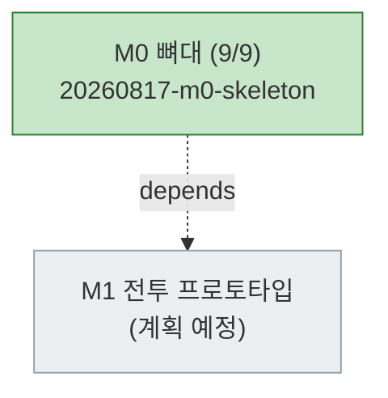

# PLAN-ygj-remake: 삼국지 영걸전 리메이크 구현 계획

> 문서 유형: `plan`
> 작업 ID: `20260817-m0-skeleton`
> 상태: `in-progress`
> 기준선: `v1` (2026-08-17 승인)
> 작성일: 2026-08-17
> 최종 갱신: 2026-08-17
> 관련 문서: [REQ-ygj-remake: 요구사항](./requirements.md), [DESIGN-ygj-remake: 설계](./design.md), [결정 등록부](./decisions.md), [WORK-20260817-m0-skeleton: 작업 기록](./work/20260817-m0-skeleton/work-log.md)

## 요약

- 목적: 승인된 기준선 v1을 마일스톤 단위로 구현하기 위한 저장소 현행 계획. 현재 사이클은 **M0 뼈대**다.
- 현재 결론 또는 상태: **M0 사이클 완료**(TASK-01~09, 검증 4/4 성공). 상세는 [작업 기록](./work/20260817-m0-skeleton/work-log.md).
- 다음 행동: M1(전투 프로토타입) 사이클의 작업을 이 문서에 추가한다.

## 문서 연결

| 방향 | 관계 | 대상 문서 | 대상 항목 | 비고 |
|---|---|---|---|---|
| input | baseline | [REQ-ygj-remake: 요구사항](./requirements.md) | FR-13, NFR-02, NFR-03, AC-01 | M0가 충족할 승인된 요구사항 |
| input | baseline | [DESIGN-ygj-remake: 설계](./design.md) | DES-03, DES-05, DES-12 | M0가 구현할 설계 요소 |
| input | decision | [ADR-002: 기술 스택 선정](./work/20260817-ygj-remake-baseline/ADR-002-기술-스택-선정.md) | document | 스택 제약 |
| output | implementation | [WORK-20260817-m0-skeleton: 작업 기록](./work/20260817-m0-skeleton/work-log.md) | TASK-01~09 | 수행 기록·검증 결과 |

## 기준선

- 관련 요구사항: [REQ-ygj-remake](./requirements.md) v1 — FR-13(데이터 주도·검증), NFR-02(로직·렌더 분리), NFR-03(데이터 무결성·내성), AC-01(데이터 검증)
- 관련 설계: [DESIGN-ygj-remake](./design.md) v1 — DES-03(데이터 계층), DES-05(렌더 계층), DES-12(데이터 계약)
- 관련 ADR·DCR: [ADR-001](./work/20260817-ygj-remake-baseline/ADR-001-하이브리드-리메이크와-데이터-주도-엔진.md), [ADR-002](./work/20260817-ygj-remake-baseline/ADR-002-기술-스택-선정.md)

## 작업 정의

- 목표: [전체 설계 §8](../yeonggeoljeon-remake-design.md)의 M0 완료 기준 — `npm run dev`로 빈 맵이 렌더되고 `npm run validate`가 동작한다.
- 범위: Vite+TS(strict) 스캐폴딩, zod 데이터 스키마, 시드 데이터, 데이터 로더와 참조 무결성 검사, validate CLI, PixiJS 타일맵 렌더와 플레이스홀더 에셋 파이프라인.
- 범위 밖: 전투 로직(M1~M2), 캠페인·세이브(M3), 맵 에디터(M3.5), 콘텐츠 데이터 입력(M4), 장수 에디터(M4.5), 그래픽 교체(M5), Tauri 패키징·CI(M6). M0 시드 데이터는 파이프라인 검증용 최소 샘플이며 원작 데이터 입력이 아니다.
- 가정: Node.js LTS·npm 사용 가능(2026-08-17 확인 — v24.19.0 / npm 11.17.0 사용자 영역 설치).
- 위험: 렌더 결과(빈 맵)는 자동 테스트가 어려워 수동 확인에 의존한다([RISK-M0-01](#위험-1)).

## 계획 트리

<!-- generated -->

```text
[✓] [작업] 20260817-m0-skeleton — M0 뼈대 ........ completed (9/9)
    └─ 상세 트리 스냅숏: work-log.md의 계획 트리 절
```



## 작업 목록

### M0 사이클 (완료)

완료·통합된 사이클이므로 축약형으로 유지한다. 각 작업의 수행 내용·결정·검증 증거는 [WORK-20260817-m0-skeleton](./work/20260817-m0-skeleton/work-log.md)이 정본이다.

| 작업 | 상태 | 상위 | 요약 |
|---|---|---|---|
| TASK-01 | completed | 없음 | Vite+TS(strict)+PixiJS+Vitest 스캐폴딩 |
| TASK-02 | completed | 없음 | zod 데이터 스키마 정의 (`src/core/data/schemas.ts`) |
| TASK-03 | completed | TASK-02 | 스키마 검증 테스트 (선행, Red→Green) |
| TASK-04 | completed | 없음 | 시드 데이터 (지형 9·병과 6·상성 9·스테이지 1) |
| TASK-05 | completed | 없음 | 데이터 로더·참조 무결성 검사 (`loader.ts`, `integrity.ts`) |
| TASK-06 | completed | TASK-05 | 무결성·AC-01 인수 테스트 (선행, Red→Green) |
| TASK-07 | completed | 없음 | validate CLI (`npm run validate`, 실패 시 exit 1) |
| TASK-08 | completed | 없음 | PixiJS 타일맵 렌더·플레이스홀더 파이프라인 |
| TASK-09 | completed | 없음 | 자체 리뷰·전체 검증·통합 |

### M1 사이클 (미착수)

M1(전투 프로토타입)의 작업은 착수 시점에 이 절에 추가한다. 착수 전 확인할 사항은 [작업 기록의 후속 작업](./work/20260817-m0-skeleton/work-log.md#후속-작업)에 있다.

## 검증 계획

| 검증 ID | 인수 조건 | 방법 | 대상 작업 |
|---|---|---|---|
| VER-01 | [AC-01](./requirements.md#인수-조건) | 자동 인수 테스트(`tests/data/integrity.test.ts`) + CLI 시나리오(정상 exit 0 / 손상 exit 1) | TASK-06, TASK-07 |
| VER-02 | M0 완료 기준(빈 맵 렌더) | `npm run build` 성공 + `npm run dev` 화면 확인 | TASK-08 |
| VER-03 | NFR-02(로직·렌더 분리) | `src/core/`가 PixiJS·`node:` 모듈을 import하지 않음을 정적 확인 | TASK-09 |
| VER-04 | NFR-03(데이터 내성) | 미정의 지형 주입 시 크래시 없이 폴백 렌더 + validate 보고 확인 | TASK-08 |

M0 사이클의 실행 결과와 증거는 [작업 기록의 인수 조건별 결과](./work/20260817-m0-skeleton/work-log.md#인수-조건별-결과)에 있다(VER-01~04 전부 성공).

VER-04는 계획 작성 시 "스프라이트 매핑 누락 시 폴백"으로 적었으나 M0에는 렌더할 유닛이 없어, 같은 성질의 M0 범위 폴백(미정의 지형)으로 검증했다. 유닛 스프라이트 폴백 검증은 M1로 넘긴다. 인수 조건은 바뀌지 않았다.

## 마이그레이션과 롤백

- 마이그레이션: N/A — 신규 프로젝트로 기존 데이터·사용자 없음.
- 롤백: 전 변경이 신규 파일이며 git 커밋 단위로 되돌릴 수 있다. Node.js는 사용자 영역(`%LOCALAPPDATA%\Programs\nodejs`)에 설치되어 폴더 삭제와 사용자 PATH 항목 제거로 되돌릴 수 있다.

## 위험

| ID | 위험 | 영향 | 완화 |
|---|---|---|---|
| RISK-M0-01 | 렌더 결과는 자동 검증이 어렵다 | 회귀를 놓칠 수 있음 | 빌드 성공을 자동 게이트로 두고 육안 확인 결과를 작업 기록에 남긴다. 렌더 회귀 테스트 도입은 M1 이후 검토 |
| RISK-M0-02 | M0 시드 데이터를 원작 데이터로 오인 | 잘못된 기준으로 M4 진행 | 시드 파일에 파이프라인 검증용임을 명시하고 M4에서 교체 |

## 인계

- 다음 단계 또는 워크플로우: wf-implement로 M1(전투 프로토타입) 사이클을 계획·구현한다.
- 시작 조건: 기준선 v1 승인 완료(2026-08-17), Node.js·npm 사용 가능, M0 뼈대 완료
- 입력 문서와 기준선: [REQ-ygj-remake](./requirements.md), [DESIGN-ygj-remake](./design.md), [결정 등록부](./decisions.md), [WORK-20260817-m0-skeleton](./work/20260817-m0-skeleton/work-log.md)
- 완료된 항목: M0 사이클 TASK-01~09, 검증 VER-01~04
- 미완료 항목: M1~M6 전부
- 차단 요인: 없음
- 다음 행동: M1 착수 시 [작업 기록의 후속 작업](./work/20260817-m0-skeleton/work-log.md#후속-작업)을 먼저 읽고(이동 제약 우선순위·상성 방향 확정 필요) M1 작업을 이 문서의 M1 절에 추가한다
