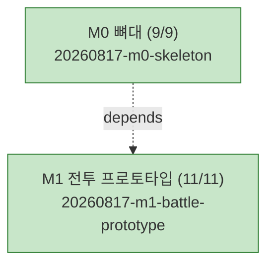

# PLAN-ygj-remake: 삼국지 영걸전 리메이크 구현 계획

> 문서 유형: `plan`
> 작업 ID: `20260817-m1-battle-prototype`
> 상태: `in-progress`
> 기준선: `v1` (2026-08-17 승인)
> 작성일: 2026-08-17
> 최종 갱신: 2026-08-17
> 관련 문서: [REQ-ygj-remake: 요구사항](./requirements.md), [DESIGN-ygj-remake: 설계](./design.md), [결정 등록부](./decisions.md), [WORK-20260817-m0-skeleton: 작업 기록](./work/20260817-m0-skeleton/work-log.md), [WORK-20260817-m1-battle-prototype: 작업 기록](./work/20260817-m1-battle-prototype/work-log.md)

## 요약

- 목적: 승인된 기준선 v1을 마일스톤 단위로 구현하기 위한 저장소 현행 계획. 다음 사이클은 **M2 전투 완성**이다.
- 현재 결론 또는 상태: **M0 사이클 완료**(TASK-01~09, 검증 4/4 성공, [기록](./work/20260817-m0-skeleton/work-log.md)). **M1 사이클 완료**(TASK-10~20, 검증 VER-05~08 4/4 충족, [기록](./work/20260817-m1-battle-prototype/work-log.md)) — 화면에서 전투 한 판을 승리까지 완주했고 테스트 184건·타입 검사·데이터 검증·빌드가 모두 성공했다.
- 다음 행동: M2(전투 완성) 사이클 계획을 이 문서에 추가한다 — 책략·아이템·사기·혼란·경험치·승급·일기토·전투 이벤트와 원작 대조 튜닝. 착수 전 [M1 작업 기록의 후속 작업](./work/20260817-m1-battle-prototype/work-log.md#후속-작업)을 확인한다.

## 문서 연결

| 방향 | 관계 | 대상 문서 | 대상 항목 | 비고 |
|---|---|---|---|---|
| input | baseline | [REQ-ygj-remake: 요구사항](./requirements.md) | FR-02, FR-03, FR-11, FR-13, FR-17, FR-18, NFR-01~03, NFR-06, AC-01, AC-02, AC-04 | 충족할 승인된 요구사항 |
| input | baseline | [DESIGN-ygj-remake: 설계](./design.md) | DES-01, DES-03~06, DES-12 | 구현할 설계 요소 |
| input | decision | [ADR-002: 기술 스택 선정](./work/20260817-ygj-remake-baseline/ADR-002-기술-스택-선정.md) | document | 스택 제약 |
| input | decision | [ADR-003: 결정론적 RNG와 세이브 포함 정책](./work/20260817-ygj-remake-baseline/ADR-003-결정론적-RNG와-세이브-포함-정책.md) | document | TASK-10의 근거 |
| output | implementation | [WORK-20260817-m0-skeleton: 작업 기록](./work/20260817-m0-skeleton/work-log.md) | TASK-01~09, VER-01~04 | M0 수행 기록·검증 결과 |
| output | implementation | [WORK-20260817-m1-battle-prototype: 작업 기록](./work/20260817-m1-battle-prototype/work-log.md) | TASK-10~20, VER-05~08 | M1 수행 기록·검증 결과 |

## 기준선

- 관련 요구사항: [REQ-ygj-remake](./requirements.md) v1 — FR-02(전투 규칙), FR-03(상성), FR-11(적 AI), FR-13(데이터 주도·검증), FR-17(플레이스홀더 렌더), FR-18(전투 UI), NFR-01(결정론), NFR-02(로직·렌더 분리), NFR-03(데이터 무결성·내성), NFR-06(상수 튜닝), AC-01(데이터 검증), AC-02(전투 완주), AC-04(상성)
- 관련 설계: [DESIGN-ygj-remake](./design.md) v1 — DES-01(전투 코어), DES-03(데이터 계층), DES-04(결정론적 RNG), DES-05(렌더 계층), DES-06(전투 화면), DES-12(데이터 계약)
- 관련 ADR·DCR: [ADR-001](./work/20260817-ygj-remake-baseline/ADR-001-하이브리드-리메이크와-데이터-주도-엔진.md), [ADR-002](./work/20260817-ygj-remake-baseline/ADR-002-기술-스택-선정.md), [ADR-003](./work/20260817-ygj-remake-baseline/ADR-003-결정론적-RNG와-세이브-포함-정책.md)

## 작업 정의

- 목표: [전체 설계 §8](../yeonggeoljeon-remake-design.md)의 마일스톤 완료 기준을 순서대로 충족한다. 각 사이클의 목표·범위는 아래 [작업 목록](#작업-목록)의 사이클별 절에 있다.
  - M0(완료): `npm run dev`로 맵이 렌더되고 `npm run validate`가 동작한다.
  - M1(완료): 테스트 스테이지 1개에서 전투 한 판을 완주한다([AC-02](./requirements.md#인수-조건)).
- 범위: 기준선 v1이 규정한 엔진과 데이터 파이프라인 전체를 마일스톤 단위로 구현한다.
- 범위 밖(현재까지): 책략·아이템·경험치·일기토 등 전투 확장(M2), 캠페인·세이브(M3), 맵 에디터(M3.5), 콘텐츠 데이터 입력(M4), 장수 에디터(M4.5), 그래픽 교체(M5), Tauri 패키징·CI(M6). 지금까지의 시드 데이터는 파이프라인·전투 검증용 최소 샘플이며 원작 데이터 입력이 아니다.
- 가정: Node.js LTS·npm 사용 가능(2026-08-17 확인 — v24.19.0 / npm 11.17.0 사용자 영역 설치).
- 위험: 렌더·입력 결과는 자동 테스트가 어려워 화면 확인에 의존한다([RISK-M0-01](#위험)).

## 계획 트리

<!-- generated -->

```text
[✓] [작업] 20260817-m0-skeleton — M0 뼈대 ................ completed (9/9)           2026-08-17 21:08
    └─ 상세 트리 스냅숏: work-log.md의 계획 트리 절

[✓] [작업] 20260817-m1-battle-prototype — M1 전투 프로토타입 .. completed (11/11)      2026-08-17 23:39
    └─ 상세 트리 스냅숏: work-log.md의 계획 트리 절
```



## 작업 목록

### M0 사이클 (완료)

완료·통합된 사이클이므로 축약형으로 유지한다. 각 작업의 수행 내용·결정·검증 증거는 [WORK-20260817-m0-skeleton](./work/20260817-m0-skeleton/work-log.md)이 정본이다.

사이클 완료: **2026-08-17 21:08** — 계획에서 M0 노드가 `completed`로 전이된 시각이며, 축약된 사이클이므로 완료 시점을 사이클 단위 하나로 요약했다. M0는 9건을 한 묶음으로 완료 처리해 TASK별 완료 시각이 기록되지 않았다.

| 작업 | 상태 | 상위 | 요약 |
|---|---|---|---|
| TASK-01 | completed | 없음 | Vite+TS(strict)+PixiJS+Vitest 스캐폴딩 |
| TASK-02 | completed | 없음 | zod 데이터 스키마 정의 (`src/core/data/schemas.ts`) |
| TASK-03 | completed | TASK-02 | 스키마 검증 테스트 (선행, Red→Green) |
| TASK-04 | completed | 없음 | 시드 데이터 (지형 9·병과 6·상성 9·스테이지 1) |
| TASK-05 | completed | 없음 | 데이터 로더·참조 무결성 검사 (`loader.ts`, `integrity.ts`) |
| TASK-06 | completed | TASK-05 | 무결성·AC-01 인수 테스트 (선행, Red→Green) |
| TASK-07 | completed | 없음 | validate CLI (`npm run validate`, 실패 시 exit 1) |
| TASK-08 | completed | 없음 | PixiJS 타일맵 렌더·플레이스홀더 파이프라인 |
| TASK-09 | completed | 없음 | 자체 리뷰·전체 검증·통합 |

### M1 사이클 (완료)

목표: [전체 설계 §8](../yeonggeoljeon-remake-design.md)의 M1 완료 기준 — 테스트 스테이지 1개에서 전투 한 판을 완주한다([AC-02](./requirements.md#인수-조건)).

범위: 유닛 배치·선택·이동(코스트 기반 이동 범위), 근접/원거리 공격과 데미지 공식·상성, 턴 교대, 1단계 AI, 승패 판정, 결정론적 RNG.
범위 밖: 책략·아이템·사기 변동·혼란·경험치·레벨업·승급·일기토·전투 이벤트(전부 M2), 캠페인·세이브(M3).

완료·통합된 사이클이므로 축약형으로 유지한다. 각 작업의 목표·수행 내용·결정·검증 증거는 [WORK-20260817-m1-battle-prototype](./work/20260817-m1-battle-prototype/work-log.md)이 정본이다. 각 작업은 [TDD 사이클](./work/20260817-m1-battle-prototype/work-log.md#수행-기록)을 따랐다 — 각 작업 기록의 "실행한 검증"에 Red→Green 전환이 남아 있다.

| 작업 | 상태 | 완료 | 상위 | 요약 |
|---|---|---|---|---|
| TASK-10 | completed | 2026-08-17 21:26 | 없음 | 결정론적 RNG — xoshiro128**와 상태 직렬화·복원 (`src/core/rng.ts`) |
| TASK-11 | completed | 2026-08-17 21:35 | 없음 | 전투 데이터 확장 — 무장·전투 상수·스테이지 배치/적/승패 조건 |
| TASK-12 | completed | 2026-08-17 21:39 | TASK-11 | 전투 상태 구성 (`createBattleState`, 병력 상한식 확정) |
| TASK-13 | completed | 2026-08-17 21:45 | TASK-12 | 이동 범위 계산 (다익스트라, 이동 제약 우선순위 확정) |
| TASK-14 | completed | 2026-08-17 21:49 | TASK-10, TASK-11 | 데미지 공식과 상성 (상성 방향 0.75=유리 고정) |
| TASK-15 | completed | 2026-08-17 22:06 | TASK-13, TASK-14 | 커맨드 적용 (`applyCommand` — 이동·공격·대기, 반격 없음) |
| TASK-16 | completed | 2026-08-17 22:13 | TASK-15 | 턴 진행과 승패 판정 (`endPhase`·`isPhaseComplete`·`outcome`) |
| TASK-17 | completed | 2026-08-17 22:17 | TASK-15 | 1단계 적 AI (접근·공격, 페이즈 종료 보장) |
| TASK-18 | completed | 2026-08-17 22:28 | TASK-13 | 유닛 렌더와 범위 하이라이트 (VER-08 충족) |
| TASK-19 | completed | 2026-08-17 23:19 | TASK-16, TASK-17, TASK-18 | 전투 입력과 명령 UI (씬·HUD·상태 기계, VER-05 충족) |
| TASK-20 | completed | 2026-08-17 23:39 | TASK-19 | 자체 리뷰·전체 검증·통합 (예상 데미지 결함 1건 수정) |

## 검증 계획

| 검증 ID | 인수 조건 | 방법 | 대상 작업 |
|---|---|---|---|
| VER-01 | [AC-01](./requirements.md#인수-조건) | 자동 인수 테스트(`tests/data/integrity.test.ts`) + CLI 시나리오(정상 exit 0 / 손상 exit 1) | TASK-06, TASK-07 |
| VER-02 | M0 완료 기준(빈 맵 렌더) | `npm run build` 성공 + `npm run dev` 화면 확인 | TASK-08 |
| VER-03 | NFR-02(로직·렌더 분리) | `src/core/`가 PixiJS·`node:` 모듈을 import하지 않음을 정적 확인 | TASK-09 |
| VER-04 | NFR-03(데이터 내성) | 미정의 지형 주입 시 크래시 없이 폴백 렌더 + validate 보고 확인 | TASK-08 |

M0 사이클의 실행 결과와 증거는 [작업 기록의 인수 조건별 결과](./work/20260817-m0-skeleton/work-log.md#인수-조건별-결과)에 있다(VER-01~04 전부 성공).

M1 사이클의 검증 계획:

| 검증 ID | 인수 조건 | 방법 | 대상 작업 |
|---|---|---|---|
| VER-05 | [AC-02](./requirements.md#인수-조건) 전투 완주 | 화면에서 배치→이동/공격→턴 교대→승패 판정까지 한 판 진행 | TASK-19 |
| VER-06 | [AC-04](./requirements.md#인수-조건) 상성 검증 | 상성 3×3 조합·지형·경계값 단위 테스트 | TASK-14 |
| VER-07 | NFR-01 결정론 | 고정 시드에서 같은 커맨드 열이 같은 결과를 내는 테스트 | TASK-10, TASK-14 |
| VER-08 | NFR-03 데이터 내성 | 유닛 스프라이트 매핑 누락 시 플레이스홀더 폴백 확인(M0에서 이월) | TASK-18 |

M1 사이클의 실행 결과와 증거는 [작업 기록의 인수 조건별 결과](./work/20260817-m1-battle-prototype/work-log.md#인수-조건별-결과)에 있다(VER-05~08 전부 성공).

VER-04는 계획 작성 시 "스프라이트 매핑 누락 시 폴백"으로 적었으나 M0에는 렌더할 유닛이 없어, 같은 성질의 M0 범위 폴백(미정의 지형)으로 검증했다. 유닛 스프라이트 폴백 검증은 M1로 넘긴다. 인수 조건은 바뀌지 않았다.

## 마이그레이션과 롤백

- 마이그레이션: N/A — 신규 프로젝트로 기존 데이터·사용자 없음.
- 롤백: 전 변경이 신규 파일이며 git 커밋 단위로 되돌릴 수 있다. Node.js는 사용자 영역(`%LOCALAPPDATA%\Programs\nodejs`)에 설치되어 폴더 삭제와 사용자 PATH 항목 제거로 되돌릴 수 있다.

## 위험

| ID | 위험 | 영향 | 완화 |
|---|---|---|---|
| RISK-M0-01 | 렌더 결과는 자동 검증이 어렵다 | 회귀를 놓칠 수 있음 | 빌드 성공을 자동 게이트로 두고 육안 확인 결과를 작업 기록에 남긴다. 렌더 회귀 테스트 도입은 M1 이후 검토 |
| RISK-M0-02 | M0 시드 데이터를 원작 데이터로 오인 | 잘못된 기준으로 M4 진행 | 시드 파일에 파이프라인 검증용임을 명시하고 M4에서 교체 |

## 인계

- 다음 단계 또는 워크플로우: M2(전투 완성) 사이클의 계획을 이 문서에 추가한 뒤 wf-implement로 구현한다. M2는 전투 규칙과 데이터 모델을 넓히므로(책략·아이템·상태이상·경험치·승급·일기토) 계획 수립 전에 기준선이 그 범위를 충분히 규정하는지 확인하고, 새 제품 결정이 필요하면 wf-design으로 반환한다.
- 시작 조건: 기준선 v1 승인 완료(2026-08-17), Node.js·npm 사용 가능, M0·M1 완료
- 입력 문서와 기준선: [REQ-ygj-remake](./requirements.md), [DESIGN-ygj-remake](./design.md), [결정 등록부](./decisions.md), [WORK-20260817-m0-skeleton](./work/20260817-m0-skeleton/work-log.md), [WORK-20260817-m1-battle-prototype](./work/20260817-m1-battle-prototype/work-log.md)
- 완료된 항목: M0 사이클 TASK-01~09(검증 VER-01~04), M1 사이클 TASK-10~20(검증 VER-05~08)
- 미완료 항목: M2~M6 전부
- 차단 요인: 없음
- 다음 행동: M2 계획을 수립한다. 착수 전 [M1의 후속 작업](./work/20260817-m1-battle-prototype/work-log.md#후속-작업) 3건(병과 플래그 3종 미구현, `officerLost` 판정 재정의, 반격 미구현)을 M2 범위에 반영할지 판단한다
