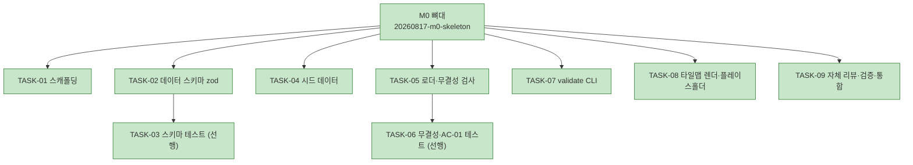

# WORK-20260817-m0-skeleton: M0 뼈대 작업 기록

> 문서 유형: `work-log`, `verification`, `completion`
> 작업 ID: `20260817-m0-skeleton`
> 상태: `completed`
> 기준선: `v1` (2026-08-17 승인)
> 작성일: 2026-08-17
> 최종 갱신: 2026-08-17
> 관련 문서: [PLAN-ygj-remake: 구현 계획](../../plan.md), [REQ-ygj-remake: 요구사항](../../requirements.md), [DESIGN-ygj-remake: 설계](../../design.md)

## 요약

- 목적: 승인된 기준선 v1의 M0 뼈대(스캐폴딩·스키마·validate·렌더)를 구현하고 검증 증거를 남긴다.
- 현재 결론 또는 상태: **완료.** TASK-01~09를 모두 마쳤다. 타입 검사·테스트 31건·데이터 검증·프로덕션 빌드가 전부 성공했고, M0 완료 기준(빈 맵 렌더 + validate 동작)과 [AC-01](../../requirements.md#인수-조건)을 증거와 함께 충족했다.
- 다음 행동: M1(전투 프로토타입) 계획을 [PLAN-ygj-remake](../../plan.md)에 추가한다.

## 문서 연결

| 방향 | 관계 | 대상 문서 | 대상 항목 | 비고 |
|---|---|---|---|---|
| input | baseline | [REQ-ygj-remake: 요구사항](../../requirements.md) | FR-13, NFR-02, NFR-03, AC-01 | 승인된 입력 기준선 |
| input | baseline | [DESIGN-ygj-remake: 설계](../../design.md) | DES-03, DES-05, DES-12 | 구현 대상 설계 요소 |
| input | implementation | [PLAN-ygj-remake: 구현 계획](../../plan.md) | TASK-01~09, VER-01~04 | 이 기록이 수행하는 계획 |

## 기준선과 현재 계획

- 기준선: [REQ-ygj-remake](../../requirements.md) v1, [DESIGN-ygj-remake](../../design.md) v1, ADR-001~006([결정 등록부](../../decisions.md)).
- 현재 계획: [PLAN-ygj-remake](../../plan.md)의 M0 사이클 TASK-01~09.
- 작업 ID 발행 근거: wf-design은 프로젝트 전체 기준선을 하나의 작업 ID(`20260817-ygj-remake-baseline`)로 발행했고 마일스톤별 작업 ID를 발행하지 않았다. M0는 독립적으로 계획·검증·완료되는 구현 사이클이므로 wf-implement가 `20260817-m0-skeleton`을 발행했다. 기준선의 의미는 바뀌지 않았다.

## 현재 상태

- 진행 중인 작업: 없음
- 마지막 완료 작업: TASK-09 자체 리뷰·검증·통합
- 차단 요인: 없음

## 계획 트리

<!-- snapshot: 2026-08-17 완료 시점 -->

```text
[작업] 20260817-m0-skeleton — M0 뼈대 ............ completed (9/9)
├─ [✓] TASK-01 구현: 프로젝트 스캐폴딩
├─ [✓] TASK-02 구현: 데이터 스키마 정의 (zod)
│   └─ [✓] TASK-03 테스트: 스키마 검증 (선행)
├─ [✓] TASK-04 구현: 시드 데이터 작성
├─ [✓] TASK-05 구현: 로더·참조 무결성 검사
│   └─ [✓] TASK-06 테스트: 무결성·AC-01 인수 (선행)
├─ [✓] TASK-07 구현: validate CLI 스크립트
├─ [✓] TASK-08 구현: 타일맵 렌더·플레이스홀더
└─ [✓] TASK-09 통합: 자체 리뷰·검증·통합
```



## 수행 기록

### 2026-08-17 — 사전 조건 확인 (계획 직전 재확인, wf-implement §3.1)

- 수행 내용: 기준선 이후 저장소 변경 여부와 실행 환경을 확인했다. 저장소는 커밋 `def02b4` 이후 변경 없음(작업 트리 청결). [REQ-ygj-remake 가정](../../requirements.md#가정과-미해결-질문)의 "Node.js LTS·npm 사용 가능" 전제를 검사한 결과 **Node.js와 npm이 설치되어 있지 않았다**(Bash·PowerShell 양쪽 PATH, 일반 설치 경로, nvm/fnm/volta/scoop/choco 모두 없음).
- 발견 사항:
  - 사실: `node`·`npm` 미설치. winget은 사용 가능하나 현재 세션은 비관리자(`Elevated: False`)이며, Node.js MSI는 관리자 승격(UAC)을 유발해 비대화형 세션을 정지시킬 위험이 있었다.
  - 사실: Node.js LTS는 v24.19.0(Krypton), `https://nodejs.org/dist/index.json`으로 네트워크 접근 가능.
- 결정과 이유: 공식 배포 zip을 사용자 영역 `%LOCALAPPDATA%\Programs\nodejs`에 전개하고 **사용자 PATH**에만 등록했다. 관리자 권한이 필요 없고(UAC 정지 위험 없음), 시스템 레지스트리·Program Files를 건드리지 않으며, 폴더 삭제와 PATH 항목 제거만으로 완전히 되돌릴 수 있기 때문이다. 기각한 대안: `winget install`(UAC 정지 위험, 시스템 범위 변경).
  - 승인 근거: Node.js·npm은 승인된 [ADR-002 기술 스택](../20260817-ygj-remake-baseline/ADR-002-기술-스택-선정.md)이 요구하는 불가피한 전제이고, 설치는 로컬·되돌릴 수 있는 변경이므로 wf-implement §2.3(자율 진행과 승인) 범위로 판단했다. 외부 시스템 상태 변경이나 비가역 작업이 아니다.
- 실행한 검증: `node --version` → `v24.19.0`, `npm --version` → `11.17.0`.
- 결과: 성공. 다만 도구 셸은 Claude Code 프로세스의 낡은 환경을 상속하므로 이번 세션의 명령에는 `$env:Path += ";$env:LOCALAPPDATA\Programs\nodejs"` 접두가 필요하다. 사용자가 새로 여는 터미널에는 사용자 PATH가 적용된다.
- 기준선 영향: 없음. [REQ-ygj-remake](../../requirements.md)의 가정이 확인된 것이며 요구사항·설계의 의미는 바뀌지 않았다(DCR 불필요).

### 2026-08-17 — TASK-01 프로젝트 스캐폴딩

- 수행 내용: `package.json`, `tsconfig.json`(strict + `noUncheckedIndexedAccess`·`exactOptionalPropertyTypes`), `vite.config.ts`, `index.html`을 만들고 의존성을 설치했다.
- 변경 파일: `package.json`, `package-lock.json`, `tsconfig.json`, `vite.config.ts`, `index.html`
- 발견 사항: npm 11의 `allow-scripts` 정책이 esbuild의 postinstall을 보류시켰다. esbuild 바이너리는 optional dependency(`@esbuild/win32-x64`)로 이미 제공되어 빌드·테스트에 영향이 없음을 확인했다(승인 절차 불필요).
- 결정과 이유: Vitest 설정을 별도 파일 대신 `vite.config.ts`에 두고 `vitest/config`의 `defineConfig`를 썼다. 파일 수를 늘리지 않으면서 타입이 맞는 표준 방식이다.
- 실행한 검증: `npm install`(성공), `npx tsc --noEmit` → exit 0.
- 결과: 성공.

### 2026-08-17 — TASK-03·TASK-02 스키마 (TDD)

- 수행 내용: 스키마 테스트를 먼저 작성해 Red를 확인한 뒤 `schemas.ts`를 구현했다.
- 변경 파일: `tests/data/fixtures.ts`, `tests/data/schemas.test.ts`, `src/core/data/schemas.ts`
- 결정과 이유: 스키마는 [상세 스펙 §9](../../../yeonggeoljeon-remake-spec-detail.md)를 정본으로 옮기되 M0가 실제로 쓰는 파일로 한정했다(YAGNI). 파일 내부 정합성(사거리 min≤max, 승급 대상·레벨 동반, 타일 행렬 크기)은 스키마 refinement로, 파일 간 참조는 무결성 검사로 분리했다. 계열 목록 `FAMILIES` 하나에서 이동 코스트 표 스키마를 파생시켜 계열 추가 시 수정 지점이 한 곳이 되게 했다.
- 실행한 검증: 구현 전 `npm test` → 2개 스위트 실패(`Failed to load url ../../src/core/data/schemas`) = 의도한 Red. 구현 후 전부 통과.
- 결과: 성공.

### 2026-08-17 — TASK-06·TASK-05 로더·참조 무결성 (TDD, AC-01)

- 수행 내용: [AC-01](../../requirements.md#인수-조건)을 자동 인수 테스트로 전환한 뒤 `integrity.ts`와 `loader.ts`를 구현했다.
- 변경 파일: `tests/data/integrity.test.ts`, `src/core/data/integrity.ts`, `src/core/data/loader.ts`
- 결정과 이유:
  - 파일 읽기를 코어에 두지 않고 `RawGameData`(이미 읽어온 원본)를 받게 했다. Node의 `fs`와 브라우저의 번들 import가 같은 코어를 공유하고 코어가 순수하게 유지된다(NFR-02).
  - 상성 커버리지는 7개 계열 전수가 아니라 **실제로 정의된 병과가 쓰는 계열 조합**만 요구한다. 쓰지 않는 계열까지 채우게 만들면 개조 비용만 늘어난다.
  - 첫 문제에서 멈추지 않고 전부 모아 보고한다. 같은 오타가 반복된 스테이지 타일은 지형 종류당 한 번만 보고해 목록이 수백 줄로 불어나지 않게 했다.
  - 오류 출력 형식을 `formatIssues()` 하나로 모아 CLI와 테스트가 같은 문자열을 검사하게 했다.
- 실행한 검증: 구현 전 Red(모듈 없음) → 구현 후 `npm test` 31건 통과.
- 결과: 성공.

### 2026-08-17 — TASK-04 시드 데이터

- 수행 내용: 지형 9종, 병과 6종(계열 3종·승급 체인 3쌍), 상성 9조합, 스프라이트·애니메이션 매핑 6종, 20×15 테스트 스테이지를 작성했다.
- 변경 파일: `data/config/game-config.json`, `data/terrain.json`, `data/classes.json`, `data/affinity.json`, `data/assets-map/sprites.json`, `data/assets-map/animations.json`, `data/scenario/stages/stage-test.json`
- 발견 사항(선행 명세 불일치): 상성 배수의 방향이 두 문서에서 어긋난다. [전체 설계 §4.2](../../../yeonggeoljeon-remake-design.md)의 예시는 `기병→보병 = 1.25`인데, [상세 스펙 §1.3](../../../yeonggeoljeon-remake-spec-detail.md)은 "유리 0.75 / 불리 1.25를 방어측에 곱함"이라고 규정한다. 기병은 보병에 유리하므로 두 값이 반대다.
- 결정과 이유: 승인된 기준선의 문서 우선순위 규칙([REQ 제약과 의존성](../../requirements.md#제약과-의존성) — 상세 스펙 > 전체 설계)에 따라 **상세 스펙을 채택**해 유리한 쪽을 0.75로 넣었다. 우선순위 규칙이 이미 기준선에 있으므로 새 결정이 아니며 DCR이 필요 없다. 실제 데미지 방향은 M1 전투 구현에서 테스트로 고정한다.
- 실행한 검증: `npm run validate` → 통과(병과 6, 지형 9, 스테이지 1).
- 결과: 성공.

### 2026-08-17 — TASK-07 validate CLI

- 수행 내용: `scripts/readGameData.ts`(Node 파일 읽기)와 `scripts/validate.ts`(CLI)를 만들고 `npm run validate`에 연결했다. 데이터 폴더 경로를 인자로 받게 해 임의 데이터셋을 검사할 수 있다.
- 변경 파일: `scripts/readGameData.ts`, `scripts/validate.ts`, `package.json`, `tsconfig.json`
- 발견 사항(결함, 수정함): JSON 파일 앞에 BOM이 있으면 `JSON.parse`가 "Unexpected token" 오류를 내며 실패했다. 윈도우 편집기가 BOM을 흔히 붙이는데 이 프로젝트는 사용자가 JSON을 직접 고치는 것이 전제이므로(FR-13·FR-17) 실제 결함으로 판단해 읽는 지점에서 BOM을 제거했다. 최소 구현 원칙의 예외 영역(신뢰 경계 입력 검증)에 해당한다.
- 결정과 이유: `@types/node`를 추가하면서 `types: ["vite/client","node"]`로 두었다. 스크립트 전용 tsconfig를 따로 두는 대신, 코어가 `node:` 모듈을 쓰면 Vite 빌드가 실패하고 VER-03이 이를 점검하므로 파일을 늘리지 않았다.
- 실행한 검증: 정상 데이터 → `데이터 검증 통과`, exit 0. 참조 오류 3종(존재하지 않는 승급 대상·스프라이트 매핑 누락·미정의 지형)을 심은 사본 → 3건을 위치와 함께 목록 출력, **exit 1**.
- 결과: 성공 (AC-01 시나리오 충족).

### 2026-08-17 — TASK-08 타일맵 렌더·플레이스홀더

- 수행 내용: `browserData.ts`(Vite 번들에서 데이터 공급), `TilemapRenderer.ts`(지형 레이어), `main.ts`(부팅·오류 표시)를 구현했다.
- 변경 파일: `src/browserData.ts`, `src/render/TilemapRenderer.ts`, `src/main.ts`, `index.html`
- 결정과 이유:
  - 스테이지 파일 수집에 Vite 네이티브 `import.meta.glob`을 썼다(결정 사다리 4단계). Vite 전용 기능이므로 코어가 아니라 `src/browserData.ts`에 두어 코어 순수성을 지켰다.
  - 타일마다 `Graphics`를 만들지 않고 하나에 모아 그렸다. 원작 맵은 40×40까지 커지므로 1,600개 객체 생성을 피한다.
  - 정의되지 않은 지형은 조용히 비우지 않고 마젠타로 그린다. 개조 중 실수를 화면에서 바로 드러내기 위함이다.
- 실행한 검증: `npm run build` 성공. `npm run dev` 후 헤드리스 Chrome 스크린샷으로 20×15 타일맵이 시드 데이터와 일치하게 렌더됨을 확인(산·숲·강+다리·황무지·마을·성문·성내, 격자, 1280×720 중앙 정렬).
- 결과: 성공.

### 2026-08-17 — TASK-09 자체 리뷰·검증·통합

- 수행 내용: wf-implement §3.5(자체 리뷰) 항목을 점검하고 전체 검증을 실행했다.
- 변경 파일: `vite.config.ts`(정리), `docs/plan.md`, `README.md`, 본 기록
- 발견 사항과 수정: `vite.config.ts`의 `publicDir: "public"`와 `server.open: false`는 Vite 기본값과 같은 보일러플레이트라 제거했다.
- 실행한 검증: 아래 [인수 조건별 결과](#인수-조건별-결과) 참조.
- 결과: 성공.

## 검증 범위와 환경

- 대상 기준선 또는 구현: [REQ-ygj-remake](../../requirements.md) v1 중 M0 범위(FR-13, NFR-02, NFR-03, AC-01)와 [PLAN](../../plan.md) TASK-01~09.
- 실행 환경: Windows 11 Pro 26200, Node.js v24.19.0, npm 11.17.0, Vite 6.4.3, Vitest 2.1.9, TypeScript 5.7, 헤드리스 Chrome(SwiftShader).
- 제외 항목: M1 이후 범위(전투·캠페인·세이브·에디터·패키징) 전부. 유닛 스프라이트 플레이스홀더 폴백은 렌더할 유닛이 M1에 생기므로 M0에서 검증하지 않는다.

## 결과 요약

- 성공: VER-01, VER-02, VER-03, VER-04 (4/4)
- 실패: 없음
- 미수행: 없음

## 인수 조건별 결과

| 검증 ID | 인수 조건 | 방법·명령 | 결과 | 증거 |
|---|---|---|---|---|
| VER-01 | [AC-01](../../requirements.md#인수-조건) | `npm test`(`tests/data/integrity.test.ts` 10건) + `npm run validate -- <손상 사본>` | 성공 | 테스트 31건 통과. 손상 사본에서 3건 보고 후 exit 1 — `classes[0].upgradesTo: 'no_such_class'가 classes.json에 없다`, `classes[4] (archer).sprite: 매핑 'archer'가 sprites.json에 없다`, `map.tiles[4][13]: 정의되지 않은 지형 'swamp'`. 정상 데이터는 exit 0. TDD 증거: 구현 전 Red(모듈 미존재) → 구현 후 Green |
| VER-02 | M0 완료 기준(빈 맵 렌더) | `npm run build`(성공) + `npm run dev` 후 헤드리스 Chrome 스크린샷 | 성공 | 20×15 타일맵이 시드 데이터와 일치하게 렌더. 강(y5~6)과 다리(x7~8), 마을(x2~3,y8~9), 성문(y13), 성내(y14), 숲·산·황무지 배치가 `stage-test.json`과 일치. 오류 표시 영역은 숨김 상태 |
| VER-03 | NFR-02(로직·렌더 분리) | `src/core` 전체 import 문 정적 검사 | 성공 | `src/core`의 import는 `zod`와 자기 모듈뿐 — PixiJS·`node:`·`src/render` 참조 없음 |
| VER-04 | NFR-03(데이터 내성) | `stage-test.json`에 미정의 지형 주입 후 렌더·검증, 이후 복원 | 성공 | 앱이 죽지 않고 해당 타일만 마젠타로 렌더. 같은 상태에서 `npm run validate`가 `map.tiles[13][6] 정의되지 않은 지형 'swamp'`를 보고하고 exit 1. 복원 후 재검증 exit 0 |

전체 게이트: `npx tsc --noEmit` exit 0 / `npm test` 31건 통과 / `npm run validate` exit 0 / `npm run build` exit 0.

## 실패와 미수행 분석

- 실패·미수행 없음.
- 참고: TASK-07 진행 중 발견한 BOM 파싱 결함은 수정 후 재검증했다(위 수행 기록 참조).

## 비기능 검증

- NFR-02: VER-03으로 확인.
- NFR-03: VER-04로 확인(에셋·데이터 누락 시 크래시 없음).
- NFR-04(성능): M0에는 AI·전투가 없어 해당 없음. 타일맵은 `Graphics` 1개로 배치 렌더하여 대형 맵(40×40)에 대비했다.
- NFR-06(튜닝 가능성): 전투 상수는 M2 범위. M0의 `game-config.json`은 타일 크기·논리 해상도를 코드 수정 없이 바꿀 수 있다.

## 남은 위험

| 위험 | 영향 | 대응 |
|---|---|---|
| 렌더 회귀를 자동으로 잡지 못한다([RISK-M0-01](../../plan.md#위험)) | 시각적 회귀를 놓칠 수 있음 | 빌드 성공을 자동 게이트로 유지. 렌더 회귀 테스트 도입은 M1에서 판단 |
| M0 시드 데이터가 원작 값이 아니다([RISK-M0-02](../../plan.md#위험)) | 원작 데이터로 오인할 수 있음 | 스테이지 이름에 "파이프라인 검증용" 명시. 능력치·보정값은 M2·M4에서 원작 대조로 교체 |
| 데이터가 번들에 포함되어 배포본에서 JSON 직접 개조가 안 된다 | 패키징 후 모딩 제약 | M6에서 `SaveStore`·`AssetStore`와 함께 디스크 로딩 경로를 도입(설계에 이미 반영됨) |

## 재검증 조건

- `data/` 또는 `src/core/data/`가 바뀌면 `npm run validate`와 `npm test`를 다시 실행한다.
- `src/render/` 또는 `src/main.ts`가 바뀌면 `npm run build`와 화면 확인을 다시 수행한다.

## 완료 상태

- 결과: **완료**
- 완료 판단 근거: 계획된 TASK-01~09를 모두 마쳤고, 인수 조건 AC-01과 M0 완료 기준(빈 맵 렌더 + validate 동작)이 실행 증거와 함께 충족되었다. 자동 게이트 4종(tsc·test·validate·build)이 모두 성공했으며 실패하거나 수행하지 못한 검증이 없다.

## 완료한 내용

- Vite + TypeScript(strict) + PixiJS v8 + Vitest 프로젝트 뼈대
- zod 데이터 스키마와 참조 무결성 검사(코어는 순수 TypeScript)
- `npm run validate` CLI — 문제 목록 출력과 0이 아닌 종료 코드
- 시드 데이터(지형 9·병과 6·상성 9·스프라이트/애니메이션 6·테스트 스테이지 1)
- PixiJS 타일맵 렌더와 플레이스홀더 기반 렌더 파이프라인

## 설계와 달라진 점

- **없음**(기준선 변경 없음). 아래는 승인 범위 안에서 구체화한 사항이다.
  - 상성 배수 방향: 선행 명세 두 문서가 어긋나 기준선의 문서 우선순위 규칙대로 상세 스펙을 채택했다(TASK-04 기록 참조).
  - VER-04의 검증 대상: 계획 작성 시 "스프라이트 매핑 누락 시 플레이스홀더 폴백"으로 적었으나, M0에는 렌더할 유닛이 없어 같은 성질의 M0 범위 폴백(미정의 지형 → 눈에 띄는 색, 크래시 없음)으로 검증했다. 유닛 스프라이트 폴백은 유닛 렌더가 생기는 M1에서 검증한다. AC는 바뀌지 않았다.
  - `movementRules`와 `terrain.moveCost`가 이동 제약을 이중으로 표현할 수 있다. M0 시드에서는 두 값을 일치시켰고, 어느 쪽이 우선하는지는 이동 로직을 구현하는 M1에서 확정한다.

## 미완료 항목

- 없음(M0 범위 기준).

## 후속 작업

- M1(전투 프로토타입): 이동 범위(BFS), 근접 공격·데미지 공식·상성, 턴 교대, 1단계 AI. 이때 `movementRules` ↔ `terrain.moveCost` 우선순위를 확정한다.
- M4: 시드 데이터를 원작 데이터로 교체.
- M6: 패키징 시 데이터 디스크 로딩 경로 도입.

## 통합 상태

- 코드·테스트·데이터·문서를 로컬 작업 사본에 일관되게 반영했다. 원격 저장소 push는 사용자 요청 시 수행한다.

## 재개 지점

- 다음 작업: M1 계획 수립([PLAN-ygj-remake](../../plan.md)에 M1 사이클 추가)
- 먼저 확인할 사항: 본 기록의 [설계와 달라진 점](#설계와-달라진-점)에 적힌 M1 확정 사항(이동 제약 우선순위, 상성 방향 테스트 고정)
- 필요한 명령 또는 파일: PowerShell에서 `$env:Path += ";$env:LOCALAPPDATA\Programs\nodejs"` 후 `npm test` / `npm run validate` / `npm run dev`. 사용자가 새로 여는 터미널에는 사용자 PATH가 이미 적용되어 있다
