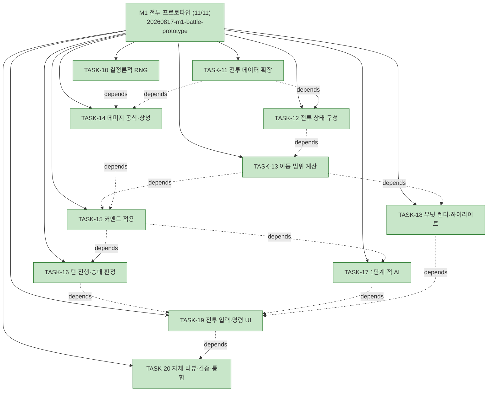

# WORK-20260817-m1-battle-prototype: M1 전투 프로토타입 작업 기록

> 문서 유형: `work-log`, `verification`, `completion`
> 작업 ID: `20260817-m1-battle-prototype`
> 상태: `completed`
> 기준선: `v1` (2026-08-17 승인)
> 작성일: 2026-08-17
> 최종 갱신: 2026-08-17
> 관련 문서: [PLAN-ygj-remake: 구현 계획](../../plan.md), [REQ-ygj-remake: 요구사항](../../requirements.md), [DESIGN-ygj-remake: 설계](../../design.md), [WORK-20260817-m0-skeleton: M0 기록](../20260817-m0-skeleton/work-log.md)

## 요약

- 목적: 기준선 v1의 M1 범위(전투 프로토타입 — 이동·공격·상성·턴 교대·1단계 AI·승패 판정)를 구현하고 [AC-02](../../requirements.md#인수-조건)를 증거와 함께 충족한다.
- 현재 결론 또는 상태: **완료.** TASK-10~20을 모두 마쳤다. 화면에서 마우스·키보드로 전투 한 판을 완주해 승리 판정까지 확인했고, 자체 리뷰에서 찾은 결함 1건(칠 수 없는 부대에 예상 데미지 표시)을 수정했다. 테스트 184건 통과, 타입 검사·데이터 검증·빌드 성공. 검증 VER-05~08 4건 모두 성공.
- 다음 행동: M2(전투 완성) 사이클 계획을 [PLAN-ygj-remake](../../plan.md)에 추가한다. 착수 전 [후속 작업](#후속-작업)을 확인한다.

## 문서 연결

| 방향 | 관계 | 대상 문서 | 대상 항목 | 비고 |
|---|---|---|---|---|
| input | baseline | [REQ-ygj-remake: 요구사항](../../requirements.md) | FR-02, FR-03, FR-11, FR-18, NFR-01, NFR-06, AC-02, AC-04 | 승인된 입력 기준선 |
| input | baseline | [DESIGN-ygj-remake: 설계](../../design.md) | DES-01, DES-04, DES-05, DES-06 | 구현 대상 설계 요소 |
| input | decision | [ADR-003: 결정론적 RNG와 세이브 포함 정책](../20260817-ygj-remake-baseline/ADR-003-결정론적-RNG와-세이브-포함-정책.md) | document | TASK-10의 근거 |
| input | implementation | [PLAN-ygj-remake: 구현 계획](../../plan.md) | TASK-10~20, VER-05~08 | 이 기록이 수행하는 계획 |
| input | result | [WORK-20260817-m0-skeleton: M0 기록](../20260817-m0-skeleton/work-log.md) | 후속 작업 | M1에서 확정할 미결 사항의 출처 |

## 기준선과 현재 계획

- 기준선: [REQ-ygj-remake](../../requirements.md) v1, [DESIGN-ygj-remake](../../design.md) v1, ADR-001~006([결정 등록부](../../decisions.md)).
- 현재 계획: [PLAN-ygj-remake](../../plan.md)의 M1 사이클 TASK-10~20.
- 작업 ID 발행 근거: M0와 같다 — 마일스톤 단위로 계획·검증·완료되는 구현 사이클이므로 wf-implement가 `20260817-m1-battle-prototype`을 발행했다. 기준선의 의미는 바뀌지 않았다.

## 현재 상태

- 진행 중인 작업: 없음
- 마지막 완료 작업: TASK-20 자체 리뷰·검증·통합 (2026-08-17 23:39)
- 차단 요인: 없음

## 계획 트리

<!-- snapshot: 2026-08-17 23:39 완료 시점 -->

```text
[작업] 20260817-m1-battle-prototype — M1 전투 프로토타입 ... completed (11/11)      2026-08-17 23:39
├─ [✓] TASK-10 구현: 결정론적 RNG                                                  2026-08-17 21:26
├─ [✓] TASK-11 구현: 전투 데이터 확장(무장·전투 상수·스테이지)                     2026-08-17 21:35
├─ [✓] TASK-12 구현: 전투 상태 구성            depends: TASK-11                    2026-08-17 21:39
├─ [✓] TASK-13 구현: 이동 범위 계산            depends: TASK-12                    2026-08-17 21:45
├─ [✓] TASK-14 구현: 데미지 공식·상성          depends: TASK-10, TASK-11           2026-08-17 21:49
├─ [✓] TASK-15 구현: 커맨드 적용               depends: TASK-13, TASK-14           2026-08-17 22:06
├─ [✓] TASK-16 구현: 턴 진행·승패 판정         depends: TASK-15                    2026-08-17 22:13
├─ [✓] TASK-17 구현: 1단계 적 AI               depends: TASK-15                    2026-08-17 22:17
├─ [✓] TASK-18 구현: 유닛 렌더·범위 하이라이트  depends: TASK-13                   2026-08-17 22:28
├─ [✓] TASK-19 구현: 전투 입력·명령 UI         depends: TASK-16, TASK-17, TASK-18  2026-08-17 23:19
└─ [✓] TASK-20 통합: 자체 리뷰·검증·통합       depends: TASK-19                    2026-08-17 23:39
```



## 수행 기록

### 2026-08-17 — M1 계획 수립

- 수행 내용: 기준선의 M1 범위를 작업 11건(TASK-10~20)과 검증 4건(VER-05~08)으로 분해하고 [PLAN](../../plan.md)에 기록했다. 의존 관계를 포함한 계획 트리를 생성했다.
- 변경 파일: `docs/plan.md`, 본 기록
- 발견 사항: M1 구현에 앞서 기준선이 명시하지 않아 이 사이클에서 결정해야 할 항목이 세 가지 있다.
  - **병력(HP) 상한 산출 규칙**: [상세 스펙 §1.6](../../../yeonggeoljeon-remake-spec-detail.md)은 레벨업 시 `growth.hpPerLevel`만큼 상한이 오른다고만 규정하고 초기 병력 산출식을 정하지 않았다. 데미지 공식과 격파 판정에 필요하므로 TASK-12에서 결정하고 근거를 남긴다. `OfficerSchema`의 `growth`에 기준값을 추가하는 방향이 유력하다(설계가 "스키마는 코드가 원본"이라고 규정하므로 확장은 승인 범위 안이다).
  - **이동 제약의 우선순위**: `terrain.moveCost`(계열별 코스트, [상세 스펙 §1.2](../../../yeonggeoljeon-remake-spec-detail.md))와 `classes.movementRules`([전체 설계 §4.1](../../../yeonggeoljeon-remake-design.md))가 같은 제약을 이중으로 표현할 수 있다. M0 시드에서는 두 값을 일치시켜 두었고, 어느 쪽이 우선하는지는 TASK-13에서 확정한다.
  - **상성 배수 방향**: M0에서 문서 우선순위 규칙에 따라 "유리 0.75"(상세 스펙 §1.3)를 채택했다. TASK-14에서 테스트로 고정한다.
- 결정과 이유: 테스트 작업을 별도 TASK로 분리하지 않고 각 작업의 검증 방법에 선행 테스트(Red 시작점)를 명시했다. M1은 작업 수가 11건이라 테스트 노드를 따로 두면 트리가 22건으로 불어나 가독성이 떨어진다. TDD 순서 자체는 wf-implement §3.3대로 지킨다(스킬 문서는 저장소 밖이라 링크하지 않는다).
- 실행한 검증: 없음(계획 단계 — 코드 변경 없음).
- 결과: 계획 수립 완료.

### 2026-08-17 21:26 — TASK-10 결정론적 RNG (TDD)

- 수행 내용: `tests/rng.test.ts`를 먼저 작성해 Red를 확인한 뒤 `src/core/rng.ts`에 xoshiro128**와 상태 직렬화·복원을 구현했다.
- 변경 파일: `tests/rng.test.ts`, `src/core/rng.ts`
- 결정과 이유(모두 승인 범위 안의 내부 구현 세부사항):
  - **공개 API를 `range`·`save`·`createRng`·`restoreRng`로 한정했다.** M1이 실제로 쓰는 난수는 데미지 산포 `rng.range(0.9, 1.1)`([상세 스펙 §1.3](../../../yeonggeoljeon-remake-spec-detail.md)) 하나뿐이다. 정수 추첨·확률 판정(`nextInt`·`chance`)은 책략 명중과 AI가 들어오는 M2에서 필요해질 때 추가한다(결정 사다리 1단계 — YAGNI). 원시 32bit 출력은 노출하지 않아 구현 교체 여지를 남겼다.
  - **상태 스냅숏 형식은 세이브 포맷 `{ algo, state[4] }`([상세 스펙 §2.3](../../../yeonggeoljeon-remake-spec-detail.md))를 그대로 쓴다.** M3 세이브 계층이 변환 없이 그대로 담을 수 있고, `algo` 필드가 있어야 [ADR-003](../20260817-ygj-remake-baseline/ADR-003-결정론적-RNG와-세이브-포함-정책.md)이 예고한 알고리즘 교체 시 마이그레이션을 판별할 수 있다.
  - **`restoreRng`는 이미 설치된 zod로 상태를 검사한다**(결정 사다리 5단계). 세이브 파일은 사용자가 직접 고치는 것이 전제이므로 신뢰 경계 입력이며, 이는 최소 구현 원칙의 예외 영역이다. 특히 상태가 전부 0이면 xoshiro는 영원히 0만 내놓는데, 이 고장은 화면에서 "운이 나쁜 전투"로 보일 뿐 조용히 재현성을 무너뜨린다(계획이 지목한 TASK-10 위험). 던져서 즉시 드러낸다.
  - **시드 확장에 splitmix32를 썼다.** 32bit 시드 하나를 128bit 상태에 그대로 채우면 시드 0이 전부 0인 금지 상태가 되고, 작은 시드끼리 초기 수열이 서로 닮는다. 시드 0을 테스트로 고정했다.
  - `save()`는 내부 상태를 배열 리터럴로 복사해 돌려준다. 스냅숏을 넘긴 뒤 난수를 더 소비해도 이미 저장한 값이 따라 바뀌지 않아야 한다(M3 자동 저장의 전제).
- 실행한 검증: 구현 전 `npm test` → `tests/rng.test.ts` 스위트 로드 실패(`Failed to load url ../src/core/rng`) = 의도한 Red. 구현 후 `npm test` 40건 통과(신규 9건), `npx tsc --noEmit` exit 0.
- 결과: 성공. NFR-01 결정론과 상태 왕복이 테스트로 고정되었다([VER-07](../../plan.md#검증-계획)의 절반 — 나머지 데미지 결정론은 TASK-14).

### 2026-08-17 21:35 — TASK-11 전투 데이터 확장 (TDD)

- 수행 내용: 스키마·무결성 테스트 25건을 먼저 작성해 Red를 확인한 뒤 `OfficerSchema`·`CombatConfigSchema`와 스테이지의 배치·적·승패 조건을 구현하고 시드 데이터를 채웠다.
- 변경 파일: `tests/data/fixtures.ts`, `tests/data/schemas.test.ts`, `tests/data/integrity.test.ts`, `src/core/data/schemas.ts`, `src/core/data/loader.ts`, `src/core/data/integrity.ts`, `scripts/readGameData.ts`, `scripts/validate.ts`, `src/browserData.ts`, `data/officers.json`, `data/config/combat-config.json`, `data/scenario/stages/stage-test.json`
- 결정과 이유:
  - **병력 상한식을 `growth.baseHp + growth.hpPerLevel × (level - 1)`로 정했다**(계획이 미결로 남긴 항목 1). [상세 스펙 §1.6](../../../yeonggeoljeon-remake-spec-detail.md)은 "레벨업 시 상한 +`hpPerLevel`"만 규정하고 레벨 1의 값을 정하지 않아, 그 기준값 `growth.baseHp`를 무장 데이터에 추가했다. 기준값을 전역 상수로 두지 않고 무장별로 둔 이유는 원작에서 장수마다 병력 규모가 다르고, [스키마 정본은 코드](../../design.md#데이터와-인터페이스)이므로 확장이 승인 범위 안이기 때문이다. 계획은 이 결정을 TASK-12에 배정했으나 데이터 형태가 식에 딸려 있어 TASK-11에서 확정했다(식을 실제로 계산하는 코드는 TASK-12).
  - **스키마를 M1이 읽는 필드로 한정했다.** 무장은 `id·name·war·int·ldr·classId·growth`만 둔다 — 초상·`essential`·`joinStage`·일기토·`mpCurve`는 해당 기능이 들어오는 M2 이후에 추가한다(계획이 지목한 YAGNI 위험). `int`는 M1이 쓰지 않지만 무/지/통은 한 덩어리의 능력치이고 검증 규칙이 같아 함께 넣었다.
  - **승패 조건을 `{ type, ... }` 객체로 두었다.** M1은 `annihilateEnemies`·`officerLost` 두 유형뿐이라 문자열로도 충분하지만, M2가 도달·생존 조건(매개변수 있음)을 더할 때 `z.discriminatedUnion`으로 자연스럽게 넓어지는 형태다. 필드 하나 값의 비용으로 확장 지점을 명시했다.
  - **출진 명단(`deployment.roster`)을 스테이지에 선택 필드로 넣었다.** M1에는 캠페인 편성(M3)이 없어 출진 명단의 출처가 없는데, 이를 코드에 박으면 [FR-13](../../requirements.md) 데이터 주도 원칙이 깨진다. M3에서 `CampaignState`가 이 자리를 대신하면 스테이지는 필드를 비우면 된다.
  - **전투 상수 초기값은 `baseDamage: 300`, `minDamage: 1`, `damageJitter: 0.9~1.1`.** 시드 무장·병과 기준으로 관우(Lv5)가 등무를 3~4대에, 등무가 관우를 7대 이상에 격파하는 수치가 되도록 역산했다 — 프로토타입에서 전투 한 판이 지루하지도 즉사하지도 않는 길이. 전부 [상세 스펙](../../../yeonggeoljeon-remake-spec-detail.md)의 `[검증]` 항목이며 M2 원작 대조 튜닝에서 교체된다.
  - **시드 무장 이름에 "(프로토타입 값)"을 붙였다.** JSON에는 주석을 달 수 없어 화면에 그대로 드러나는 이름에 표시했다([RISK-M0-02](../../plan.md#위험) — 시드 데이터를 원작 값으로 오인하는 것을 막는다). M4 데이터 입력에서 교체한다.
  - 무결성 검사에 무장 ID 중복·`classId` 참조·적/명단/패배 조건의 `officerId` 참조·배치 좌표의 맵 범위·적 부대 겹침을 추가했다. 지형 진입 가능 여부는 검사하지 않는다 — 이동 규칙의 우선순위가 TASK-13에서 정해지기 전에 판정하면 규칙이 두 곳으로 갈라진다.
- 실행한 검증: 구현 전 `npm test` → 25건 실패(`CombatConfigSchema`·`OfficerSchema` 미존재, 새 무결성 규칙 미구현) = 의도한 Red. 구현 후 `npm test` 65건 통과, `npx tsc --noEmit` exit 0, `npm run validate` → `병과 6, 무장 6, 지형 9, 스테이지 1` 통과, `npm run build` 성공.
- 결과: 성공.

### 2026-08-17 21:39 — TASK-12 전투 상태 구성 (TDD)

- 수행 내용: `tests/battle/state.test.ts` 13건을 먼저 작성해 Red를 확인한 뒤 `src/core/battle/state.ts`에 `BattleState`·`Unit`과 `createBattleState`를 구현했다.
- 변경 파일: `tests/battle/state.test.ts`, `tests/data/fixtures.ts`, `tests/data/schemas.test.ts`, `tests/data/integrity.test.ts`, `src/core/battle/state.ts`, `src/core/data/schemas.ts`
- 결정과 이유:
  - **`Unit`을 M1이 쓰는 필드로 한정했다.** [전체 설계 §6.3](../../../yeonggeoljeon-remake-design.md)의 `Unit`에서 `mp`·`items`·`status`를, `BattleState`에서 `flags`를 뺐다 — 책략·아이템·혼란·전투 이벤트가 모두 M2 범위여서 지금 넣으면 아무도 읽지 않는 필드가 세이브 포맷(M3)까지 따라간다. 해당 기능이 들어오는 마일스톤에서 그 기능과 함께 추가한다.
  - **`side`와 `hpMax`를 `Unit`에 더했다.** 설계의 발췌에는 없지만 진영 구분 없이는 아군·적군을 나눌 수 없고, 병력 상한은 격파 판정과 데미지 상한([상세 스펙 §1.3]의 `clamp(..., def.hp)`)이 매번 참조한다. 발췌가 생략한 항목의 보충이지 계약 변경이 아니다.
  - **부대 식별자는 `officerId`를 그대로 쓴다.** 한 무장이 한 부대를 지휘하고 같은 무장이 두 번 출진할 수 없으므로(테스트로 고정) 별도 `unitId`는 중복 개념이다.
  - **배치 규칙 위반은 예외로 던진다.** 스테이지 데이터는 `npm run validate`가, 플레이어 배치는 UI가 이미 막는 층이라 여기까지 온 위반은 버그다. 조용한 폴백은 잘못된 좌표의 부대를 화면에 남긴다.
  - **사기 기본값(100)을 `RosterEntrySchema`로 옮겼다.** 적 배치와 출진 명단이 같은 기본값을 쓰는데 코드에 한 번 더 적으면 데이터와 코드 두 곳에 같은 상수가 생긴다.
  - 배치 좌표가 배치 구역(`deployment.zone`) 안인지도 검사한다. 구역을 데이터로 정의해 두고 강제하지 않으면 그 데이터는 장식이 된다.
- 실행한 검증: 구현 전 `npm test` → `tests/battle/state.test.ts` 로드 실패(모듈 없음) = 의도한 Red. 구현 후 `npm test` 78건 통과(신규 13건), `npx tsc --noEmit` exit 0.
- 결과: 성공. 계획이 미결로 남긴 병력 상한식은 TASK-11에서 결정하고 여기서 `hpMaxOf()`로 구현했다.

### 2026-08-17 21:45 — TASK-13 이동 범위 계산 (TDD)

- 수행 내용: 전투 테스트용 소형 전장 픽스처와 `tests/battle/movement.test.ts` 9건을 먼저 작성해 Red를 확인한 뒤 `src/core/battle/movement.ts`를 구현했다.
- 변경 파일: `tests/battle/fixtures.ts`, `tests/battle/movement.test.ts`, `tests/battle/state.test.ts`, `src/core/battle/movement.ts`, `src/core/battle/state.ts`
- 결정과 이유:
  - **이동 제약의 우선순위를 확정했다**(계획이 미결로 남긴 항목 2, [M0 후속 작업](../20260817-m0-skeleton/work-log.md#후속-작업)): **`terrain.moveCost`가 계열별 기본값이고 병과의 `movementRules`가 그 위를 덮어쓴다.** 근거는 [상세 스펙 §1.2](../../../yeonggeoljeon-remake-spec-detail.md)가 지형표를 "기본표"로 부르고 계열 단위로 적으며, `movementRules`는 병과 단위라는 점이다. 좁은 규칙(병과)이 넓은 규칙(계열)을 이겨야 예외를 표현할 수 있고, 반대로 두면 병과별 예외를 적을 방법이 사라진다. 두 값이 서로 다른 상황을 픽스처(숲의 기병 코스트 1 vs 경기병 `forbidden: ["forest"]`)로 만들어 테스트로 고정했다.
  - **이동은 상하좌우 4방향으로 확정했다.** 원작과 [상세 스펙 §1.2](../../../yeonggeoljeon-remake-spec-detail.md)의 코스트 표가 격자 이동을 전제한다. 공격 방향(4/8)은 병과 데이터가 따로 정하므로 이동과 섞지 않았다.
  - **정의되지 않은 지형은 진입 불가로 다룬다.** 크래시 없이 길만 막고, 문제 자체는 `npm run validate`가 별도로 보고한다(NFR-03 — M0 렌더의 마젠타 폴백과 같은 태도).
  - **우선순위 큐 없이 최솟값 훑기로 다익스트라를 돌린다.** 이동 범위는 최대 이동력 7 기준 수십 칸이라 힙을 들이면 코드만 길어진다.
  - **결과를 (y, x) 순으로 정렬해 돌려준다.** AI가 이 목록에서 목적지를 고르므로(TASK-17) 순서가 흔들리면 결정론(NFR-01)이 깨진다.
  - **`BattleContext { data, stage }`를 도입했다.** [전체 설계 §6.3](../../../yeonggeoljeon-remake-design.md)의 `applyCommand(state, cmd, rng)`에는 데이터 인자가 없지만, `BattleState`는 세이브에 그대로 실리는 값이어야 해서(M3, [상세 스펙 §2.3](../../../yeonggeoljeon-remake-spec-detail.md)) 정적 참조 자료를 상태에 담을 수 없다. 전투 함수들이 컨텍스트를 별도 인자로 받는다.
  - 병과가 없는 부대는 `classOf`가 던지고, 배치 시점(`createBattleState`)에 미리 확인한다 — 전투 도중이 아니라 시작 전에 드러나야 한다.
- 실행한 검증: 구현 전 `npm test` → `tests/battle/movement.test.ts` 로드 실패(모듈 없음) = 의도한 Red. 구현 후 `npm test` 88건 통과(신규 10건), `npx tsc --noEmit` exit 0.
- 결과: 성공.

### 2026-08-17 21:49 — TASK-14 데미지 공식과 상성 (TDD, VER-06·VER-07)

- 수행 내용: `tests/battle/damage.test.ts` 22건을 먼저 작성해 Red를 확인한 뒤 `src/core/battle/damage.ts`를 구현했다.
- 변경 파일: `tests/battle/damage.test.ts`, `tests/battle/fixtures.ts`, `src/core/battle/damage.ts`, `src/core/battle/state.ts`
- 결정과 이유:
  - **상성 방향을 테스트로 고정했다**(계획이 미결로 남긴 항목 3): **배수 0.75가 유리**다. 방어측 방어력에 곱하므로 배수가 작을수록 데미지가 커진다. 기병→보병(0.75)이 보병→기병(1.25)보다 큰 피해를 준다는 테스트와, 계열 3×3 전 조합에서 배수가 실제로 적용되는지 보는 테스트로 묶었다. M0가 [문서 우선순위 규칙](../../requirements.md#제약과-의존성)에 따라 채택한 [상세 스펙 §1.3](../../../yeonggeoljeon-remake-spec-detail.md)의 방향 그대로다.
  - **상성 3×3 검증을 "배수를 1로 덮어쓴 같은 조합"과의 비교로 짰다.** 기대 데미지를 테스트에서 다시 계산하면 공식을 두 번 적으므로 회귀를 잡지 못한다. 대신 상성만 지운 대조군을 만들어 방향과 조합별 조회를 확인한다.
  - **난수 폭을 1~1로 고정한 픽스처로 공식 테스트를 짰다.** 상수가 데이터에 있으므로(NFR-06) 난수를 제거하면 공식만 남아 정확한 값을 고정할 수 있다. 결정론 자체는 고정 시드 수열 비교로 따로 확인했다(VER-07).
  - **아이템 보정 항(`itemAtkMul`·`itemDefMul`)을 넣지 않았다.** 아이템은 M2 범위이고 지금 넣으면 항상 1을 곱하는 죽은 항이 된다. 곱셈 항이라 M2에서 그 자리에 붙이면 된다.
  - **데미지 상한을 남은 병력으로 잘라 마지막에 적용한다.** `clamp` 순서상 최소 데미지가 남은 병력보다 클 수 있는데(병력 3, 최소 데미지 10), 그때는 남은 병력이 이겨야 초과 격파가 안 생긴다.
  - `officerOf`를 `state.ts`에 두어 무장 조회를 한 곳으로 모았다 — 데미지·UI·AI가 같은 조회를 반복하게 두지 않는다.
- 실행한 검증: 구현 전 `npm test` → `tests/battle/damage.test.ts` 로드 실패(모듈 없음) = 의도한 Red. 구현 후 `npm test` 110건 통과(신규 22건), `npx tsc --noEmit` exit 0, `npm run validate` 통과.
- 결과: 성공. [VER-06](../../plan.md#검증-계획)(AC-04 상성)과 [VER-07](../../plan.md#검증-계획)(NFR-01 결정론)의 단위 테스트 부분을 충족했다. VER-07의 "같은 커맨드 열 → 같은 결과"는 커맨드가 생기는 TASK-15 이후에 완결한다.

### 2026-08-17 22:06 — TASK-15 커맨드 적용 (TDD, VER-07 완결)

- 수행 내용: `tests/battle/commands.test.ts` 22건을 먼저 작성해 Red를 확인한 뒤 `src/core/battle/events.ts`와 `src/core/battle/commands.ts`를 구현했다.
- 변경 파일: `tests/battle/commands.test.ts`, `tests/battle/fixtures.ts`, `src/core/battle/commands.ts`, `src/core/battle/events.ts`, `src/core/battle/state.ts`
- 결정과 이유:
  - **공격 사거리의 거리 척도를 `attackRange.directions`가 정하게 했다** — 4방향이면 상하좌우 합(맨해튼), 8방향이면 대각을 한 칸으로 세는 정사각형(체비셰프). [상세 스펙 §1.3](../../../yeonggeoljeon-remake-spec-detail.md)은 "공격 가능 방향 4 또는 8"과 "사거리 1~N"을 따로 적을 뿐 둘을 어떻게 합치는지 정하지 않았다. 이 척도를 택하면 사거리 1에서 4방향은 인접 4칸, 8방향은 둘러싼 8칸이 정확히 나오고, 궁병 사거리 2가 원작의 마름모 범위가 된다. 대안인 "축 방향 직선만"은 궁병 사거리 2를 8칸으로 좁혀 원작 감각과 어긋난다. 스펙이 `[검증]`으로 남긴 항목이라 M2 원작 대조에서 확인한다.
  - **최소 사거리(`attackRange.min`)를 실제로 강제한다.** 시드 병과는 전부 `min: 1`이라 지금은 아무 효과가 없지만, 스키마가 "원거리 병과의 최소 사거리도 데이터로 정의"한다고 규정한 값이다. 읽지 않으면 데이터가 조용히 무시된다 — 죽은 코드를 피하는 것과 데이터를 무시하는 것은 다르다. 픽스처에 발석차(사거리 2~3)를 넣어 테스트로 고정했다.
  - **`Unit.moved`를 더했다.** "페이즈당 이동 1회 + 행동 1회, 순서는 이동 → 행동 고정"([상세 스펙 §1.1](../../../yeonggeoljeon-remake-spec-detail.md))은 `acted` 하나로 표현할 수 없다 — 이동 후 공격은 되고 공격 후 이동은 안 되기 때문이다. [세이브 포맷 발췌 §2.3](../../../yeonggeoljeon-remake-spec-detail.md)의 유닛 필드 목록에는 없지만, 그 발췌는 이미 `level`·`classId`도 생략한 예시이고 전투 중 저장이 가능한 이상 이동 소비 여부는 저장되어야 한다.
  - **잘못된 커맨드는 `BattleCommandError`를 던진다.** 빈 배열을 돌려주면 UI·AI의 버그가 "아무 일도 안 일어나는 화면"으로 조용히 숨는다. 규칙 검사를 모두 통과한 뒤에만 상태를 건드려, 거부된 커맨드가 상태를 바꾸지 않는다는 완료 조건을 구조로 보장했다(`BattleSetupError`와 같은 태도).
  - **커맨드는 현재 페이즈의 진영만 받는다.** 계획의 선행 테스트 목록에는 없지만 턴 구조가 정한 규칙이고, 이 검사가 없으면 UI 버그가 적 부대를 조작해도 드러나지 않는다.
  - **반격을 구현하지 않았다.** 시드 병과 6종 중 `counterAttack` 플래그를 가진 병과가 없어 지금 넣으면 아무도 밟지 않는 경로가 된다(결정 사다리 1단계). 계획의 "반격 없음"을 테스트로 고정하고, 플래그를 가진 병과가 데이터에 들어올 때 함께 구현한다([후속 작업](#후속-작업)).
  - **이벤트는 `moved`·`attacked`·`defeated` 셋으로 한정했다.** 사기 변화·책략·일기토는 M2 범위다. 대기는 이벤트를 내지 않는다 — 렌더러가 재생할 연출이 없고 행동 종료는 `acted`로 읽는다.
  - 부대 조회·대상 지정은 전부 `officerId`로 한다. 커맨드가 세이브·리플레이에 그대로 실릴 수 있어야 하므로 객체 참조를 인자로 받지 않는다.
- 실행한 검증: 구현 전 `npm test` → `tests/battle/commands.test.ts` 로드 실패(모듈 없음) = 의도한 Red. 구현 후 `npm test` 132건 통과(신규 22건), `npx tsc --noEmit` exit 0, `npm run validate` 통과.
- 결과: 성공. [VER-07](../../plan.md#검증-계획)이 완결되었다 — 고정 시드에서 같은 커맨드 열(이동·공격·대기 4건)이 같은 상태와 같은 이벤트 열을 내고, 다른 시드는 다른 결과를 낸다는 테스트를 추가했다.

### 2026-08-17 22:13 — TASK-16 턴 진행과 승패 판정 (TDD)

- 수행 내용: `tests/battle/turn.test.ts` 12건과 무결성 테스트 1건을 먼저 작성해 Red를 확인한 뒤 `src/core/battle/turn.ts`와 패배 조건 무결성 규칙을 구현했다.
- 변경 파일: `tests/battle/turn.test.ts`, `tests/data/integrity.test.ts`, `src/core/battle/turn.ts`, `src/core/data/integrity.ts`
- 결정과 이유:
  - **행동 기록은 차례를 받는 진영의 것만 지운다.** 전원 초기화가 한 줄 더 짧지만, 그러면 적 페이즈 동안 플레이어 부대가 "아직 행동 가능"한 모습으로 화면에 남는다(회색 처리가 풀린다). 행동 완료 표시는 `acted`를 그대로 읽는 UI 계약이므로(TASK-18·19) 진영별로 지운다.
  - **패배가 승리보다 우선한다.** M1에서 두 조건이 동시에 성립하는 경로는 없지만 판정 순서는 정해 두어야 한다. [상세 스펙 §1.3](../../../yeonggeoljeon-remake-spec-detail.md)이 "필수 장수 괴멸은 게임 오버"라고 규정하므로 승리 연출이 게임 오버를 덮어쓰지 않게 했다.
  - **`officerLost`를 "지정 무장이 지금 전장에 없다"로 구현하고, 그 결과 생기는 데이터 함정을 `npm run validate`로 막았다.** 이 판정은 "출진하지 않은 무장"과 "격파된 무장"을 구분하지 못해, 출진할 수 없는 무장을 패배 조건에 두면 전투가 시작하자마자 패배가 된다. 상태에 격파 명단을 따로 들고 다니는 대신(세이브에 실리는 값이 늘어난다) 무결성 검사에 "패배 조건 무장은 출진 명단에 있어야 한다"를 더했다 — 실패를 런타임이 아니라 데이터 검증 시점으로 옮기는 쪽이 싸다. M3에서 캠페인 편성이 명단을 대신하고 부분 출진이 가능해지면 이 판정 방식을 다시 정해야 한다([후속 작업](#후속-작업)).
  - **`isPhaseComplete`를 함께 뒀다.** "현재 진영이 모두 행동을 마치면 페이즈가 끝난다"는 규칙을 UI(TASK-19)와 AI 루프(TASK-17)가 각각 적으면 같은 규칙이 두 곳에 생긴다. 부대가 하나도 없는 진영도 참으로 보아 전멸 직후 페이즈가 멈추지 않게 했다.
  - 승패 판정은 이벤트를 내지 않는다. `outcome`은 상태를 읽기만 하는 순수 함수이고, 결과 화면 전환은 UI가 이 값을 보고 결정한다.
- 실행한 검증: 구현 전 `npm test` → `tests/battle/turn.test.ts` 로드 실패 + 무결성 테스트 1건 실패 = 의도한 Red. 구현 후 `npm test` 145건 통과(신규 13건), `npx tsc --noEmit` exit 0, `npm run validate` 통과.
- 결과: 성공.

### 2026-08-17 22:17 — TASK-17 1단계 적 AI (TDD)

- 수행 내용: `tests/battle/ai.test.ts` 11건을 먼저 작성해 Red를 확인한 뒤 `src/core/battle/ai.ts`를 구현했다.
- 변경 파일: `tests/battle/ai.test.ts`, `src/core/battle/ai.ts`, `src/core/battle/commands.ts`
- 결정과 이유:
  - **결정 함수(`planUnitTurn`)와 구동 함수(`runAiPhase`)를 나눴다.** 커맨드 열을 돌려주는 함수는 "왜 그렇게 움직였는지"를 테스트가 그대로 읽을 수 있다 — 이벤트만 보면 접근과 공격을 구분하기 어렵다. 구동 함수는 페이즈 종료 보장을 코어에 두기 위한 것으로, UI가 자기 루프를 짜면 그 보장이 화면 코드로 새어 나간다.
  - **페이즈 종료를 루프 조건이 아니라 구조로 보장했다.** `while (!isPhaseComplete)`는 AI가 행동을 마치지 않는 커맨드를 내는 순간 무한 루프가 된다(계획이 지목한 TASK-17 위험). 대신 움직일 부대 목록을 먼저 고정해 순회하고, 커맨드 열의 마지막은 언제나 공격 아니면 대기라 `acted`가 반드시 선다.
  - **접근 거리는 걸음 수(맨해튼)로, 공격 가능 여부는 병과의 사거리 척도로 잰다.** 이동이 4방향이므로 "얼마나 가까운가"는 걸음 수가 맞고, "칠 수 있는가"는 TASK-15에서 정한 `directions` 척도가 맞다. 둘은 다른 질문이라 척도를 억지로 맞추지 않았다.
  - **선택 순서를 전부 고정했다** — 대상은 (가까운 순, 무장 ID 순), 공격 자리는 (적게 움직이는 순), 접근 칸은 (목표에 가까운 순, 적게 움직이는 순). 동률에서 배열 순서에 기대면 같은 배치가 다른 수를 내 결정론(NFR-01)이 깨진다. 동률 시 무장 ID 순을 테스트로 고정했다.
  - **AI를 진영 일반으로 썼다**(`unit.side !== other.side`). 적 전용으로 박는 것과 코드 길이가 같은데, `state.phase` 진영을 움직인다는 규칙 하나만 남아 더 정확하다.
  - **승패가 갈리면 남은 부대를 멈춘다.** 필수 장수를 격파한 뒤에도 나머지 적이 계속 때리면 결과 화면 뒤에 붙일 곳 없는 연출이 쌓인다.
  - **`inAttackRange`에 가상 위치(`from`) 인자를 더했다.** AI가 이동 후보마다 "저 자리에 서면 칠 수 있나"를 물어야 하는데, 같은 판정을 AI 쪽에 다시 적으면 사거리 규칙이 두 곳으로 갈라진다. 기본값이 현재 위치라 기존 호출부는 그대로다.
  - 이미 이동한 부대는 제자리에서만 공격 자리를 찾는다(`unit.moved`). M1 UI는 AI에 부분 행동을 시키지 않지만, 규칙을 커맨드 계층과 어긋나지 않게 두는 편이 싸다.
- 실행한 검증: 구현 전 `npm test` → `tests/battle/ai.test.ts` 로드 실패(모듈 없음) = 의도한 Red. 구현 후 `npm test` 156건 통과(신규 11건), `npx tsc --noEmit` exit 0, `npm run validate` 통과.
- 결과: 성공. 갇힌 부대·도달 불가 목표·산으로 갈린 전장에서도 페이즈가 끝나는 것을 테스트로 고정했다.

### 2026-08-17 22:28 — TASK-18 유닛 렌더와 범위 하이라이트 (VER-08)

- 수행 내용: 하이라이트가 쓸 코어 함수 `attackableTiles`를 선행 테스트 6건으로 먼저 고정한 뒤(Red→Green), `UnitRenderer`·`HighlightRenderer`를 구현하고 `main.ts`에 전투 상태를 배선했다. 렌더 결과는 헤드리스 Chrome 스크린샷으로 확인했다.
- 변경 파일: `tests/battle/commands.test.ts`, `src/core/battle/commands.ts`, `src/render/UnitRenderer.ts`, `src/render/HighlightRenderer.ts`, `src/main.ts`
- 결정과 이유:
  - **하이라이트가 쓸 칸 계산은 코어에 두고 테스트했다**(`attackableTiles`). 사거리 규칙이 커맨드 판정과 화면 표시에서 갈라지면 "빨갛게 칠해졌는데 못 치는 칸"이 생긴다. 렌더 자체는 자동 검증이 어렵지만([RISK-M0-01](../../plan.md#위험)) 어떤 칸을 칠할지는 순수 함수라 테스트로 고정할 수 있다.
  - **공격 범위를 이동 범위 위에 그리고 불투명도를 나눴다**(이동 0.3, 공격 0.45). 처음에는 반대 순서로 그렸는데 근접 병과의 공격 범위가 이동 범위 안에 완전히 묻혀 화면에서 사라졌다(스크린샷으로 확인). 겹치는 칸에서는 "칠 수 있다"가 더 급한 정보다. 화면 픽셀로 확인한 값 — 범위 밖 `(127,166,80)`, 이동 `(113,175,130)`, 공격 `(169,134,108)`.
  - **하이라이트는 자식을 새로 만들지 않고 `Graphics` 한 장을 `clear()` 후 덧그린다.** 커서를 움직일 때마다 갱신되는 레이어라 매번 객체를 만들면 프레임마다 쓰레기가 쌓인다. 반면 부대 레이어는 부대 수가 한 자리라 통째로 다시 그리는 편이 짧다.
  - **부대는 `색 사각형 + 병과명 + 진영 테두리 + 병력바`로 그린다.** 앞의 셋은 [전체 설계 §5](../../../yeonggeoljeon-remake-design.md)의 플레이스홀더 계약 그대로다. 병력바는 계약에 없지만, 없으면 화면에서 공격이 통했는지 알 수 없어 [AC-02](../../requirements.md#인수-조건)의 "전투 완주"를 눈으로 판정할 수 없다. 행동을 마친 부대는 흐리게 그려 `acted`를 화면 계약으로 드러냈다(TASK-16의 페이즈 초기화 결정과 짝을 이룬다).
  - **렌더러는 병과·스프라이트를 못 찾아도 던지지 않는다.** 코어의 `classOf`는 데이터가 어긋나면 던지지만, 렌더 루프에서 던지면 화면 전체가 죽는다. 지형의 마젠타 폴백과 같은 태도로 색은 마젠타, 이름은 `?`로 그리고 문제 보고는 `npm run validate`에 맡긴다(NFR-03).
  - **출진 명단을 배치 구역 앞에서부터 자동으로 채운다**(`deployRoster`). M1에는 편성·배치 화면이 없다(M3 범위). [AC-02](../../requirements.md#인수-조건)의 "배치"는 이 자동 배치로 충족하는 것으로 읽었다 — 대화형 배치 화면을 요구하는 것으로 읽으면 M3 범위를 M1으로 끌어오게 된다.
  - `main.ts`의 배선은 TASK-19가 `BattleScene`으로 옮길 임시 배선이다. 지금은 첫 아군 부대의 범위를 보여 렌더를 확인하는 용도다.
- 실행한 검증:
  - 선행 테스트: `attackableTiles is not a function` 6건 실패 = 의도한 Red → 구현 후 `npm test` 162건 통과(신규 6건), `npx tsc --noEmit` exit 0.
  - `npm run build` 성공. `npm run dev` 후 헤드리스 Chrome 스크린샷 — 20×15 타일맵 위에 아군 3부대(단병·장병·경기병, 청색 테두리)가 배치 구역 `[4,12]~[6,12]`에, 적 3부대(단병·궁병·중기병, 적색 테두리)가 `[5,9]·[7,8]·[10,9]`에 병과명·병력바와 함께 렌더. 선택된 아군의 이동 범위(청)와 공격 범위(적)가 지형 코스트대로 표시됨.
  - **VER-08(유닛 스프라이트 폴백)**: `classes.json`의 `sword_soldier.sprite`를 `no_such_sprite`로 바꾼 뒤 재렌더 — 앱이 죽지 않고 해당 부대 몸통만 마젠타 `(255,0,255)`로 그려지고 다른 부대는 정상 색 유지. 같은 상태에서 `npm run validate`가 `병과 sword_soldier의 스프라이트 매핑 'no_such_sprite'가 sprites.json에 없다`를 보고하고 exit 1. 데이터 복원 후 재검증 exit 0.
- 결과: 성공. [VER-08](../../plan.md#검증-계획) 충족.

### 2026-08-17 — TASK-19 전투 입력과 명령 UI (진행 중 — 코어 부분만 완료)

- 수행 내용: UI가 쓸 예상 데미지 계산 `damageRange`를 선행 테스트 3건으로 고정한 뒤(Red→Green) `src/core/battle/damage.ts`에 구현했다. 씬·HUD·입력은 아직 착수하지 않았다.
- 변경 파일: `tests/battle/damage.test.ts`, `src/core/battle/damage.ts`
- 결정과 이유:
  - **예상 데미지를 실제 공격과 같은 `physicalDamage`로 계산한다.** 난수만 폭의 양 끝(0.9·1.1)으로 고정한 `Roller`를 넣어 `[최소, 최대]`를 얻는다. UI가 공식을 다시 적으면 화면의 예상과 실제 결과가 갈라진다 — 계획이 TASK-19의 검증 방법으로 지목한 항목이다. "실제 공격 50회가 모두 예상 범위 안"이라는 테스트로 이 성질을 고정했다.
  - **예상 데미지는 난수를 소비하지 않는다.** 실제 난수원을 쓰면 화면에 값을 띄우는 것만으로 수열이 밀려 결정론(NFR-01)이 깨진다. 그래서 `physicalDamage`의 난수 인자 타입을 `Pick<Rng, "range">`로 좁혀, 상태가 없는 고정 난수원을 넣을 수 있게 했다.
- 실행한 검증: 구현 전 `npm test` → `damageRange is not a function` 3건 실패 = 의도한 Red. 구현 후 `npm test` 165건 통과(신규 3건), `npx tsc --noEmit` exit 0.
- 결과: 부분 완료. 남은 것은 `BattleScene`·HUD·입력 처리와 VER-05 판정이다.

### 2026-08-17 22:47 — 완료 시각 기록 규칙 소급 반영 (문서 정비)

- 수행 내용: 워크플로우 스킬(wf-implement §3.2 계획 수립, wf-doc 구현 계획 템플릿, wf-tree §7 렌더링)에 신설된 완료 시각 규정을 이미 완료된 작업에 소급 적용했다. 스킬 문서는 저장소 밖에 있어 링크하지 않는다. [계획](../../plan.md)의 TASK-10~18에 `완료:` 필드를 넣고, 계획 트리의 완료 라인 우측에 그 값을 표기했으며, 이 기록의 수행 기록 제목에 같은 시각을 넣었다.
- 변경 파일: `docs/plan.md`, 본 기록
- 결정과 이유:
  - **완료 시각의 정의를 "계획에서 해당 TASK의 상태가 `completed`로 전이된 시각"으로 잡았다.** 규정이 완료 필드 기입을 상태 전이와 같은 변경에서 하라고 정하므로, 소급 복원에서도 같은 사건을 기준으로 삼아야 앞으로 실시간으로 기입할 값과 의미가 어긋나지 않는다. 대안인 파일 수정 시각은 후속 작업이 같은 파일을 다시 건드리면(예: TASK-18이 `commands.ts`를, TASK-19가 `damage.ts`를 수정) 완료 시점보다 늦어져 쓸 수 없었다.
  - **값의 근거는 이전 세션 기록이다.** `~/.claude/projects/c--src-git-hero/*.jsonl`에서 `docs/plan.md`의 각 `#### TASK-NN` 항목이 `상태: pending → completed`로 바뀐 편집의 시각을 추출했다(로컬 시각, Asia/Seoul). 저장소만으로는 복원할 수 없는 값이라 근거를 여기 남긴다.
  - **M0 사이클은 TASK별 시각 없이 사이클 단위 하나(2026-08-17 21:08)로 요약했다.** M0는 9건을 한 묶음으로 완료 처리해 TASK별 전이 사건이 존재하지 않는다. 축약된 완료 사이클은 완료 시점을 사이클 단위로 요약할 수 있다는 계획 템플릿 규정에 해당한다. [M0 기록](../20260817-m0-skeleton/work-log.md)의 트리 스냅숏은 동결된 역사 기록이므로 손대지 않았다(완료 필드가 없는 항목은 시점 표기를 생략한다는 렌더링 규칙 그대로다).
  - **완료 시각의 정본은 계획의 `완료:` 필드다.** 이 기록의 제목 시각은 같은 사건을 시간순 로그로 읽기 위한 표기이며, 두 값이 어긋나면 계획이 맞다.
- 실행한 검증: 문서 변경만으로 코드·테스트에 영향이 없어 별도 실행 검증을 하지 않았다. 계획의 `완료:` 필드 9건과 트리의 완료 라인 9건, 이 기록의 제목 9건이 같은 값인지 대조했다.
- 결과: 성공. TASK-19 진행 부분은 그때 미완료였으므로 완료 시각을 두지 않았다.

### 2026-08-17 23:19 — TASK-19 전투 입력과 명령 UI 완료 (TDD, VER-05)

- 수행 내용: 입력 상태 기계의 선행 테스트 18건을 먼저 작성해 Red를 확인한 뒤(`tests/scenes/interaction.test.ts`) `BattleInteraction`을 구현하고, 그 위에 `BattleScene`(입력·페이즈 진행)과 `BattleHud`(DOM 오버레이)를 붙였다. `main.ts`의 임시 배선을 씬으로 옮기고 화면에서 전투 한 판을 완주해 VER-05를 판정했다.
- 변경 파일: `tests/scenes/interaction.test.ts`, `src/scenes/BattleInteraction.ts`, `src/scenes/BattleScene.ts`, `src/ui/BattleHud.ts`, `src/render/HighlightRenderer.ts`, `src/main.ts`, `index.html`
- 결정과 이유:
  - **상태 기계를 PixiJS·DOM을 모르는 별도 모듈로 떼어 냈다**(`BattleInteraction`). 씬 안에 두면 "이동 취소가 좌표를 되돌리는가" 같은 규칙을 화면 없이 확인할 수 없어 TDD가 불가능해진다. 떼어 내니 18건이 순수 테스트로 고정되고 씬에는 그리기·타이머·이벤트 배선만 남았다(NFR-02). 마우스와 키보드가 같은 함수(`confirm`·`cancel`·`choose`)로 모이므로 "마우스로는 되는데 키보드로는 안 되는" 차이도 생기지 않는다.
  - **이동 확정 전 취소는 좌표와 `moved`를 되돌리는 방식으로 구현했다**(인계에서 정한 방향 그대로). 되돌린 상태도 저장 가능한 일관 상태다.
  - **행동 메뉴가 열린 동안 지도 클릭은 무시한다.** 메뉴 밖을 눌러 이동이 확정되면 취소할 기회가 사라진다 — 원작에서도 메뉴는 모달이다.
  - **칠 수 있는 적이 없으면 대상 선택 모드로 들어가지 않는다.** 들어가면 취소 말고는 나올 길이 없는 화면이 된다. 버튼은 감추지 않고 흐리게 남겨 "왜 못 하는지"를 드러냈다.
  - **커서를 하이라이트와 같은 `Graphics` 한 장에 그린다.** 갱신 주기가 같은 그림을 두 장으로 나누면 지우기·그리기가 두 벌이 된다. `drawHighlights`에 선택적 인자를 하나 더하는 비용으로 끝났다.
  - **행동 메뉴가 열려 있으면 방향키가 커서 대신 메뉴 항목을 고른다.** 메뉴 중에 커서를 옮기면 확정 직전의 자리를 잃는다. [상세 스펙 §8.1](../../../yeonggeoljeon-remake-spec-detail.md)에서 M1이 쓰는 키(방향키·Z/Enter·X/ESC, 마우스 좌/우클릭)만 구현했고 수동 턴 종료는 두지 않았다 — 모두 행동하면 `isPhaseComplete`로 페이즈가 저절로 끝난다.
  - **적 페이즈는 `endPhase` → 450ms 후 `runAiPhase` → `endPhase`로 돌린다.** 지연 없이 처리하면 무슨 일이 일어났는지 볼 틈이 없다. 부대별 연출은 M2 범위라 지금은 페이즈 전환을 좇을 만큼만 쉰다. 지연 동안과 승패 확정 뒤에는 입력을 잠근다.
  - **전투 시드를 고정 상수로 뒀다.** M1에는 캠페인이 없어 [ADR-003](../20260817-ygj-remake-baseline/ADR-003-결정론적-RNG와-세이브-포함-정책.md)의 "캠페인 시드+스테이지 ID+진입 횟수"를 공급할 곳이 없다. 고정 시드는 같은 조작이 언제나 같은 전투가 되어 프로토타입을 재현할 수 있고, M3에서 캠페인이 이 자리를 대신한다.
  - **HUD는 게임 데이터를 조회하지 않는다.** 무장·병과 이름은 씬이 `officerOf`·`classOf`로 읽어 문자열로 넘긴다(FR-13 — 계획이 지목한 TASK-19 위험). HUD가 데이터 접근을 겸하면 표시할 것이 늘 때마다 데이터 조회가 화면 곳곳으로 번진다. 날씨만은 데이터 파일이 아니라 스키마의 열거값(`clear`·`rain`)이라 표시 이름을 HUD에 뒀다.
  - **Zustand는 도입하지 않았다.** 화면이 전투 하나뿐이라 씬이 `render()`를 직접 부르면 충분하다([설계와 달라진 점](#설계와-달라진-점)에 기록됨).
- 실행한 검증:
  - 선행 테스트: 구현 전 `npm test` → `tests/scenes/interaction.test.ts` 로드 실패(모듈 없음) = 의도한 Red. 구현 후 `npm test` 183건 통과(신규 18건), `npx tsc --noEmit` exit 0, `npm run validate` 통과, `npm run build` 성공.
  - **VER-05(AC-02 전투 완주)**: `npm run dev` + 헤드리스 Chrome(`--remote-debugging-port`)에 CDP로 입력을 주입해 전투 한 판을 완주했다. 하네스는 앱 내부 상태에 손대지 않고 화면만 쓴다 — 부대 위치는 커서를 옮겨 HUD 정보창을 읽어 알아내고, 조작은 캔버스 클릭과 메뉴 버튼 클릭으로만 한다. 결과: 자동 배치된 아군 3부대(유비·관우·장비)가 4턴에 적 3부대(등무·장보·정원지)를 전멸시키고 화면에 **승리**가 표시됐다. 매 공격에서 HUD의 예상 데미지가 실제 감소량을 감쌌고(예: 예상 327~400 → 실제 366), 남은 병력이 예상 폭보다 적을 때는 폭이 잔여 병력으로 좁혀졌다(예상 41~41 → 격파). 적 페이즈에 AI가 실제로 반격해 아군 병력이 줄었다(유비 1232/1440, 관우 1045/1580, 장비 924/1580). 승패 확정 뒤 클릭해도 행동 메뉴가 열리지 않았고 콘솔 오류는 0건이었다. 증거 스크린샷 6장(시작·이동 범위·행동 메뉴·예상 데미지·적 페이즈·승리)은 세션 스크래치패드에 있다.
- 결과: 성공. [VER-05](../../plan.md#검증-계획) 충족 — M1 검증 4건(VER-05~08)이 모두 충족되었다.

### 2026-08-17 23:39 — TASK-20 자체 리뷰·전체 검증·통합

- 수행 내용: M1이 추가·수정한 코드 전체를 wf-implement §3.5의 자체 리뷰 항목에 비추어 훑고, 발견한 결함 1건을 TDD로 고친 뒤 전체 검증을 재실행하고 계획·기록·README를 통합했다.
- 변경 파일: `tests/scenes/interaction.test.ts`, `src/scenes/BattleInteraction.ts`, `README.md`, `docs/plan.md`, 본 기록
- 발견 사항:
  - **[수정] 칠 수 없는 부대에도 예상 데미지가 떴다.** 대상 선택 중 커서 아래 부대의 예상 데미지를 `inAttackRange`만으로 판정해, 사거리 안에 있는 **아군**에게도 값이 표시됐다. 눌러도 아무 일이 없는 값을 화면에 띄우는 것이므로 [FR-18](../../requirements.md#기능-요구사항)의 예상 데미지 표시가 실제 선택지와 어긋난다. 시드 스테이지는 아군 3부대가 배치 구역에 나란히 서므로 첫 턴부터 재현된다.
  - **[보고—고치지 않음] 출진 명단이 배치 가능 수보다 길면 뒤쪽 무장이 조용히 빠진다.** `deployRoster`는 `deployment.maxUnits`까지만 세우는데, 무결성 검사의 "패배 조건 무장은 출진 명단에 있어야 한다"(TASK-16)는 **명단** 등재만 본다. 그래서 필수 장수가 명단 뒤쪽에 있으면 검증을 통과하고도 전투가 시작하자마자 패배가 된다. 시드 데이터는 명단 3 = `maxUnits` 3이라 지금은 닿지 않는 경로다.
  - **[수정] 문서 링크 2건이 어긋나 있었다.** [계획](../../plan.md)의 `#위험-1` 앵커는 대상 제목이 하나뿐이라 닿지 않았고, 이 기록의 `wf-implement §3.3` 참조는 저장소 밖 스킬 문서를 계획 파일로 링크하고 있었다(같은 기록의 2026-08-17 22:47 항목이 "스킬 문서는 저장소 밖에 있어 링크하지 않는다"로 정한 규칙과 어긋난다). 앵커는 고치고 스킬 참조는 평문으로 바꿨다. 상대 링크와 앵커 전수 검사를 스크립트로 돌려 남은 문제가 없음을 확인했다.
  - 나머지 리뷰 항목은 이상 없음: 미사용 export·죽은 코드 없음, 디버그 코드·비밀 정보 없음, `src/core/`는 여전히 zod와 자기 모듈만 import(NFR-02), 화면에 나가는 무장·병과 이름은 모두 데이터에서 읽는다(FR-13), 승인 범위 밖 변경 없음.
- 결정과 이유:
  - **예상 데미지 판정을 `inAttackRange`에서 `targets()`로 바꿨다.** "칠 수 있는가"는 사거리만이 아니라 진영까지 포함하는 질문이고, 그 판정은 이미 `targets()`에 있다 — 조건을 다시 적는 대신 있는 것을 쓰면 대상 목록과 예상 데미지가 갈라질 수 없다(결정 사다리 2단계). 씬이 아니라 상태 기계에서 고친 이유는 "지금 무엇을 고를 수 있는가"가 그 모듈의 책임이기 때문이다. 화면 쪽에서 걸렀다면 같은 규칙이 두 곳에 생긴다.
  - **명단 truncation은 이번에 고치지 않고 [후속 작업](#후속-작업)으로 남겼다.** 무결성 규칙으로 "명단 ≤ `maxUnits`"를 강제하는 방법이 가장 짧지만, 명단이 배치 가능 수보다 긴 것은 원작의 편성(가능한 장수 중 N명 출진)에서 정상인 데이터 형태다 — 지금 금지하면 M3 편성이 들어올 때 되돌려야 한다. 반대로 `deployRoster`의 선발 규칙을 무결성 검사에 적는 것은 임시 UI 동작에 데이터 검증을 묶는 일이다. 어느 쪽도 지금은 제값을 하지 못하므로, 이미 있던 "M3에서 `officerLost` 판정을 다시 정한다" 항목에 이 경로를 명시해 그 결정과 함께 처리한다.
- 실행한 검증:
  - 선행 테스트: `tests/scenes/interaction.test.ts`에 "칠 수 없는 부대에는 예상 데미지를 내지 않는다"를 먼저 추가 → 아군에 `[260, 318]`이 나와 실패 = 의도한 Red. 수정 후 Green.
  - 전체 게이트 재실행: `npx tsc --noEmit` exit 0 / `npm test` 184건 통과(10파일, 신규 1건) / `npm run validate` → `병과 6, 무장 6, 지형 9, 스테이지 1` 통과 / `npm run build` 성공.
  - 화면 확인: `npm run dev` + 헤드리스 Chrome에 CDP로 조작을 주입해 유비를 [4,10]에 대기시키고 관우를 [5,10]으로 이동시킨 뒤 공격을 골랐다(북쪽 적 등무, 서쪽 아군 유비가 모두 사거리 안). 적 위에서는 `등무에게 예상 데미지 378~462`, 아군 위에서는 빈 문자열. 콘솔 오류 0건. 하네스는 캔버스 클릭·HUD 버튼 클릭과 HUD 텍스트만 쓰고 앱 내부 상태에 손대지 않는다.
- 결과: 성공. 자체 리뷰에서 발견한 결함이 해소되었고 전체 검증이 통과했다.

## 검증 범위와 환경

- 대상 기준선 또는 구현: [REQ-ygj-remake](../../requirements.md) v1 중 M1 범위(FR-02, FR-03, FR-11, FR-13, FR-18, NFR-01~03, NFR-06, AC-02, AC-04)와 [PLAN](../../plan.md)의 TASK-10~20.
- 실행 환경: Windows 11 Pro 26200, Node.js v24.19.0, npm 11.17.0, Vite 6.4.3, Vitest 2.1.9, TypeScript 5.7, 헤드리스 Chrome(SwiftShader) + CDP 입력 주입.
- 제외 항목: M2 이후 범위(책략·아이템·사기 변동·혼란·경험치·승급·일기토·전투 이벤트)와 캠페인·세이브(M3) 전부. 전투 상수와 공격 사거리 척도가 원작과 일치하는지는 [상세 스펙](../../../yeonggeoljeon-remake-spec-detail.md)이 `[검증]`으로 남긴 항목이라 M2 원작 대조에서 확인한다.

## 결과 요약

- 성공: VER-05, VER-06, VER-07, VER-08 (4/4)
- 실패: 없음
- 미수행: 없음

## 인수 조건별 결과

| 검증 ID | 인수 조건 | 방법·명령 | 결과 | 증거 |
|---|---|---|---|---|
| VER-05 | [AC-02](../../requirements.md#인수-조건) 전투 완주 | `npm run dev` + 헤드리스 Chrome에 CDP로 조작 주입(캔버스 클릭·HUD 버튼·키 입력) | 성공 | 자동 배치된 아군 3부대(유비·관우·장비)가 **4턴에 적 3부대를 전멸시키고 화면에 "승리" 표시**. 매 공격에서 HUD 예상 데미지가 실제 감소량을 감쌌고(예상 327~400 → 실제 366), 잔여 병력이 폭보다 적을 때는 폭이 잔여 병력으로 좁혀졌다(41~41 → 격파). 적 페이즈에 AI가 반격해 아군 병력 감소(유비 1232/1440, 관우 1045/1580, 장비 924/1580). 승패 확정 후 클릭해도 행동 메뉴가 열리지 않았고 콘솔 오류 0건 — [TASK-19 기록](#2026-08-17-2319--task-19-전투-입력과-명령-ui-완료-tdd-ver-05) |
| VER-06 | [AC-04](../../requirements.md#인수-조건) 상성 검증 | `npm test` — `tests/battle/damage.test.ts` 25건 | 성공 | 상성 3×3 전 조합을 "배수만 1로 덮어쓴 대조군"과 비교해 방향(**0.75 = 유리**)과 조합별 조회를 확인. 기병→보병(0.75)이 보병→기병(1.25)보다 큰 피해. 지형 방어 보정·최소 데미지·잔여 병력 상한 경계 포함. TDD: 구현 전 Red(모듈 없음) → 구현 후 Green |
| VER-07 | NFR-01 결정론 | `npm test` — `tests/rng.test.ts` 9건 + `tests/battle/commands.test.ts`의 결정론 테스트 | 성공 | 같은 시드는 같은 수열, 다른 시드는 다른 수열. 상태 저장→복원 후 이어지는 수열 일치(시드 0 포함). 고정 시드에서 같은 커맨드 열(이동·공격·대기 4건)이 같은 상태와 같은 이벤트 열을 내고 다른 시드는 다른 결과. 예상 데미지 계산은 난수를 소비하지 않아 화면 표시가 수열을 밀지 않는다. TDD: Red → Green |
| VER-08 | NFR-03 데이터 내성 | `classes.json`의 `sword_soldier.sprite`를 `no_such_sprite`로 바꾼 뒤 재렌더 + `npm run validate`, 이후 복원 | 성공 | 앱이 죽지 않고 해당 부대 몸통만 마젠타 `(255,0,255)`로 그려지며 다른 부대는 정상 색 유지. 같은 상태에서 validate가 `병과 sword_soldier의 스프라이트 매핑 'no_such_sprite'가 sprites.json에 없다`를 보고하고 exit 1. 데이터 복원 후 재검증 exit 0 |

전체 게이트(2026-08-17 23:39 재실행): `npx tsc --noEmit` exit 0 / `npm test` **184건 통과**(10파일) / `npm run validate` exit 0(`병과 6, 무장 6, 지형 9, 스테이지 1`) / `npm run build` 성공.

## 실패와 미수행 분석

- 실패·미수행 없음.
- 자체 리뷰(TASK-20)에서 결함 1건(칠 수 없는 부대에 예상 데미지 표시)을 발견해 재현 테스트를 먼저 세우고 고친 뒤 전체 게이트와 화면 확인을 다시 실행했다.
- 그 밖에 구현 중 관측된 실패는 모두 TDD의 의도된 Red이며 같은 작업 안에서 Green으로 전환되었다. 전환 증거는 각 수행 기록의 "실행한 검증"에 있다.

## 비기능 검증

- **NFR-01(결정론)**: VER-07로 확인. 이동 범위·AI 선택 순서까지 정렬로 고정해 같은 배치가 언제나 같은 수를 낸다.
- **NFR-02(로직·렌더 분리)**: `src/core/` 전체 import 정적 확인 — `zod`와 자기 모듈뿐이며 PixiJS·`node:`·`src/render` 참조가 없다. 입력 상태 기계(`BattleInteraction`)도 PixiJS·DOM을 모르므로 화면 없이 테스트된다(18건).
- **NFR-03(데이터 내성)**: VER-08로 확인. 코어는 데이터가 어긋나면 던지지만 렌더러는 마젠타·`?`로 폴백하고, 문제 보고는 `npm run validate`가 맡는다.
- **NFR-06(상수 튜닝)**: 데미지 공식의 상수가 전부 `combat-config.json`에 있고 코드에 숫자가 남지 않았다. 난수 폭을 1~1로 고정한 픽스처로 공식만 분리해 테스트한다.
- **NFR-04(성능)**: 부대 6개·20×15 맵에서 체감 지연이 없었다. 이동 범위는 우선순위 큐 없는 다익스트라이므로 원작 대형 맵이 들어오는 M4에서 다시 확인한다.

## 남은 위험

| 위험 | 영향 | 대응 |
|---|---|---|
| 렌더·입력 회귀를 자동으로 잡지 못한다([RISK-M0-01](../../plan.md#위험)) | 시각·조작 회귀를 놓칠 수 있음 | 판정 가능한 부분(범위 계산·입력 상태 기계·커맨드)은 순수 함수로 떼어 테스트로 고정했고, 그리기와 배선만 화면 확인에 남겼다. 빌드 성공을 자동 게이트로 유지한다 |
| 전투 상수·사거리 척도가 원작 값이 아니다([RISK-M0-02](../../plan.md#위험)) | 전투 감각이 원작과 다를 수 있음 | 시드 무장 이름에 "(프로토타입 값)"을 남겨 화면에서 구분된다. M2 원작 대조 튜닝에서 교체 |
| 병과 플래그 3종이 조용히 무시된다 | 데이터에 넣어도 동작하지 않음 | [후속 작업](#후속-작업)에 기록. 플래그를 가진 병과가 데이터에 들어오는 마일스톤에서 함께 구현 |
| 출진 명단이 `maxUnits`보다 길면 뒤쪽 무장이 배치되지 않는다 | 필수 장수가 뒤쪽이면 시작 즉시 패배 | 시드 데이터는 명단 3 = `maxUnits` 3이라 현재 도달할 수 없다. M3 편성 도입 시 `officerLost` 판정과 함께 정리 |

## 재검증 조건

- `src/core/battle/` 또는 `data/config/combat-config.json`이 바뀌면 `npm test`와 `npm run validate`를 다시 실행한다.
- `src/scenes/`·`src/ui/`·`src/render/`·`index.html`이 바뀌면 `npm run build`와 화면 확인을 다시 수행한다.
- 시드 무장·병과·스테이지 수치가 바뀌면 VER-05를 다시 판정한다 — 전투가 몇 턴에 끝나는지가 그 수치에 딸려 있다.

## 완료 상태

- 결과: **완료**
- 완료 판단 근거: 계획된 TASK-10~20을 모두 마쳤고, M1 완료 기준(테스트 스테이지에서 전투 한 판 완주)과 인수 조건 [AC-02](../../requirements.md#인수-조건)·[AC-04](../../requirements.md#인수-조건)가 실행 증거와 함께 충족되었다. 검증 VER-05~08이 모두 성공했고 자동 게이트 4종(tsc·test·validate·build)이 통과했으며, 자체 리뷰에서 발견한 결함 1건을 수정하고 재검증했다. 실패하거나 수행하지 못한 검증이 없다.

## 완료한 내용

- 결정론적 RNG(xoshiro128**)와 세이브 포맷 그대로의 상태 직렬화·복원
- 전투 코어: 상태 구성·이동 범위(지형 코스트 다익스트라)·데미지 공식과 상성·커맨드 적용·턴 교대·승패 판정
- 1단계 적 AI(가장 가까운 상대에게 접근해 공격, 페이즈 종료 보장)
- 전투 화면: 유닛·범위 하이라이트 렌더, 입력 상태 기계, 마우스·키보드 조작, HUD(턴·페이즈·부대 정보·예상 데미지·행동 메뉴·승패 표시)
- 전투 데이터 확장: 무장·전투 상수·스테이지의 배치/적/승패 조건 스키마와 시드 데이터, 그에 대한 참조 무결성 규칙

## 주요 변경

- 신규 코어: `src/core/rng.ts`, `src/core/battle/{state,movement,damage,commands,events,turn,ai}.ts`
- 신규 화면: `src/render/{UnitRenderer,HighlightRenderer}.ts`, `src/scenes/{BattleScene,BattleInteraction}.ts`, `src/ui/BattleHud.ts`, `index.html`의 HUD 스타일
- 확장: `src/core/data/{schemas,loader,integrity}.ts`, `src/browserData.ts`, `scripts/readGameData.ts`, `data/officers.json`, `data/config/combat-config.json`, `data/scenario/stages/stage-test.json`
- 배선 이동: `src/main.ts`는 데이터 로드와 앱·화면 상자 생성만 하고 전투 배선은 `BattleScene`이 갖는다
- 테스트: `tests/battle/`(fixtures 포함 6파일)·`tests/scenes/` 신규, 전체 184건
- 문서: [PLAN](../../plan.md)(M1 사이클 축약·트리 갱신), 본 기록, `README.md`(전투 조작·현재 상태·로드맵)

## 설계와 달라진 점

- **`Unit`에 `moved` 플래그를 더했다.** [전체 설계 §6.3](../../../yeonggeoljeon-remake-design.md) 발췌의 `Unit`에는 `acted`만 있으나, 이동과 행동을 각각 1회씩 쓰는 규칙([상세 스펙 §1.1](../../../yeonggeoljeon-remake-spec-detail.md))을 불리언 하나로 표현할 수 없다. 발췌가 생략한 항목의 보충이며 공개 동작은 그대로다.
- **Zustand를 아직 도입하지 않았다.** [전체 설계 §6.2](../../../yeonggeoljeon-remake-design.md)는 "게임 상태는 Zustand 스토어를 통해 UI와 단방향 동기화"라고 적었으나, M1에는 화면이 전투 하나뿐이라 씬이 렌더 함수를 직접 부르면 충분하다. 스토어를 공유할 화면(중간 메뉴·편성·세이브)이 생기는 M3에서 도입한다. 의존성을 지금 늘리지 않는 선택이며 공개 동작은 바뀌지 않는다.
- **전투 함수 시그니처에 `BattleContext` 인자를 더했다.** [전체 설계 §6.3](../../../yeonggeoljeon-remake-design.md) 발췌의 `applyCommand(state, cmd, rng)`는 데이터 접근 경로를 적지 않았다. 상태를 직렬화 가능한 값으로 유지하려면(세이브 요구 FR-12) 데이터·스테이지를 상태 밖에서 받아야 한다. 공개 동작·데이터 모델·인수 조건은 그대로이므로 승인 범위 안의 구현 세부사항으로 판단했다.
- 그 밖에는 없음. 위 결정은 모두 승인된 [DES-04](../../design.md#컴포넌트와-책임)·[DES-12](../../design.md#컴포넌트와-책임)·[ADR-003](../20260817-ygj-remake-baseline/ADR-003-결정론적-RNG와-세이브-포함-정책.md) 범위 안의 구현 세부사항이다. 스키마 확장은 설계가 "스키마는 코드가 원본"으로 규정한 범위 안이다.

## 미완료 항목

- 없음(M1 범위 기준). TASK-10~20을 모두 마쳤고 검증 VER-05~08이 모두 성공했다.

## 후속 작업

- **병과 플래그 3종(`counterAttack`·`mountainMove`·`noTerrainPenalty`)을 읽는 코드가 없다.** M0에서 스키마에만 정의했고 시드 병과 6종 중 어느 것도 이 플래그를 갖지 않는다. 플래그를 가진 병과가 데이터에 들어오는 마일스톤(M2 원작 대조 또는 M4 데이터 입력)에서 해당 동작을 함께 구현한다. 그때까지 데이터에 플래그를 넣으면 조용히 무시되므로 주의한다. 반격(`counterAttack`)도 같은 이유로 구현하지 않았다.
- **M3에서 `officerLost` 패배 판정을 다시 정해야 한다.** 현재 판정은 "지정 무장이 전장에 없다"이며, 부분 출진이 없는 M1에서만 안전하다. 캠페인 편성이 들어와 필수 장수를 출진시키지 않을 수 있게 되면 "출진하지 않음"과 "격파됨"을 구분해야 한다(격파 명단을 상태에 두거나, 편성 단계에서 필수 장수를 강제 출진시키는 방식). **같은 결정에서 M1의 남은 구멍도 함께 막는다**: `deployRoster`는 출진 명단을 `deployment.maxUnits`까지만 세우는데 무결성 검사는 명단 등재만 보므로, 필수 장수가 명단 뒤쪽에 있으면 검증을 통과하고도 전투 시작과 동시에 패배가 된다(시드 데이터는 명단 3 = `maxUnits` 3이라 지금은 도달 불가 — [TASK-20 기록](#2026-08-17-2339--task-20-자체-리뷰전체-검증통합)의 판단 근거 참조).
- **대형 맵 성능을 M4에서 재확인한다.** 이동 범위는 우선순위 큐 없는 다익스트라이고 부대 레이어는 매 렌더마다 통째로 다시 그린다. 20×15·부대 6개에서는 충분하지만 원작 맵과 부대 수가 들어오면 다시 재어야 한다.

## 통합 상태

- 코드·테스트·데이터·문서를 로컬 작업 사본에 일관되게 반영했다. [PLAN](../../plan.md)의 M1 사이클은 완료 사이클 규칙에 따라 축약형으로 바꾸고, 축약 전 상세는 이 기록의 [계획 트리](#계획-트리) 스냅숏과 [수행 기록](#수행-기록)에 남겼다.
- `README.md`에 전투 조작(마우스·키보드)과 M1 완료 상태를 반영했다.
- 커밋·push는 하지 않았다 — M1의 코드·문서 전부가 로컬 작업 트리에만 있다(원격은 `f8668ad`, 로컬 HEAD는 `eb83e48`). 사용자 요청 시 수행한다.

## 재개 지점

- 다음 작업: M2(전투 완성) 사이클 계획 수립
- 먼저 확인할 사항:
  1. 이 기록의 [후속 작업](#후속-작업) 3건 — M2 범위에 넣을지 판단한다. 특히 반격(`counterAttack`)은 M2 원작 대조에서 병과 데이터와 함께 들어온다
  2. M1이 확정한 규칙: 병력 상한 `baseHp + hpPerLevel × (level-1)`, 이동 제약은 병과 `movementRules`가 지형표를 덮어씀, 상성 배수 0.75가 유리, 공격 사거리는 `directions`가 거리 척도를 정함(4=맨해튼, 8=체비셰프)
  3. 코어 함수는 `(ctx: BattleContext, state, ...)` 형태를 따른다 — `BattleState`는 세이브 가능한 값만 담는다
  4. 전투 테스트는 `tests/battle/fixtures.ts`의 `makeBattle(맵 문자열, 부대 목록, 옵션)`으로 전장을 만든다
  5. 코어 API: `applyCommand(ctx, state, cmd, rng)`, `endPhase(state)`·`isPhaseComplete(state)`·`outcome(ctx, state)`, `runAiPhase(ctx, state, rng)`, `reachableTiles(ctx, state, unit)`, `attackableTiles(ctx, unit, from?)`·`inAttackRange(ctx, attacker, target, from?)`, `damageRange(ctx, attacker, defender)`
  6. 렌더·화면 API: `drawUnits(layer, ctx, state)`, `drawHighlights(graphics, config, move, attack, cursor?)`, `startBattleScene({ app, data, stage, hudParent })`, `createInteraction(ctx, state, rng)`, `createBattleHud(parent, onChoose)`. `main.ts`는 데이터 로드와 앱·화면 상자 생성만 하고 배선은 `BattleScene`이 갖는다(`deployRoster` 포함)
  7. 화면 확인: `npm run dev` 후 `chrome.exe --headless=new --window-size=1300,860 --remote-debugging-port=9222 --user-data-dir=<임시> http://localhost:5173/`. 창을 720보다 넉넉히 잡아야 HUD 하단(정보창·조작 안내·행동 메뉴)이 잘리지 않는다. 입력 주입은 Node 24 내장 `WebSocket`으로 CDP에 직접 연결해 `Input.dispatchMouseEvent`·`Input.dispatchKeyEvent`·`Page.captureScreenshot`을 부르면 되고 새 의존성이 필요 없다(TASK-19의 VER-05 하네스가 그 방식이다 — 앱 내부 상태를 건드리지 않고 캔버스 클릭과 HUD 텍스트만 쓴다)
  8. **문서 편집에 PowerShell `Get-Content`/`Set-Content`를 쓰지 않는다** — PowerShell 5.1이 UTF-8 문서를 ANSI로 읽어 한글이 깨진다. Read/Edit/Write 도구만 쓴다
- 필요한 명령 또는 파일: PowerShell에서 `$env:Path += ";$env:LOCALAPPDATA\Programs\nodejs"` 후 `npm test` / `npm run validate` / `npm run dev` / `npm run build`. 사용자가 새로 여는 터미널에는 사용자 PATH가 이미 적용되어 있다.

## 인계

- 다음 단계 또는 워크플로우: M2(전투 완성) 사이클의 계획 수립(wf-implement §3.2). M2는 책략·아이템·상태이상·경험치·승급·일기토로 전투 규칙과 데이터 모델을 넓히므로, 계획 전에 기준선 v1이 그 범위를 충분히 규정하는지 확인하고 새 제품 결정이 필요하면 wf-design으로 반환한다
- 시작 조건: 충족 — 기준선 v1 승인, M0·M1 완료. 전 검증 명령이 통과 상태다
- 입력 문서와 기준선: [REQ-ygj-remake](../../requirements.md) v1, [DESIGN-ygj-remake](../../design.md) v1, [PLAN-ygj-remake](../../plan.md), [결정 등록부](../../decisions.md)
- 완료된 항목: M1 사이클 전체 — 계획 수립, 계획 트리, TASK-10~20, 검증 VER-05~08(4/4 성공)
- 미완료 항목: 없음(M1 범위 기준). 저장소 전체로는 M2~M6이 남아 있다
- 차단 요인: 없음
- 다음 행동: [PLAN](../../plan.md)에 M2 사이클을 추가한다. 착수 전 이 기록의 [후속 작업](#후속-작업)을 읽고 M2 범위에 넣을 항목을 정한다
- 미커밋 변경: M1의 코드·문서 전부가 로컬 작업 트리에만 있다(원격은 `f8668ad`, 로컬 HEAD는 `eb83e48`). 커밋·push는 사용자 요청 시 수행한다
- 재개 프롬프트: 작업 20260817-m1-battle-prototype은 완료되었다. M2 전투 완성 사이클을 시작하려면 docs/plan.md와 docs/work/20260817-m1-battle-prototype/work-log.md의 후속 작업을 읽고 M2 계획을 수립하라.
